# 1、GraalVM

## 1.1 什么是GraalVM

GraalVM是Oracle官方推出的一款高性能JDK，使用它享受比OpenJDK或者OracleJDK更好的性能。 GraalVM的官方网址：https://www.graalvm.org/ 官方标语：Build faster, smaller, leaner applications。 更低的CPU、内存使用率

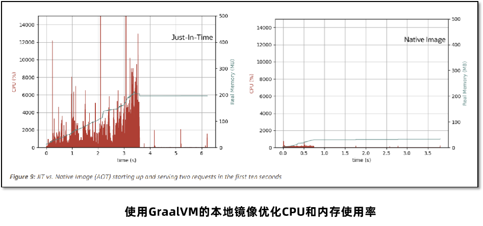

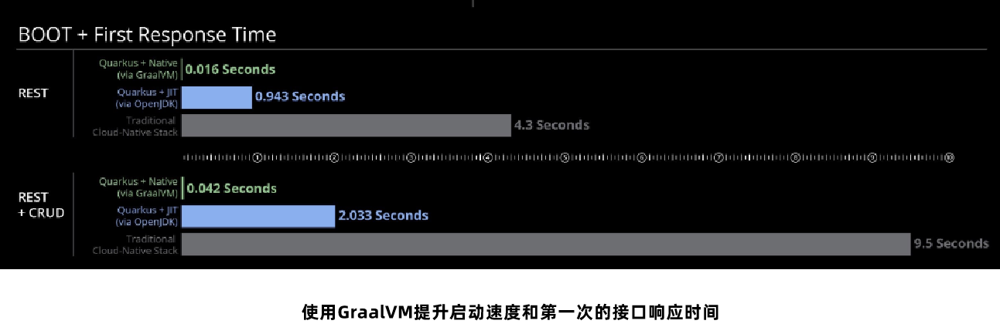

官方标语：Build faster, smaller, leaner applications。

- 更低的CPU、内存使用率
- 更快的启动速度，无需预热即可获得最好的性能
- 更好的安全性、更小的可执行文件
- 支持多种框架Spring Boot、Micronaut、Helidon 和 Quarkus。
- 多家云平台支持。
- 通过Truffle框架运行JS、Python、Ruby等其他语言。

GraalVM分为社区版（Community Edition）和企业版（Enterprise Edition）。企业版相比较社区版，在性能上有更多的优化。

| 特性                                  | 描述                                             | 社区版 | 企业版 |
| ------------------------------------- | ------------------------------------------------ | ------ | ------ |
| 收费                                  | 是否收费                                         | 免费   | 收费   |
| G1**垃圾回收器**                      | 使用**G1垃圾回收器优化垃圾回收性能**             | ×      | √      |
| Profile Guided**Optimization（PGO）** | 运行过程中收集动态数据，进一步优化本地镜像的性能 | ×      | √      |
| 高级优化特性                          | 更多优化技术，降低内存和垃圾回收的开销           | ×      | √      |
| 高级优化参数                          | 更多的高级优化参数可以设置                       | ×      | √      |

需求： 搭建Linux下的GraalVM社区版本环境。 步骤： 1、使用arch查看Linux架构

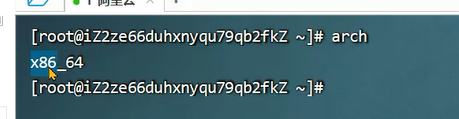

2、根据架构下载社区版的GraalVM：https://www.graalvm.org/downloads/

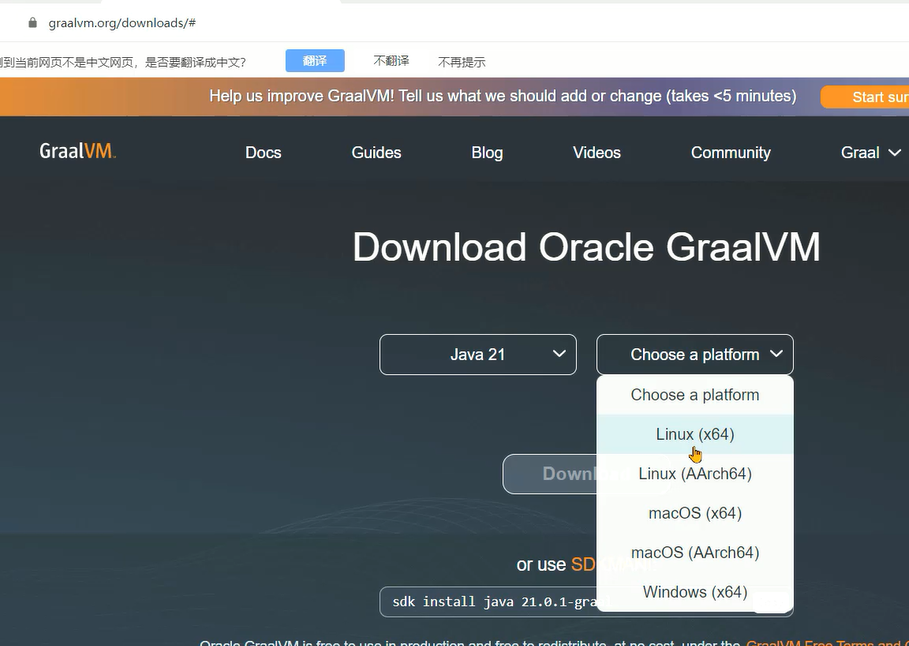

3、安装GraalVM，安装方式与安装JDK相同 解压文件：


设置环境变量:

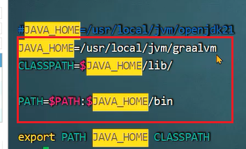

4、使用java -version和HelloWorld测试GraalVM。

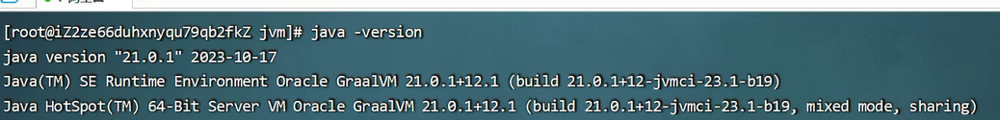

## 1.2 GraalVM的两种模式

- JIT（ Just-In-Time ）模式 ，即时编译模式
- AOT（Ahead-Of-Time）模式 ，提前编译模式

JIT模式的处理方式与Oracle JDK类似，满足两个特点：

Write Once,Run Anywhere -> 一次编写，到处运行。

预热之后，通过内置的Graal即时编译器优化热点代码，生成比Hotspot JIT更高性能的机器码。

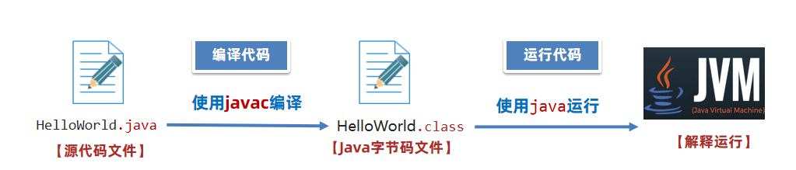

需求：

分别在JDK8 、 JDK21 、 GraalVM 21 Graal即时编译器、GraalVM 21 不开启Graal即时编译器运行Jmh性能测试用例，对比其性能。

步骤：

1、在代码文件夹中找到GraalVM的案例代码，将java-simple-stream-benchmark文件夹下的代码使用maven打包成jar包。

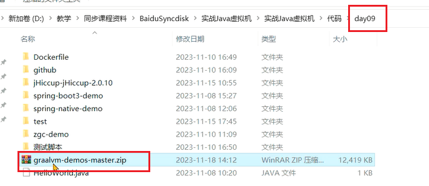

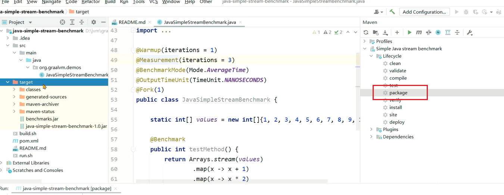

2、将jar包上传到服务器，使用不同的JDK进行测试，对比结果。

注意：

-XX:-UseJVMCICompiler参数可以关闭GraalVM中的Graal编译器。


GraalVM开启Graal编译器下的性能还是不错的：

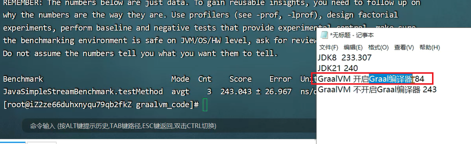

AOT（Ahead-Of-Time）模式 ，提前编译模式

AOT 编译器通过源代码，为特定平台创建可执行文件。比如，在Windows下编译完成之后，会生成exe文件。通过这种方式，达到启动之后获得最高性能的目的。但是不具备跨平台特性，不同平台使用需要单独编译。

这种模式生成的文件称之为Native Image本地镜像。

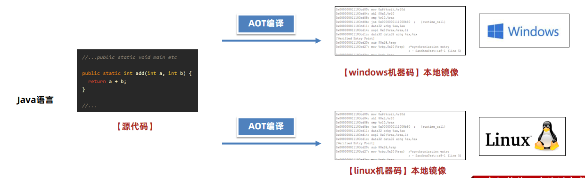

需求： 使用GraalVM AOT模式制作本地镜像并运行。 步骤： 1、安装Linux环境本地镜像制作需要的依赖库： https://www.graalvm.org/latest/reference-manual/native-image/#prerequisites 2、使用 native-image 类名 制作本地镜像。

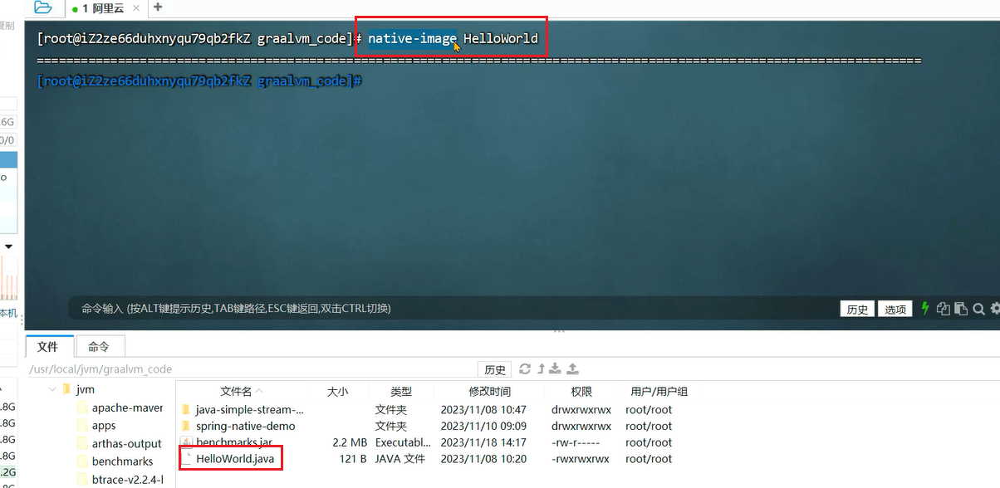

3、运行本地镜像可执行文件。


社区版的GraalVM使用本地镜像模式性能不如Hotspot JVM的JIT模式，但是企业版的性能相对会高很多。

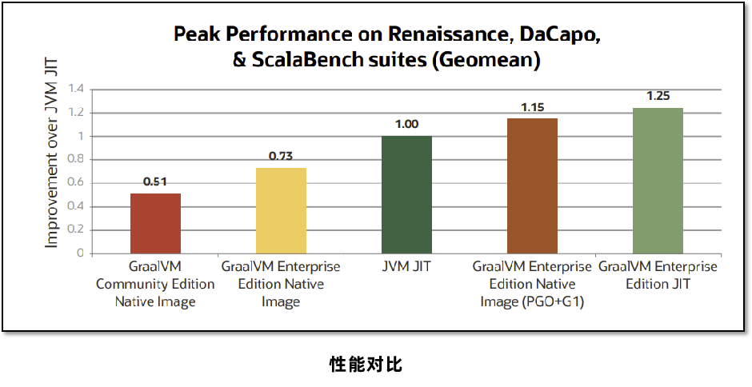

## 1.3 应用场景

GraalVM的AOT模式虽然在启动速度、内存和CPU开销上非常有优势，但是使用这种技术会带来几个问题：

1、跨平台问题，在不同平台下运行需要编译多次。编译平台的依赖库等环境要与运行平台保持一致。

2、使用框架之后，编译本地镜像的时间比较长，同时也需要消耗大量的CPU和内存。

3、AOT 编译器在编译时，需要知道运行时所有可访问的所有类。但是Java中有一些技术可以在运行时创建类，例如反射、动态代理等。这些技术在很多框架比如Spring中大量使用，所以框架需要对AOT编译器进行适配解决类似的问题。

解决方案：

1、使用公有云的Docker等容器化平台进行在线编译，确保编译环境和运行环境是一致的，同时解决了编译资源问题。

2、使用SpringBoot3等整合了GraalVM AOT模式的框架版本。

### SpringBoot搭建GraalVM应用

需求： SpringBoot3对GraalVM进行了完整的适配，所以编写GraalVM服务推荐使用SpringBoot3。 步骤： 1、使用 https://start.spring.io/ spring提供的在线生成器构建项目。

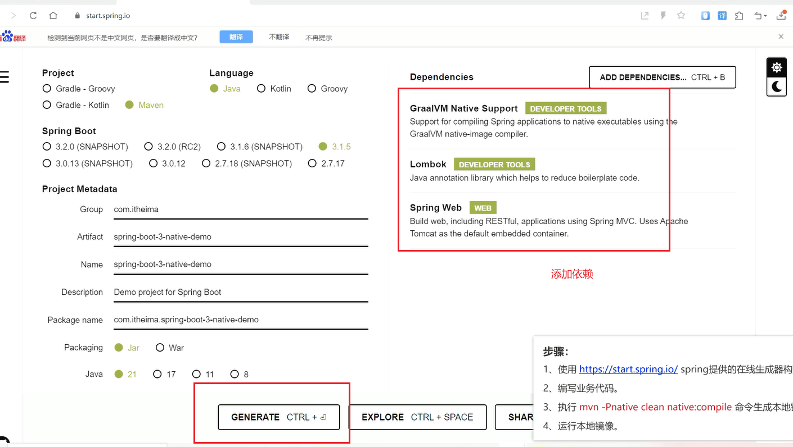

2、编写业务代码，修改原代码将`PostConstructor`注解去掉：

```Java
@Service
public class UserServiceImpl implements UserService, InitializingBean {

    private List<User> users = new ArrayList<>();

    @Autowired
    private UserDao userDao;

    @Override
    public List<UserDetails> getUserDetails() {
        return userDao.findUsers();
    }

    @Override
    public List<User> getUsers() {
        return users;
    }

    @Override
    public void afterPropertiesSet() throws Exception {
        //初始化时生成数据
        for (int i = 1; i <= 10; i++) {
            users.add(new User((long) i, RandomStringUtils.randomAlphabetic(10)));
        }
    }
}
```

3、执行 mvn -Pnative clean native:compile 命令生成本地镜像。

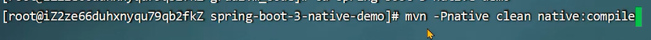

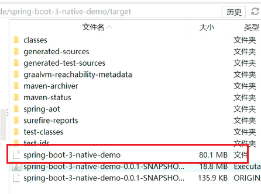

4、运行本地镜像。

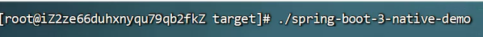

什么场景下需要使用GraalVM呢？

1、对性能要求比较高的场景，可以选择使用收费的企业版提升性能。

2、公有云的部分服务是按照CPU和内存使用量进行计费的，使用GraalVM可以有效地降低费用。

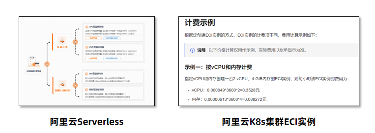

### 函数计算

传统的系统架构中，服务器等基础设施的运维、安全、高可用等工作都需要企业自行完成，存在两个主要问题：

1、开销大，包括了人力的开销、机房建设的开销。

2、资源浪费，面对一些突发的流量冲击，比如秒杀等活动，必须提前规划好容量准备好大量的服务器，这些服务器在其他时候会处于闲置的状态，造成大量的浪费。

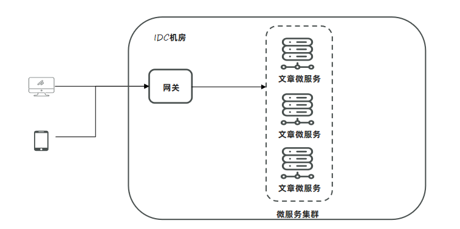

随着虚拟化技术、云原生技术的愈发成熟，云服务商提供了一套称为Serverless无服务器化的架构。企业无需进行服务器的任何配置和部署，完全由云服务商提供。比较典型的有亚马逊AWS、阿里云等。

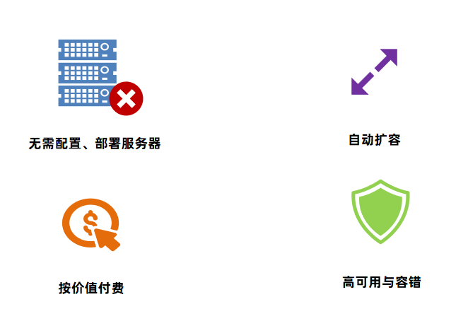

Serverless架构中第一种常见的服务是函数计算（Function as a Service），将一个应用拆分成多个函数，每个函数会以事件驱动的方式触发。典型代表有AWS的Lambda、阿里云的FC。

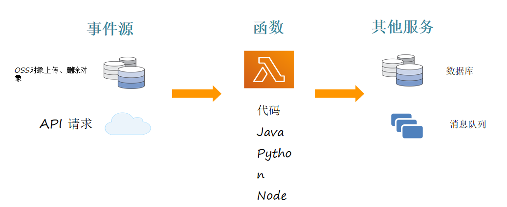

函数计算主要应用场景有如下几种：

小程序、API服务中的接口，此类接口的调用频率不高，使用常规的服务器架构容易产生资源浪费，使用Serverless就可以实现按需付费降低成本，同时支持自动伸缩能应对流量的突发情况。

大规模任务的处理，比如音视频文件转码、审核等，可以利用事件机制当文件上传之后，自动触发对应的任务。

函数计算的计费标准中包含CPU和内存使用量，所以使用GraalVM AOT模式编译出来的本地镜像可以节省更多的成本。

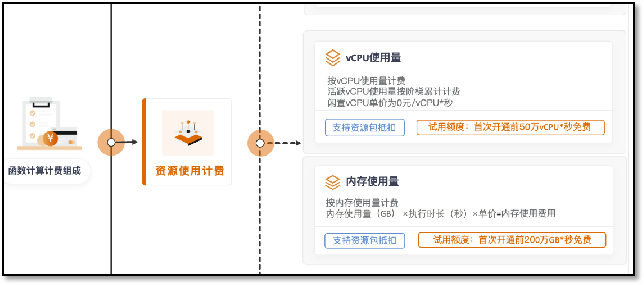

步骤：

1、在项目中编写Dockerfile文件。

```Java
# Using Oracle GraalVM for JDK 17
FROM container-registry.oracle.com/graalvm/native-image:17-ol8 AS builder

# Set the working directory to /home/app
WORKDIR /build

# Copy the source code into the image for building
COPY . /build
RUN chmod 777 ./mvnw

# Build
RUN ./mvnw --no-transfer-progress native:compile -Pnative

# The deployment Image
FROM container-registry.oracle.com/os/oraclelinux:8-slim

EXPOSE 8080

# Copy the native executable into the containers
COPY --from=builder /build/target/spring-boot-3-native-demo app
ENTRYPOINT ["/app"]
```

2、使用服务器制作镜像，这一步会消耗大量的CPU和内存资源，同时GraalVM相关的镜像服务器在国外，建议使用阿里云的镜像服务器制作Docker镜像。

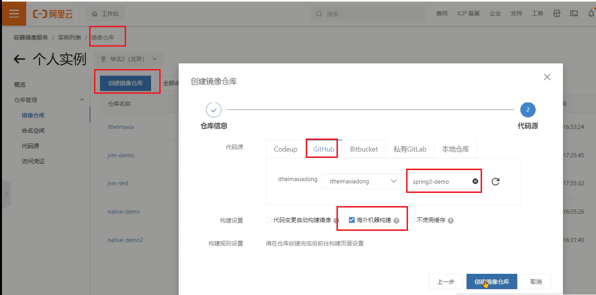

3、使用函数计算将Docker镜像转换成函数服务。

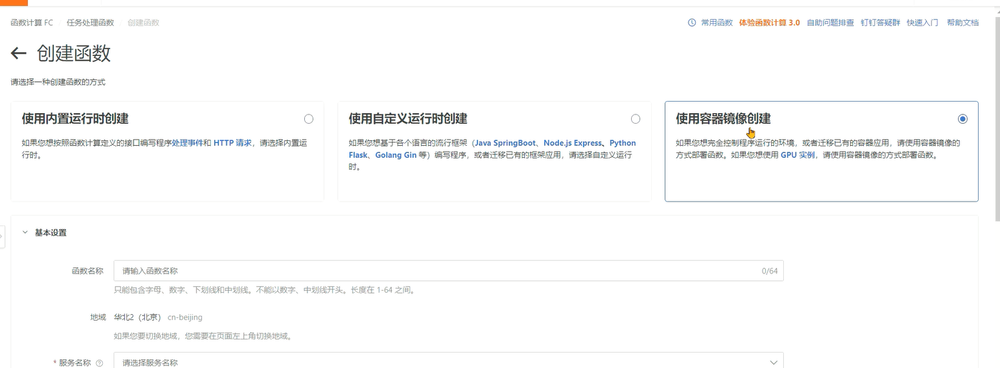

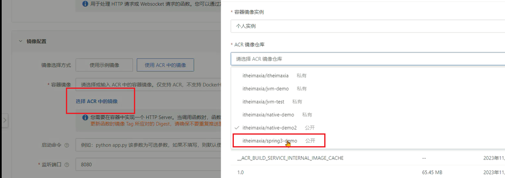

配置触发器：

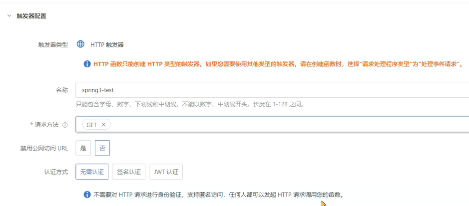

4、绑定域名并进行测试。

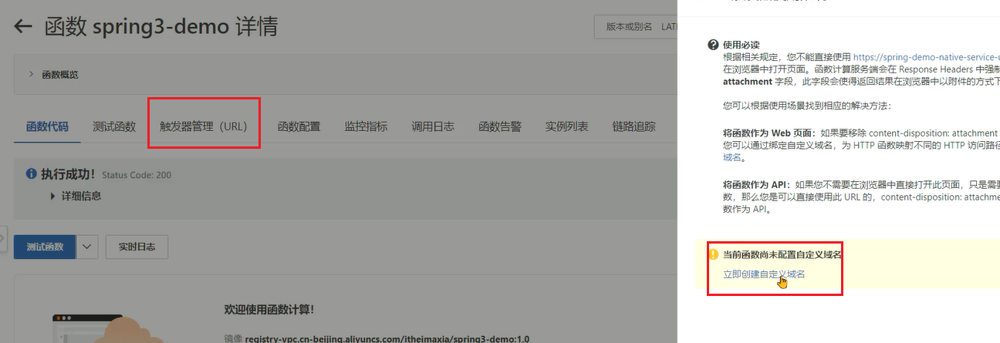

需要准备一个自己的域名：

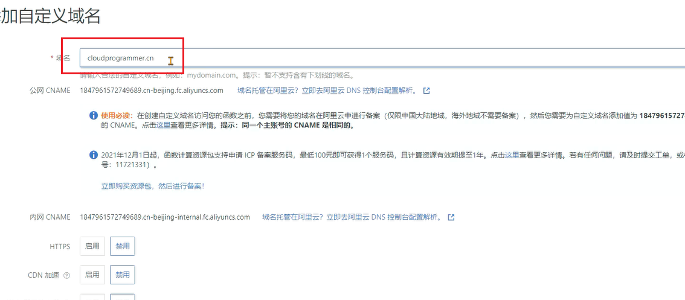

配置接口路径：

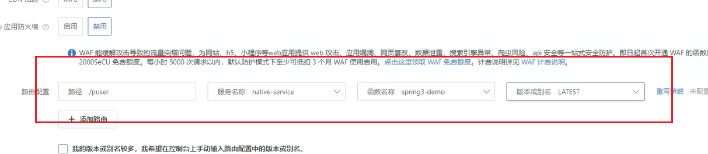

会出现一个错误：

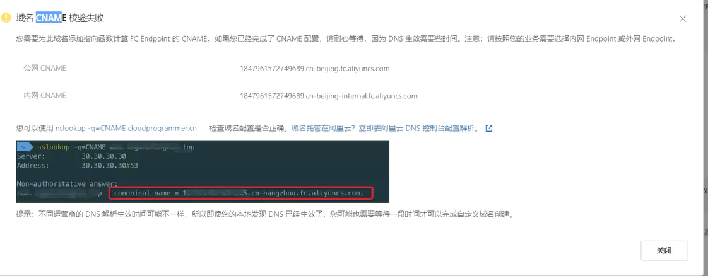

把域名导向阿里云的域名：

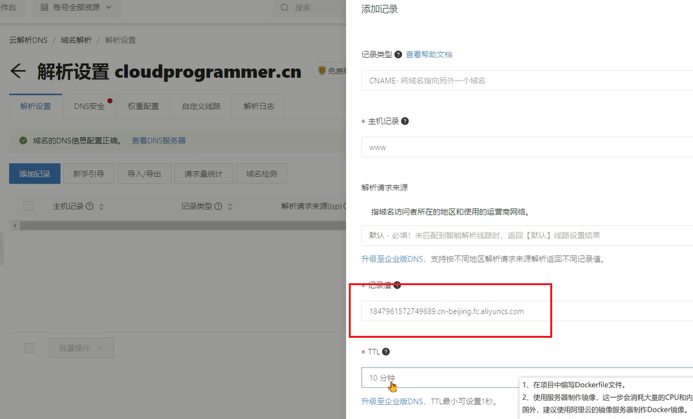

测试成功：

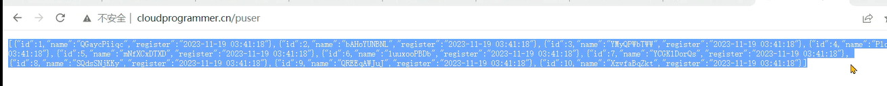

### Serverless应用

函数计算的服务资源比较受限，比如AWS的Lambda服务一般无法支持超过15分钟的函数执行，所以云服务商提供了另外一套方案：基于容器的Serverless应用，无需手动配置K8s中的Pod、Service等内容，只需选择镜像就可自动生成应用服务。

同样，Serverless应用的计费标准中包含CPU和内存使用量，所以使用GraalVM AOT模式编译出来的本地镜像可以节省更多的成本。

| 服务分类           | 交付模式 | 弹性效率 | 计费模式                  |
| ------------------ | -------- | -------- | ------------------------- |
| 函数计算           | 函数     | 毫秒级   | 调用次数**CPU内存使用量** |
| Serverless**应用** | 镜像容器 | 秒级     | CPU**内存使用量**         |

步骤：

1、在项目中编写Dockerfile文件。

2、使用服务器制作镜像，这一步会消耗大量的CPU和内存资源，同时GraalVM相关的镜像服务器在国外，建议使用阿里云的镜像服务器制作Docker镜像。

前两步同实战案例2

3、配置Serverless应用，选择容器镜像、CPU和内存。

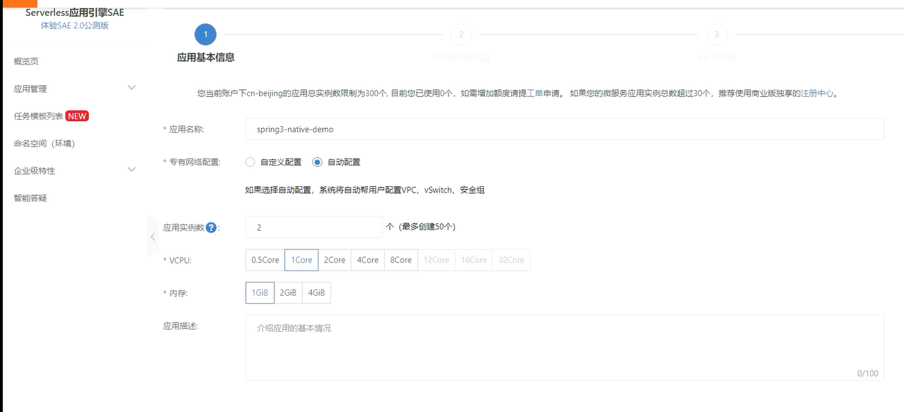

4、绑定外网负载均衡并使用Postman进行测试。

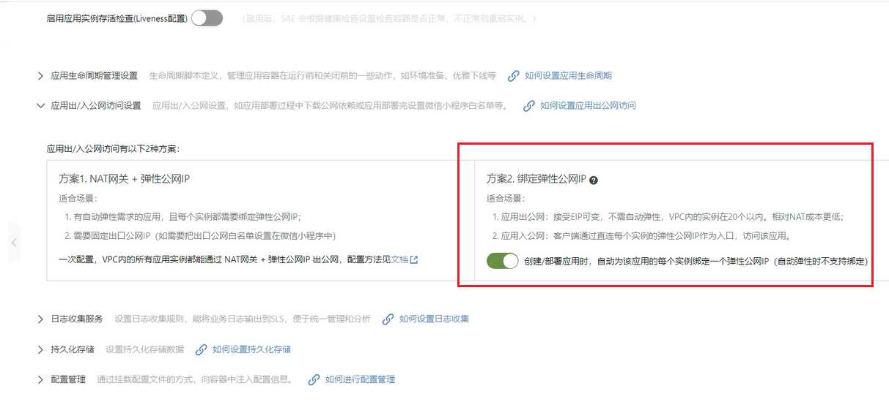

先别急着点确定，需要先创建弹性公网IP:

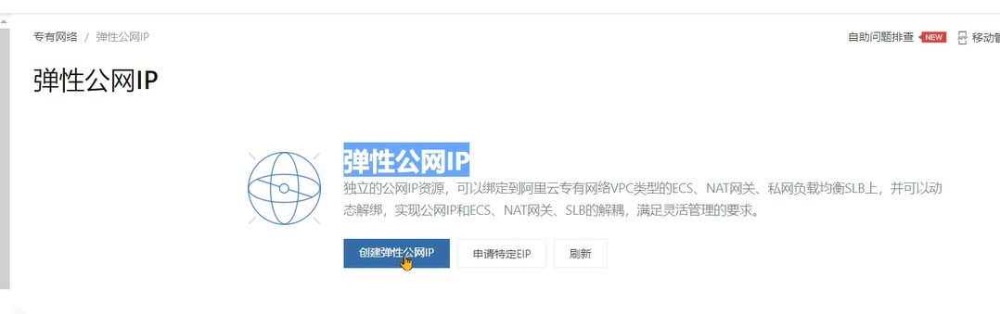

全选默认，然后创建：

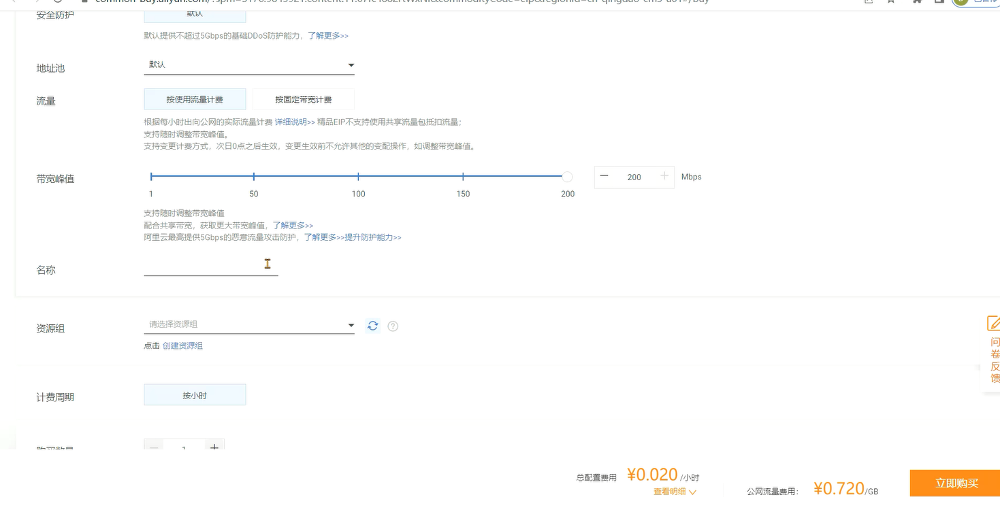

创建SLB负载均衡：

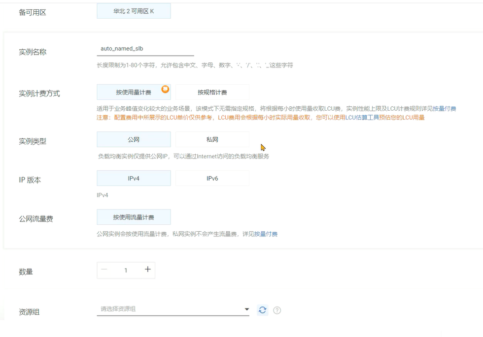

这次就可以成功创建了：


绑定刚才创建的SLB负载均衡：

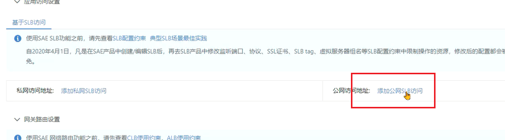

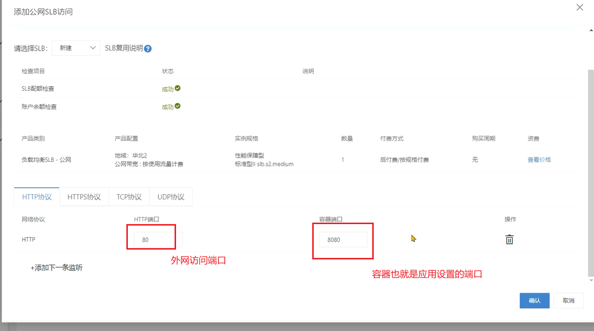

访问公网IP就能处理请求了：

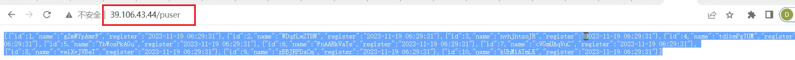

## 1.4 参数优化和故障诊断

由于GraalVM是一款独立的JDK，所以大部分HotSpot中的虚拟机参数都不适用。常用的参数参考：官方手册。

- 社区版只能使用串行垃圾回收器（Serial GC），使用串行垃圾回收器的默认最大 Java 堆大小会设置为物理内存大小的 80%，调整方式为使用  -Xmx最大堆大小。如果希望在编译期就指定该大小，可以在编译时添加参数-R:MaxHeapSize=最大堆大小。
- G1垃圾回收器只能在企业版中使用，开启方式为添加--gc=G1参数，有效降低垃圾回收的延迟。
- 另外提供一个Epsilon GC，开启方式：--gc=epsilon ，它不会产生任何的垃圾回收行为所以没有额外的内存、CPU开销。如果在公有云上运行的程序生命周期短暂不产生大量的对象，可以使用该垃圾回收器，以节省最大的资源。

-XX:+PrintGC -XX:+VerboseGC 参数打印垃圾回收详细信息。

添加虚拟机参数：

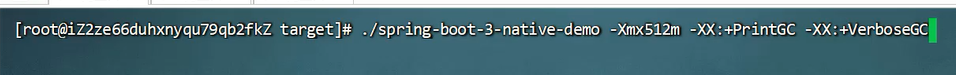

打印出了垃圾回收的信息：

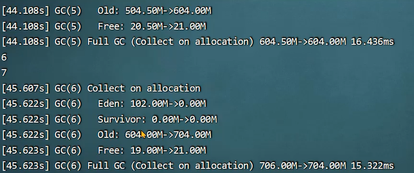

### 实战案例4：内存快照文件的获取

**需求：**

获得运行中的内存快照文件，使用MAT进行分析。

**步骤：**

1、编译程序时，添加 --enable-monitoring=heapdump，参数添加到pom文件的对应插件中。

```XML
<plugin>
   <groupId>org.graalvm.buildtools</groupId>
   <artifactId>native-maven-plugin</artifactId>
   <configuration>
      <buildArgs>
         <arg>--enable-monitoring=heapdump,jfr</arg>
      </buildArgs>
   </configuration>
</plugin>
```

2、运行中使用 kill -SIGUSR1 进程ID 命令，创建内存快照文件。

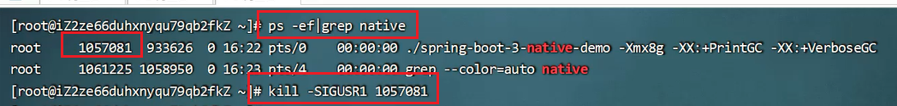

3、使用MAT分析内存快照文件。

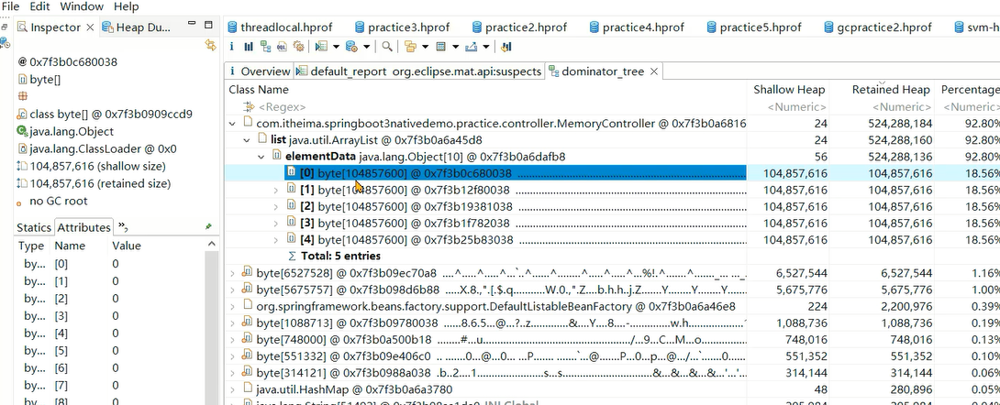

### 实战案例5：运行时数据的获取

JDK Flight Recorder (JFR) 是一个内置于 JVM 中的工具，可以收集正在运行中的 Java 应用程序的诊断和分析数据，比如线程、异常等内容。GraalVM本地镜像也支持使用JFR生成运行时数据，导出的数据可以使用VisualVM分析。

步骤：

1、编译程序时，添加 --enable-monitoring=jfr，参数添加到pom文件的对应插件中。

```XML
<plugin>
   <groupId>org.graalvm.buildtools</groupId>
   <artifactId>native-maven-plugin</artifactId>
   <configuration>
      <buildArgs>
         <arg>--enable-monitoring=heapdump,jfr</arg>
      </buildArgs>
   </configuration>
</plugin>
```

2、运行程序，添加 -XX:StartFlightRecording=filename=recording.jfr,duration=10s参数。


3、使用VisualVM分析JFR记录文件。

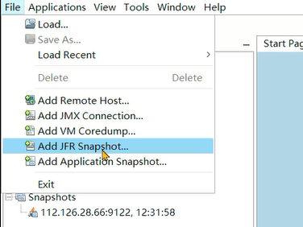

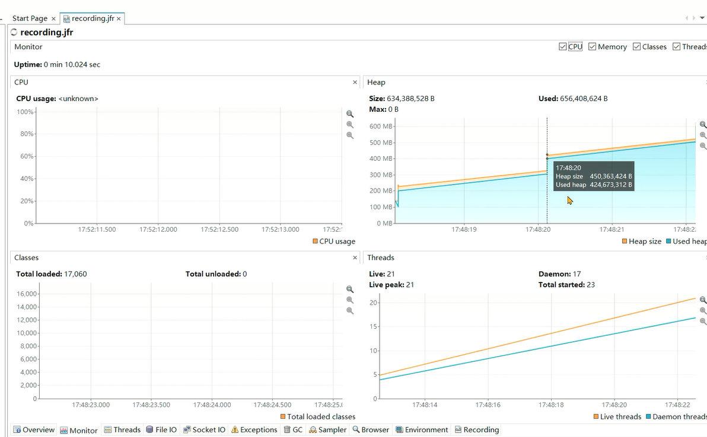

# 2、新一代的GC

## 2.1 垃圾回收器的技术演进

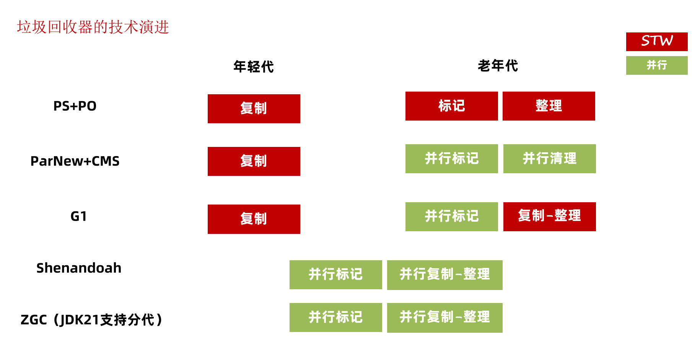

不同的垃圾回收器设计的目标是不同的，如下图所示：

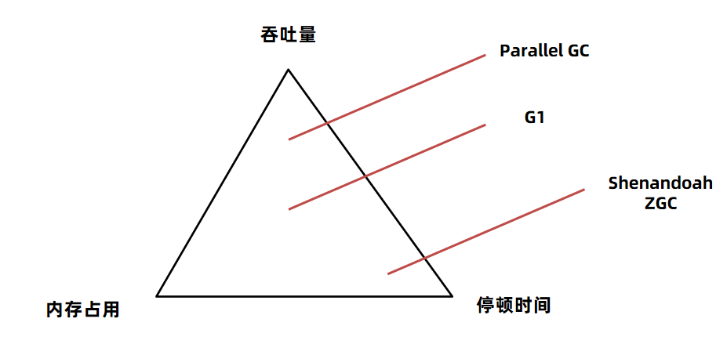

## 2.2 Shenandoah GC

Shenandoah 是由Red Hat开发的一款低延迟的垃圾收集器，Shenandoah 并发执行大部分 GC 工作，包括并发的整理，堆大小对STW的时间基本没有影响。

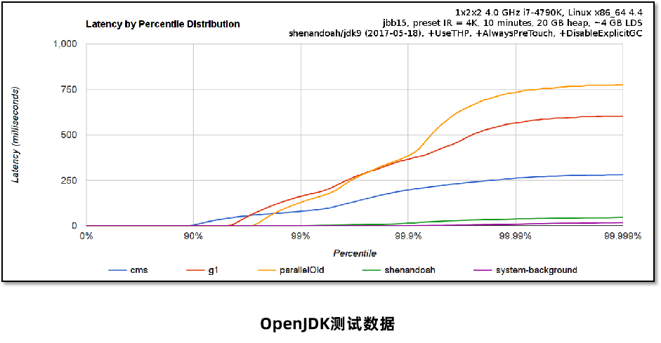

1、下载。Shenandoah只包含在OpenJDK中，默认不包含在内需要单独构建，可以直接下载构建好的。 下载地址：https://builds.shipilev.net/openjdk-jdk-shenandoah/ 选择方式如下： {aarch64, arm32-hflt, mipsel, mips64el, ppc64le, s390x, x86_32, x86_64}：架构，使用arch命令选择对应的的架构。 {server,zero}：虚拟机类型，选择server，包含所有GC的功能。 {release, fastdebug, Slowdebug, optimization}：不同的优化级别，选择release，性能最高。 {gcc*-glibc*, msvc*}：编译器的版本，选择较高的版本性能好一些，如果兼容性有问题（无法启动），选择较低的版本。

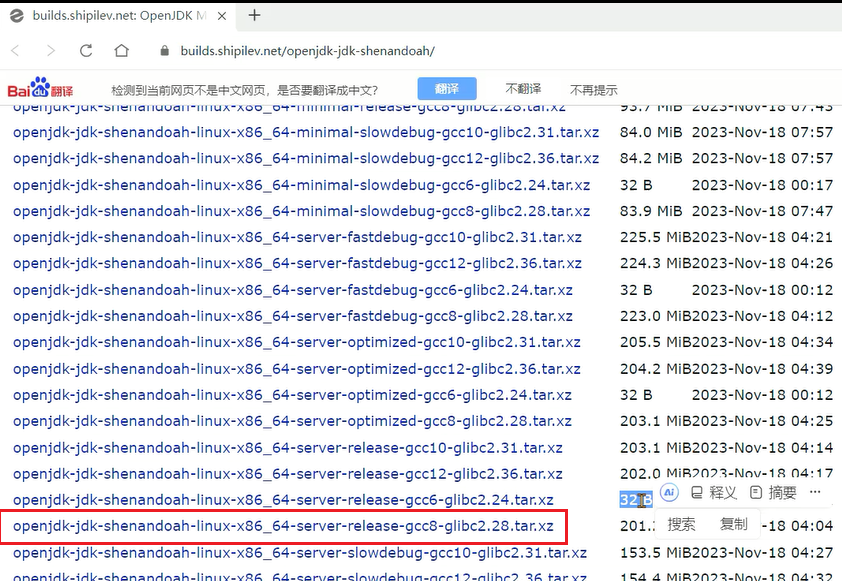

2、配置。将OpenJDK配置到环境变量中，使用java –version进行测试。打印出如下内容代表成功。

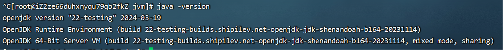

3、添加参数，运行Java程序。

-XX:+UseShenandoahGC  开启Shenandoah GC

-Xlog:gc  打印GC日志

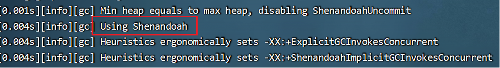

```Java
/*
 * Copyright (c) 2005, 2014, Oracle and/or its affiliates. All rights reserved.
 * DO NOT ALTER OR REMOVE COPYRIGHT NOTICES OR THIS FILE HEADER.
 *
 * This code is free software; you can redistribute it and/or modify it
 * under the terms of the GNU General Public License version 2 only, as
 * published by the Free Software Foundation.  Oracle designates this
 * particular file as subject to the "Classpath" exception as provided
 * by Oracle in the LICENSE file that accompanied this code.
 *
 * This code is distributed in the hope that it will be useful, but WITHOUT
 * ANY WARRANTY; without even the implied warranty of MERCHANTABILITY or
 * FITNESS FOR A PARTICULAR PURPOSE.  See the GNU General Public License
 * version 2 for more details (a copy is included in the LICENSE file that
 * accompanied this code).
 *
 * You should have received a copy of the GNU General Public License version
 * 2 along with this work; if not, write to the Free Software Foundation,
 * Inc., 51 Franklin St, Fifth Floor, Boston, MA 02110-1301 USA.
 *
 * Please contact Oracle, 500 Oracle Parkway, Redwood Shores, CA 94065 USA
 * or visit www.oracle.com if you need additional information or have any
 * questions.
 */

package org.sample;

import com.sun.management.OperatingSystemMXBean;
import org.openjdk.jmh.annotations.*;
import org.openjdk.jmh.infra.Blackhole;
import org.openjdk.jmh.runner.Runner;
import org.openjdk.jmh.runner.RunnerException;
import org.openjdk.jmh.runner.options.Options;
import org.openjdk.jmh.runner.options.OptionsBuilder;

import java.lang.management.ManagementFactory;
import java.lang.management.MemoryMXBean;
import java.lang.management.MemoryUsage;
import java.util.ArrayList;
import java.util.List;
import java.util.concurrent.TimeUnit;

//执行5轮预热，每次持续2秒
@Warmup(iterations = 5, time = 2, timeUnit = TimeUnit.SECONDS)
//输出毫秒单位
@OutputTimeUnit(TimeUnit.MILLISECONDS)
//统计方法执行的平均耗时
@BenchmarkMode(Mode.AverageTime)
//java -jar benchmarks.jar -rf json
@State(Scope.Benchmark)
public class MyBenchmark {

    //每次测试对象大小 4KB和4MB
    @Param({"4","4096"})
    int perSize;

    private void test(Blackhole blackhole){

        //每次循环创建堆内存60%对象 JMX获取到Java运行中的实时数据
        MemoryMXBean memoryMXBean = ManagementFactory.getMemoryMXBean();
        //获取堆内存大小
        MemoryUsage heapMemoryUsage = memoryMXBean.getHeapMemoryUsage();
        //获取到剩余的堆内存大小
        long heapSize = (long) ((heapMemoryUsage.getMax() - heapMemoryUsage.getUsed()) * 0.6);
        //计算循环次数
        long size = heapSize / (1024 * perSize);

        for (int i = 0; i < 4; i++) {
            List<byte[]> objects = new ArrayList<>((int)size);
            for (int j = 0; j < size; j++) {
                objects.add(new byte[1024 * perSize]);
            }
            blackhole.consume(objects);
        }
    }

    @Benchmark
    @Fork(value = 1,jvmArgsAppend = {"-Xms4g","-Xmx4g","-XX:+UseSerialGC"})
    public void serialGC(Blackhole blackhole){
        test(blackhole);
    }
    
    @Benchmark
    @Fork(value = 1,jvmArgsAppend = {"-Xms4g","-Xmx4g","-XX:+UseParallelGC"})
    public void parallelGC(Blackhole blackhole){
        test(blackhole);
    }
    
    @Benchmark
    @Fork(value = 1,jvmArgsAppend = {"-Xms4g","-Xmx4g"})
    public void g1(Blackhole blackhole){
        test(blackhole);
    }

    @Benchmark
    @Fork(value = 1,jvmArgsAppend = {"-Xms4g","-Xmx4g","-XX:+UseShenandoahGC"})
    public void shenandoahGC(Blackhole blackhole){
        test(blackhole);
    }


    public static void main(String[] args) throws RunnerException {

        Options opt = new OptionsBuilder()
                .include(MyBenchmark.class.getSimpleName())
                .forks(1)
                .build();

        new Runner(opt).run();
    }
}
```

测试结果：

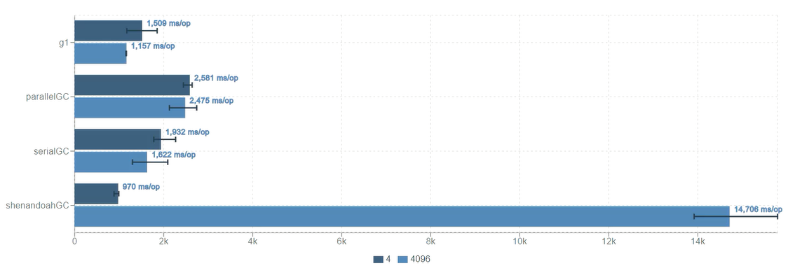

Shenandoah GC对小对象的GC停顿很短，但是大对象效果不佳。

## 2.3 ZGC

ZGC 是一种可扩展的低延迟垃圾回收器。ZGC 在垃圾回收过程中，STW的时间不会超过一毫秒，适合需要低延迟的应用。支持几百兆到16TB 的堆大小，堆大小对STW的时间基本没有影响。

ZGC降低了停顿时间，能降低接口的最大耗时，提升用户体验。但是吞吐量不佳，所以如果Java服务比较关注QPS（每秒的查询次数）那么G1是比较不错的选择。

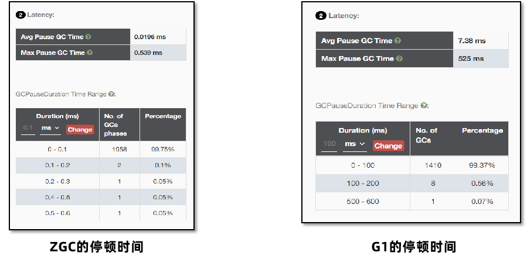

### **ZGC版本更迭：**

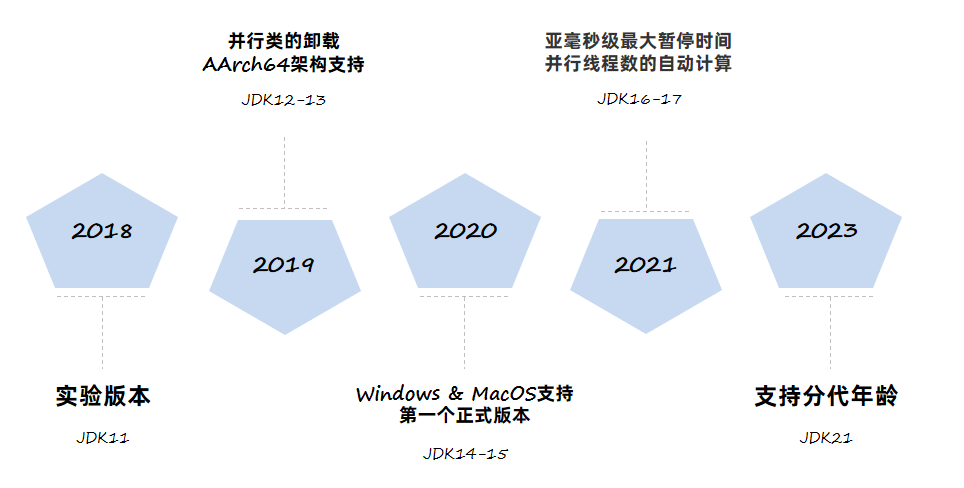

### ZGC的使用

OracleJDK和OpenJDK中都支持ZGC，阿里的DragonWell龙井JDK也支持ZGC但属于其自行对OpenJDK 11的ZGC进行优化的版本。

建议使用JDK17之后的版本，延迟较低同时无需手动配置并行线程数。

分代 ZGC添加如下参数启用   -XX:+UseZGC -XX:+ZGenerational

非分代 ZGC通过命令行选项启用 -XX:+UseZGC

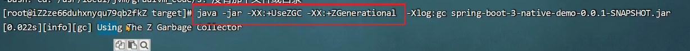

### ZGC的环境搭建

ZGC在设计上做到了自适应，根据运行情况自动调整参数，让用户手动配置的参数最少化。

- 自动设置年轻代大小，无需设置-Xmn参数。

自动晋升阈值（复制中存活多少次才搬运到老年代），无需设置-XX:TenuringThreshold。

JDK17之后支持自动的并行线程数，无需设置-XX:ConcGCThreads。

- 需要设置的参数：
  -  -Xmx 值  最大堆内存大小
  -  这是ZGC最重要的一个参数，必须设置。ZGC在运行过程中会使用一部分内存用来处理垃圾回收，所以尽量保证堆中有足够的空间。设置多少值取决于对象分配的速度，根据测试情况来决定。

- 可以设置的参数：
  -  -XX:SoftMaxHeapSize=值
  -  ZGC会尽量保证堆内存小于该值，这样在内存靠近这个值时会尽早地进行垃圾回收，但是依然有可能会超过该值。
  -  例如，-Xmx5g -XX:SoftMaxHeapSize=4g 这个参数设置，ZGC会尽量保证堆内存小于4GB，最多不会超过5GB。

```Java
@Benchmark
@Fork(value = 1,jvmArgsAppend = {"-Xms4g","-Xmx4g","-XX:+UseZGC","-XX:+UseLargePages"})
public void zGC(Blackhole blackhole){
    test(blackhole);
}

@Benchmark
@Fork(value = 1,jvmArgsAppend = {"-Xms4g","-Xmx4g","-XX:+UseZGC","-XX:+ZGenerational","-XX:+UseLargePages"})
public void zGCGenerational(Blackhole blackhole){
    test(blackhole);
}
```

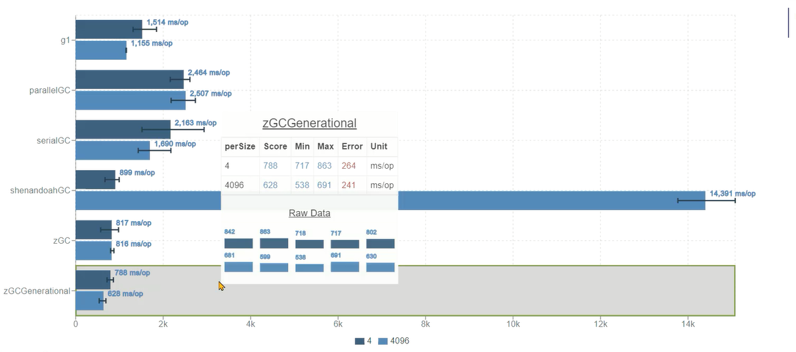

ZGC整体表现还是非常不错的，分代也让ZGC的停顿时间有更好的表现。

### ZGC调优

ZGC 中可以使用Linux的Huge Page大页技术优化性能，提升吞吐量、降低延迟。

注意：安装过程需要 root 权限，所以ZGC默认没有开启此功能。

操作步骤：

1、计算所需页数，Linux x86架构中大页大小为2MB，根据所需堆内存的大小估算大页数量。比如堆空间需要16G，预留2G（JVM需要额外的一些非堆空间），那么页数就是18G / 2MB = 9216。

2、配置系统的大页池以具有所需的页数（需要root权限）：

$ echo 9216 > /sys/kernel/mm/hugepages/hugepages-2048kB/nr_hugepages

3、添加参数-XX:+UseLargePages 启动程序进行测试

## 2.4 实战案例

**需求：**

Java服务中存在大量软引用的缓存导致内存不足，测试下g1、Shenandoah、ZGC这三种垃圾回收器在这种场景下的回收情况。

**步骤：**

测试代码:

```Java
package com.itheima.jvmoptimize.fullgcdemo;

import com.github.benmanes.caffeine.cache.Cache;
import com.github.benmanes.caffeine.cache.Caffeine;
import lombok.SneakyThrows;
import org.apache.commons.lang3.RandomStringUtils;
import org.springframework.web.bind.annotation.GetMapping;
import org.springframework.web.bind.annotation.RequestMapping;
import org.springframework.web.bind.annotation.RestController;

import java.time.Duration;
import java.util.ArrayList;
import java.util.List;
import java.util.Random;

@RestController
@RequestMapping("/fullgc")
public class Demo2Controller {

    private Cache cache = Caffeine.newBuilder().weakKeys().softValues().build();
    private List<Object> objs = new ArrayList<>();

    private static final int _1MB = 1024 * 1024;

    //FULLGC测试
    //-Xms8g -Xmx8g -Xss256k -XX:MaxMetaspaceSize=512m  -XX:+DisableExplicitGC -XX:+HeapDumpOnOutOfMemoryError -XX:HeapDumpPath=D:/test.hprof  -verbose:gc -XX:+PrintGCDetails -XX:+PrintGCTimeStamps
    //ps + po 50并发 260ms  100并发 474  200并发 930
    //cms -XX:+UseParNewGC -XX:+UseConcMarkSweepGC 50并发 157ms  200并发 833
    //g1 JDK11 并发200 248
    @GetMapping("/1")
    public void test() throws InterruptedException {
        cache.put(RandomStringUtils.randomAlphabetic(8),new byte[10 * _1MB]);
    }

}
```

1、启动程序，添加不同的虚拟机参数进行测试。

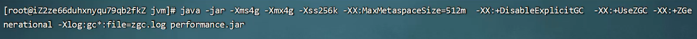

2、使用Apache Benchmark测试工具对本机进行压测。

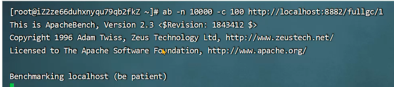

3、生成GC日志，使用GcEasy进行分析。

4、对比压测之后的结果。

两种垃圾回收器在并行回收时都会使用垃圾回收线程占用CPU资源

在内存足够的情况下，ZGC垃圾回收表现的效果会更好，停顿时间更短。

在内存不是特别充足的情况下， Shenandoah GC表现更好，并行垃圾回收的时间较短，用户请求的执行效率比较高。

# 3、揭秘Java工具

在Java的世界中，除了Java编写的业务系统之外，还有一类程序也需要Java程序员参与编写，这类程序就是Java工具。

常见的Java工具有以下几类：

1、诊断类工具，如Arthas、VisualVM等。

2、开发类工具，如Idea、Eclipse。

3、APM应用性能监测工具，如Skywalking、Zipkin等。

4、热部署工具，如Jrebel等。

## 3.1 Java工具的核心：Java Agent技术

Java Agent技术是JDK提供的用来编写Java工具的技术，使用这种技术生成一种特殊的jar包，这种jar包可以让Java程序运行其中的代码。

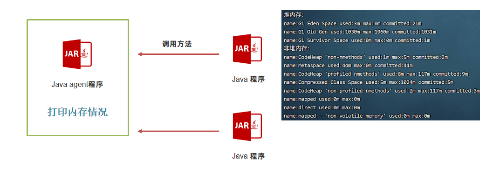

Java Agent技术实现了让Java程序执行独立的Java Agent程序中的代码，执行方式有两种：

- 静态加载模式

静态加载模式可以在程序启动的一开始就执行我们需要执行的代码，适合用APM等性能监测系统从一开始就监控程序的执行性能。静态加载模式需要在Java Agent的项目中编写一个premain的方法，并打包成jar包。


接下来使用以下命令启动Java程序，此时Java虚拟机将会加载agent中的代码并执行。


premain方法会在主线程中执行：


- 动态加载模式

动态加载模式可以随时让java agent代码执行，适用于Arthas等诊断系统。动态加载模式需要在Java Agent的项目中编写一个agentmain的方法，并打包成jar包。


接下来使用以下代码就可以让java agent代码在指定的java进程中执行了。

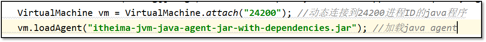

agentmain方法会在独立线程中执行：

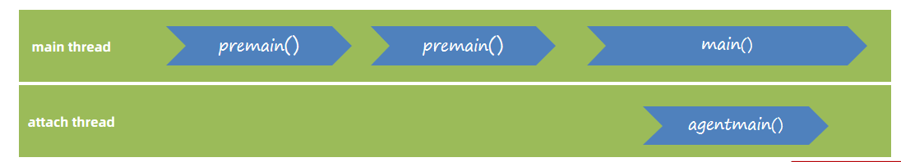

### 搭建java agent静态加载模式的环境

步骤：

1、创建maven项目，添加maven-assembly-plugin插件，此插件可以打包出java agent的jar包。

```XML
<plugin>
    <groupId>org.apache.maven.plugins</groupId>
    <artifactId>maven-assembly-plugin</artifactId>
    <configuration>
        <descriptorRefs>
            <descriptorRef>jar-with-dependencies</descriptorRef>
        </descriptorRefs>
        <archive>
            <manifestFile>src/main/resources/MANIFEST.MF</manifestFile>
        </archive>
    </configuration>
</plugin>
```

2、编写类和premain方法，premain方法中打印一行信息。

```Java
public class AgentDemo {

    /**
     * 参数添加模式 启动java主程序时添加 -javaangent:agent路径
     * @param agentArgs
     * @param inst
     */
    public static void premain(String agentArgs, Instrumentation inst) {
        System.out.println("java agent执行了...");
    }
}
```

3、编写MANIFEST.MF文件，此文件主要用于描述java agent的配置属性，比如使用哪一个类的premain方法。

```Java
Manifest-Version: 1.0
Premain-Class: com.itheima.jvm.javaagent.AgentDemo
Agent-Class: com.itheima.jvm.javaagent.AgentDemo
Can-Redefine-Classes: true
Can-Retransform-Classes: true
Can-Set-Native-Method-Prefix: true
```

4、使用maven-assembly-plugin进行打包。

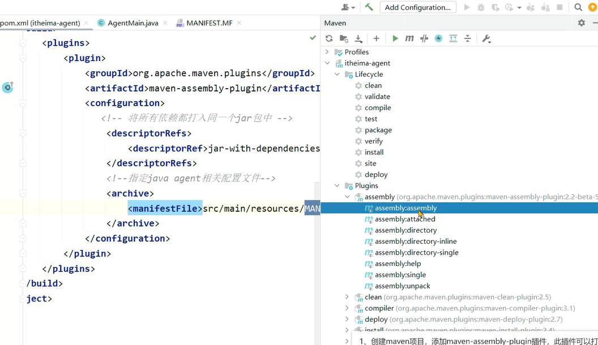

5、创建spring boot应用，并静态加载上一步打包完的java agent。

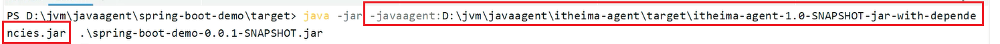

### 搭建java agent动态加载模式的环境

步骤：

1、创建maven项目，添加maven-assembly-plugin插件，此插件可以打包出java agent的jar包。

2、编写类和agentmain方法， agentmain方法中打印一行信息。

```Java
package com.itheima.jvm.javaagent.demo01;

import java.lang.instrument.Instrumentation;

public class AgentDemo {

    /**
     * 参数添加模式 启动java主程序时添加 -javaangent:agent路径
     * @param agentArgs
     * @param inst
     */
    public static void premain(String agentArgs, Instrumentation inst) {
        System.out.println("java agent执行了...");
    }

    /**
     * attach 挂载模式 java主程序运行之后，随时可以将agent挂载上去
     */

    public static void agentmain(String agentArgs, Instrumentation inst) {
        //打印线程名称
        System.out.println(Thread.currentThread().getName());
        System.out.println("attach模式执行了...");
    }
}
```

3、编写MANIFEST.MF文件，此文件主要用于描述java agent的配置属性，比如使用哪一个类的agentmain方法。

4、使用maven-assembly-plugin进行打包。

5、编写main方法，动态连接到运行中的java程序。

```Java
package com.itheima.jvm.javaagent.demo01;

import com.sun.tools.attach.AgentInitializationException;
import com.sun.tools.attach.AgentLoadException;
import com.sun.tools.attach.AttachNotSupportedException;
import com.sun.tools.attach.VirtualMachine;

import java.io.IOException;

public class AttachMain {
    public static void main(String[] args) throws IOException, AttachNotSupportedException, AgentLoadException, AgentInitializationException {
        VirtualMachine vm = VirtualMachine.attach("24200");
        vm.loadAgent("D:\\jvm-java-agent\\target\\itheima-jvm-java-agent-jar-with-dependencies.jar");
    }
}
```

## 3.2 实战案例1：简化版的Arthas

需求：

编写一个简化版的Arthas程序，具备以下几个功能：

1、查看内存使用情况

2、生成堆内存快照

3、打印栈信息

4、打印类加载器

5、打印类的源码

6、打印方法执行的参数和耗时

需求：

该程序是一个独立的Jar包，可以应用于任何Java编写的系统中。

具备以下特点：代码无侵入性、操作简单、性能高。

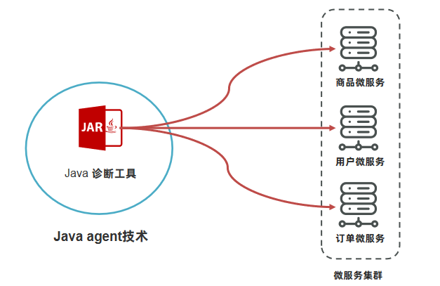

### 1、查看内存使用情况

 JDK从1.5开始提供了Java Management Extensions (JMX) 技术，通过Mbean对象的写入和获取，实现：

运行时配置的获取和更改

应用程序运行信息的获取（线程栈、内存、类信息等）

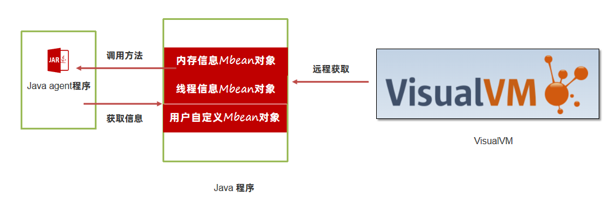

 获取JVM默认提供的Mbean可以通过如下的方式，例如获取内存信息：

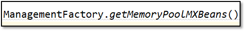

ManagementFactory提供了一系列的方法获取各种各样的信息：

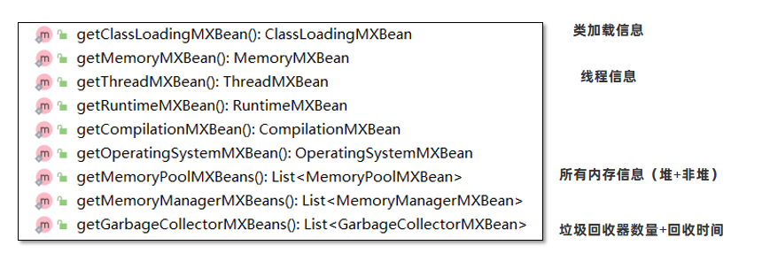

```Java
package com.itheima.jvm.javaagent.demo02;

import java.lang.instrument.Instrumentation;
import java.lang.management.*;
import java.util.List;

/**
 * 1、查询所有进程
 * 2、显示内存相关的信息
 */
public class AgentDemo {

    /**
     * 参数添加模式 启动java主程序时添加 -javaangent:agent路径
     * @param agentArgs
     * @param inst
     */
    public static void premain(String agentArgs, Instrumentation inst) {
        System.out.println("java agent执行了...");
    }

    /**
     * attach 挂载模式 java主程序运行之后，随时可以将agent挂载上去
     */

    //-XX:+UseSerialGC -Xmx1g -Xms512m
    public static void agentmain(String agentArgs, Instrumentation inst) {
        //打印内存的使用情况
        memory();
    }

    //获取内存信息
    private static void memory(){
        List<MemoryPoolMXBean> memoryPoolMXBeans = ManagementFactory.getMemoryPoolMXBeans();

        System.out.println("堆内存：");
        //获取堆内存
        getMemoryInfo(memoryPoolMXBeans, MemoryType.HEAP);

        //获取非堆内存
        System.out.println("非堆内存：");
        getMemoryInfo(memoryPoolMXBeans, MemoryType.NON_HEAP);

        //nio使用的直接内存
        try{
            @SuppressWarnings("rawtypes")
            Class bufferPoolMXBeanClass = Class.forName("java.lang.management.BufferPoolMXBean");
            @SuppressWarnings("unchecked")
            List<BufferPoolMXBean> bufferPoolMXBeans = ManagementFactory.getPlatformMXBeans(bufferPoolMXBeanClass);
            for (BufferPoolMXBean mbean : bufferPoolMXBeans) {
                StringBuilder sb = new StringBuilder();
                sb
                        .append("name:")
                        .append(mbean.getName())

                        .append(" used:")
                        .append(mbean.getMemoryUsed()/ 1024 / 1024)
                        .append("m")

                        .append(" max:")
                        .append(mbean.getTotalCapacity() / 1024 / 1024)
                        .append("m");

                System.out.println(sb);
            }
        }catch (Exception e){
            System.out.println(e);
        }

    }

    private static void getMemoryInfo(List<MemoryPoolMXBean> memoryPoolMXBeans, MemoryType heap) {
        memoryPoolMXBeans.stream().filter(x -> x.getType().equals(heap))
                .forEach(x -> {
                    StringBuilder sb = new StringBuilder();
                    sb
                            .append("name:")
                            .append(x.getName())

                            .append(" used:")
                            .append(x.getUsage().getUsed() / 1024 / 1024)
                            .append("m")

                            .append(" max:")
                            .append(x.getUsage().getMax() / 1024 / 1024)
                            .append("m")

                            .append(" committed:")
                            .append(x.getUsage().getCommitted() / 1024 / 1024)
                            .append("m");

                    System.out.println(sb);
                });
    }

    public static void main(String[] args) {
        memory();
    }
}
```

### 2、生成堆内存快照

更多的信息可以通过ManagementFactory.getPlatformMXBeans获取，比如：

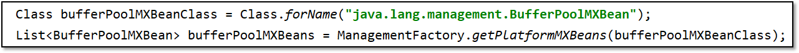

通过这种方式，获取到了Java虚拟机中分配的直接内存和内存映射缓冲区的大小。

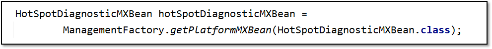

获取到虚拟机诊断用的MXBean，通过这个Bean对象可以生成内存快照。

```Java
public static void heapDump(){
    SimpleDateFormat simpleDateFormat = new SimpleDateFormat("yyyy-MM-dd-HH-mm");
    String filename = simpleDateFormat.format(new Date()) + ".hprof";
    System.out.println("生成内存dump文件，文件名为:" + filename);

    HotSpotDiagnosticMXBean hotSpotDiagnosticMXBean =
            ManagementFactory.getPlatformMXBean(HotSpotDiagnosticMXBean.class);

    try {
        hotSpotDiagnosticMXBean.dumpHeap(filename, true);
    } catch (IOException e) {
        e.printStackTrace();
    }
}
```

### 3、打印栈信息

```Java
package com.itheima.jvm.javaagent.demo03;

import java.lang.management.ManagementFactory;
import java.lang.management.ThreadInfo;
import java.lang.management.ThreadMXBean;

public class ThreadCommand {

    public static void printStackInfo(){
        ThreadMXBean threadMXBean = ManagementFactory.getThreadMXBean();
        ThreadInfo[] infos = threadMXBean.dumpAllThreads(threadMXBean.isObjectMonitorUsageSupported(),
                threadMXBean.isSynchronizerUsageSupported());
        for (ThreadInfo info : infos) {
            StringBuilder stringBuilder = new StringBuilder();
            stringBuilder.append("name:")
                    .append(info.getThreadName())
                    .append(" threadId:")
                    .append(info.getThreadId())
                    .append(" state:")
                    .append(info.getThreadState())
            ;
            System.out.println(stringBuilder);

            StackTraceElement[] stackTrace = info.getStackTrace();
            for (StackTraceElement stackTraceElement : stackTrace) {
                System.out.println(stackTraceElement.toString());
            }

            System.out.println();
        }
    }


    public static void main(String[] args) {
        printStackInfo();
    }
}
```

### 4、打印类加载器

Java Agent中可以获得Java虚拟机提供的Instumentation对象：

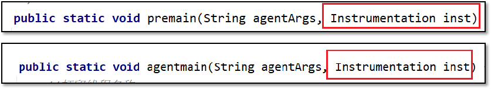

该对象有以下几个作用： 1、redefine，重新设置类的字节码信息。 2、retransform，根据现有类的字节码信息进行增强。 3、获取所有已加载的类信息。 Oracle官方手册： https://docs.oracle.com/javase/17/docs/api/java/lang/instrument/Instrumentation.html

```Java
package com.itheima.jvm.javaagent.demo04;

import org.jd.core.v1.ClassFileToJavaSourceDecompiler;
import org.jd.core.v1.api.loader.Loader;
import org.jd.core.v1.api.loader.LoaderException;
import org.jd.core.v1.api.printer.Printer;

import java.lang.instrument.*;
import java.security.ProtectionDomain;
import java.util.Comparator;
import java.util.HashSet;
import java.util.Scanner;
import java.util.Set;
import java.util.stream.Collectors;

public class ClassCommand {

    //获取所有类加载器
    private static Set<ClassLoader> getAllClassLoader(Instrumentation inst){
        HashSet<ClassLoader> classLoaders = new HashSet<>();
        Class[] allLoadedClasses = inst.getAllLoadedClasses();
        for (Class clazz : allLoadedClasses) {
            ClassLoader classLoader = clazz.getClassLoader();
            classLoaders.add(classLoader);
        }

        return classLoaders;
    }

    public static void printAllClassLoader(Instrumentation inst){
        Set<ClassLoader> allClassLoader = getAllClassLoader(inst);
        String result = allClassLoader.stream().map(x -> {
            if (x ==null) {
                return "BootStrapClassLoader";
            } else {
                return x.toString();
            }
        }).distinct().sorted(String::compareTo).collect(Collectors.joining(","));
        System.out.println(result);
    }

    

}
```

### 5、打印类的源码

打印类的源码需要分为以下几个步骤

1、获得内存中的类的字节码信息。利用Instrumentation提供的转换器来获取字节码信息。

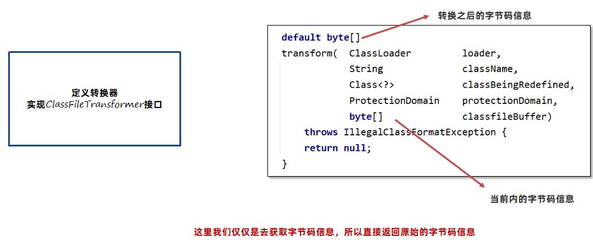


2、通过反编译工具将字节码信息还原成源代码信息。

这里我们会使用jd-core依赖库来完成，github地址：https://github.com/java-decompiler/jd-core

Pom添加依赖:

```XML
<dependency>
    <groupId>org.jd</groupId>
    <artifactId>jd-core</artifactId>
    <version>1.1.3</version>
</dependency>
//获取类信息
public static void printClass(Instrumentation inst){
    Scanner scanner = new Scanner(System.in);
    System.out.println("请输入类名:");
    String next = scanner.next();
    Class[] allLoadedClasses = inst.getAllLoadedClasses();
    System.out.println("要查找的类名是:" + next);
    //匹配类名
    for (Class clazz : allLoadedClasses) {
        if(clazz.getName().equals(next)){
            System.out.println("找到了类,类加载器为:" + clazz.getClassLoader());
            ClassFileTransformer transformer = new ClassFileTransformer() {
                @Override
                public byte[] transform(Module module, ClassLoader loader, String className, Class<?> classBeingRedefined, ProtectionDomain protectionDomain, byte[] classfileBuffer) throws IllegalClassFormatException {
                    ClassFileToJavaSourceDecompiler classFileToJavaSourceDecompiler = new ClassFileToJavaSourceDecompiler();

                    Printer printer = new Printer() {
                        protected static final String TAB = "  ";
                        protected static final String NEWLINE = "\n";

                        protected int indentationCount = 0;
                        protected StringBuilder sb = new StringBuilder();

                        @Override public String toString() { return sb.toString(); }

                        @Override public void start(int maxLineNumber, int majorVersion, int minorVersion) {}
                        @Override public void end() {
                            System.out.println(sb.toString());
                        }

                        @Override public void printText(String text) { sb.append(text); }
                        @Override public void printNumericConstant(String constant) { sb.append(constant); }
                        @Override public void printStringConstant(String constant, String ownerInternalName) { sb.append(constant); }
                        @Override public void printKeyword(String keyword) { sb.append(keyword); }
                        @Override public void printDeclaration(int type, String internalTypeName, String name, String descriptor) { sb.append(name); }
                        @Override public void printReference(int type, String internalTypeName, String name, String descriptor, String ownerInternalName) { sb.append(name); }

                        @Override public void indent() { this.indentationCount++; }
                        @Override public void unindent() { this.indentationCount--; }

                        @Override public void startLine(int lineNumber) { for (int i=0; i<indentationCount; i++) sb.append(TAB); }
                        @Override public void endLine() { sb.append(NEWLINE); }
                        @Override public void extraLine(int count) { while (count-- > 0) sb.append(NEWLINE); }

                        @Override public void startMarker(int type) {}
                        @Override public void endMarker(int type) {}
                    };

                    try {
                        classFileToJavaSourceDecompiler.decompile(new Loader() {
                            @Override
                            public boolean canLoad(String s) {
                                return false;
                            }

                            @Override
                            public byte[] load(String s) throws LoaderException {
                                return classfileBuffer;
                            }
                        },printer,className);
                    } catch (Exception e) {
                        e.printStackTrace();
                    }
                    //System.out.println(new String(classfileBuffer));
                    return ClassFileTransformer.super.transform(module, loader, className, classBeingRedefined, protectionDomain, classfileBuffer);
                }
            };

            inst.addTransformer(transformer,true);
            try {
                inst.retransformClasses(clazz);
            } catch (UnmodifiableClassException e) {
                e.printStackTrace();
            }finally {
                inst.removeTransformer(transformer);
            }

        }
    }
}
```

### 6、打印方法执行的参数和耗时

**Spring AOP是不是也可以实现类似的功能呢？**

Spring AOP 确实可以实现统计方法执行时间，打印方法参数等功能，但是使用这种方式存在几个问题：

代码有侵入性，AOP代码必须在当前项目中被引入才能完成相应的功能。

无法做到灵活地开启和关闭功能。

与Spring框架强耦合，如果项目没有使用Spring框架就不可以使用。

所以使用Java Agent技术 + 字节码增强技术，就可以解决上述三个问题。

#### ASM字节码增强技术

打印方法执行的参数和耗时需要对原始类的方法进行增强，可以使用类似于Spring AOP这类面向切面编程的方式，但是考虑到并非每个项目都使用了Spring这些框架，所以我们选择的是最基础的字节码增强框架。字节码增强框架是在当前类的字节码信息中插入一部分字节码指令，从而起到增强的作用。

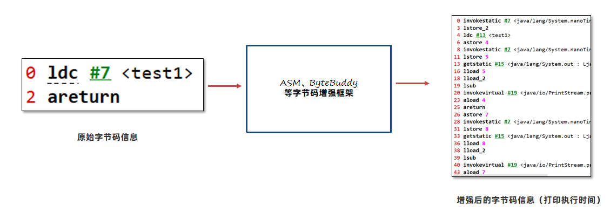

ASM是一个通用的 Java 字节码操作和分析框架。它可用于直接以二进制形式修改现有类或动态生成类。ASM重点关注性能。让操作尽可能小且尽可能快，所以它非常适合在动态系统中使用。ASM的缺点是代码复杂。

ASM的官方网址：https://asm.ow2.io/ 操作步骤： 1、引入依赖

```XML
<dependency>
    <groupId>org.ow2.asm</groupId>
    <artifactId>asm</artifactId>
    <version>9.6</version>
</dependency>
```

2、搭建基础框架，此代码为固定代码。

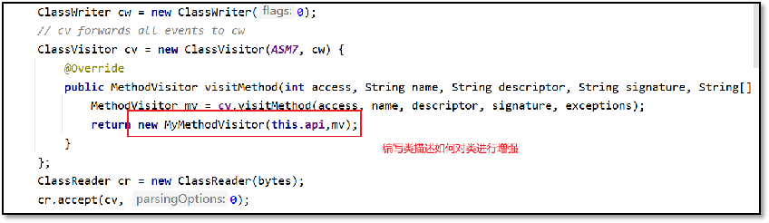

3、编写一个类描述如何去增强类，类需要继承自MethodVisitor

ASM基础案例：

```Java
package com.itheima.jvm.javaagent.demo05;

import org.objectweb.asm.*;

import java.io.IOException;
import java.io.InputStream;
import java.lang.reflect.InvocationTargetException;

import static org.objectweb.asm.Opcodes.*;

public class ASMDemo {

    public static byte[] classASM(byte[] bytes){
        ClassWriter cw = new ClassWriter(0);
        // cv forwards all events to cw
        ClassVisitor cv = new ClassVisitor(ASM7, cw) {
            @Override
            public MethodVisitor visitMethod(int access, String name, String descriptor, String signature, String[] exceptions) {
                MethodVisitor mv = cv.visitMethod(access, name, descriptor, signature, exceptions);
                return new MyMethodVisitor(this.api,mv);
            }
        };
        ClassReader cr = new ClassReader(bytes);
        cr.accept(cv, 0);

        return cw.toByteArray();
    }

    public static void main(String[] args) throws IOException, NoSuchMethodException, InvocationTargetException, InstantiationException, IllegalAccessException {
        InputStream inputStream = ASMDemo.class.getResourceAsStream("/com/itheima/jvm/javaagent/demo05/ASMDemo.class");
        byte[] b1 = inputStream.readAllBytes();

        byte[] b2 = classASM(b1); // b2 represents the same class as b1

        //创建类加载器
        MyClassLoader myClassLoader = new MyClassLoader();
        Class clazz = myClassLoader.defineClass("com.itheima.jvm.javaagent.demo05.ASMDemo", b2);
        clazz.getDeclaredConstructor().newInstance();
    }
}

class MyClassLoader extends ClassLoader {
    public Class defineClass(String name, byte[] b) {
        return defineClass(name, b, 0, b.length);
    }
}

class MyMethodVisitor extends MethodVisitor {

    public MyMethodVisitor(int api, MethodVisitor methodVisitor) {
        super(api, methodVisitor);
    }

    @Override
    public void visitCode() {
        mv.visitFieldInsn(Opcodes.GETSTATIC,"java/lang/System","out","Ljava/io/PrintStream;");
        mv.visitLdcInsn("开始执行");
        mv.visitMethodInsn(INVOKEVIRTUAL,"java/io/PrintStream","println","(Ljava/lang/String;)V",false);
        super.visitCode();
    }

    @Override
    public void visitInsn(int opcode) {
        if(opcode == ARETURN || opcode == RETURN ) {
            mv.visitFieldInsn(Opcodes.GETSTATIC,"java/lang/System","out","Ljava/io/PrintStream;");
            mv.visitLdcInsn("结束执行");
            mv.visitMethodInsn(INVOKEVIRTUAL,"java/io/PrintStream","println","(Ljava/lang/String;)V",false);
        }
        super.visitInsn(opcode);
    }

    @Override
    public void visitEnd() {
        mv.visitMaxs(20,50);
        super.visitEnd();
    }

}
```

####  Byte Buddy字节码增强技术

Byte Buddy 是一个代码生成和操作库，用于在 Java 应用程序运行时创建和修改 Java 类，而无需编译器的帮助。 Byte Buddy底层基于ASM，提供了非常方便的 API。

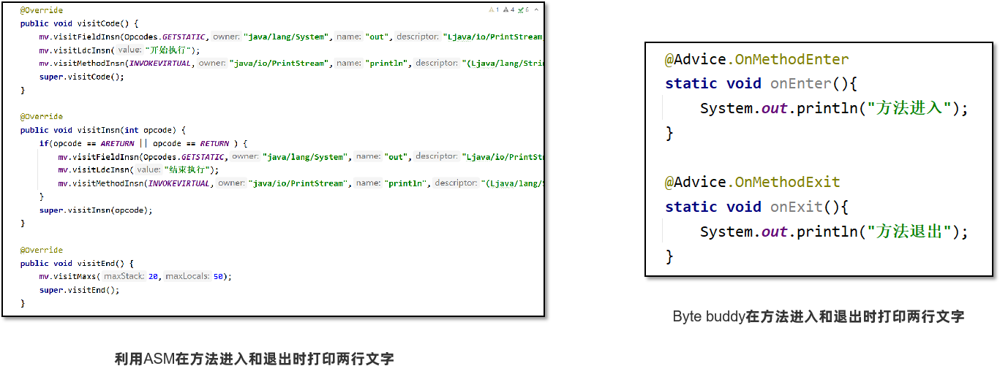

Byte Buddy官网： https://bytebuddy.net/

操作步骤：

1、引入依赖

```XML
<dependency>
    <groupId>net.bytebuddy</groupId>
    <artifactId>byte-buddy</artifactId>
    <version>1.14.10</version>
</dependency>
<dependency>
    <groupId>net.bytebuddy</groupId>
    <artifactId>byte-buddy-agent</artifactId>
    <version>1.14.10</version>
</dependency>
```

2、搭建基础框架，此代码为固定代码

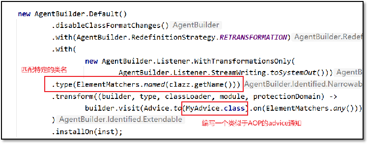

3、编写一个Advice通知描述如何去增强类

```Java
package com.itheima.jvm.javaagent.demo05;

import net.bytebuddy.ByteBuddy;
import net.bytebuddy.agent.ByteBuddyAgent;
import net.bytebuddy.asm.Advice;
import net.bytebuddy.dynamic.DynamicType;
import net.bytebuddy.dynamic.loading.ClassReloadingStrategy;
import net.bytebuddy.matcher.ElementMatchers;

import java.io.IOException;
import java.io.InputStream;
import java.lang.reflect.InvocationTargetException;

public class ByteBuddyDemo {
    public static void main(String[] args) throws IOException, NoSuchMethodException, InvocationTargetException, InstantiationException, IllegalAccessException {

        Foo foo = new Foo();
        MyClassLoader myClassLoader = new MyClassLoader();

        Class<? extends Foo> newClazz = new ByteBuddy()
                .subclass(Foo.class)
                .method(ElementMatchers.any())
                .intercept(Advice.to(MyAdvice.class))
                .make()
                .load(myClassLoader)
                .getLoaded();

        Foo foo1 = newClazz.getDeclaredConstructor().newInstance();
        foo1.test();
    }
}

class MyAdvice {
    @Advice.OnMethodEnter
    static void onEnter(){
        System.out.println("方法进入");
    }

    @Advice.OnMethodExit
    static void onExit(){
        System.out.println("方法退出");
    }

}
```

增强后的代码：

```Java
package com.itheima.jvm.javaagent.demo05;

import net.bytebuddy.agent.builder.AgentBuilder;
import net.bytebuddy.asm.Advice;
import net.bytebuddy.description.method.MethodDescription;
import net.bytebuddy.description.type.TypeDescription;
import net.bytebuddy.dynamic.DynamicType;
import net.bytebuddy.implementation.MethodDelegation;
import net.bytebuddy.matcher.ElementMatchers;
import net.bytebuddy.utility.JavaModule;
import org.jd.core.v1.ClassFileToJavaSourceDecompiler;
import org.jd.core.v1.api.loader.Loader;
import org.jd.core.v1.api.loader.LoaderException;
import org.jd.core.v1.api.printer.Printer;

import java.lang.instrument.ClassFileTransformer;
import java.lang.instrument.IllegalClassFormatException;
import java.lang.instrument.Instrumentation;
import java.lang.instrument.UnmodifiableClassException;
import java.security.ProtectionDomain;
import java.util.Scanner;

import static net.bytebuddy.matcher.ElementMatchers.isMethod;

public class ClassEnhancerCommand {


    //获取类信息
    public static void enhanceClass(Instrumentation inst){
        Scanner scanner = new Scanner(System.in);
        System.out.println("请输入类名:");
        String next = scanner.next();
        Class[] allLoadedClasses = inst.getAllLoadedClasses();
        System.out.println("要查找的类名是:" + next);
        //匹配类名
        for (Class clazz : allLoadedClasses) {
            if(clazz.getName().equals(next)){
                System.out.println("找到了类,类加载器为:" + clazz.getClassLoader());

                new AgentBuilder.Default()
                        .disableClassFormatChanges()
                        .with(AgentBuilder.RedefinitionStrategy.RETRANSFORMATION)
                        .with( //new AgentBuilder.Listener.WithErrorsOnly(
                                new AgentBuilder.Listener.WithTransformationsOnly(
                                        AgentBuilder.Listener.StreamWriting.toSystemOut()))
                        //.type(ElementMatchers.isAnnotatedWith(named("org.springframework.web.bind.annotation.RestController")))
                        .type(ElementMatchers.named(clazz.getName()))
                        .transform((builder, type, classLoader, module, protectionDomain) ->
                                builder.visit(Advice.to(MyAdvice.class).on(ElementMatchers.any()))
//                                builder .method(ElementMatchers.any())
//                                        .intercept(MethodDelegation.to(MyInterceptor.class))
                        )
                        .installOn(inst);
            }
        }
    }
}
package com.itheima.jvm.javaagent.demo07;

import net.bytebuddy.asm.Advice;

class MyAdvice {
    @Advice.OnMethodEnter
    static long enter(@Advice.AllArguments Object[] ary) {
        if(ary != null) {
            for(int i =0 ; i < ary.length ; i++){
                System.out.println("Argument: " + i + " is " + ary[i]);
            }
        }
        return System.nanoTime();
    }

    @Advice.OnMethodExit
    static void exit(@Advice.Enter long value) {
        System.out.println("耗时为：" + (System.nanoTime() - value) + "纳秒");
    }
}
```

最后将整个简化版的arthas进行打包，在服务器上进行测试。使用maven-shade-plugin插件可以将所有依赖打入同一个jar包中并指定入口main方法。

```XML
<!--打包成jar包使用-->

<plugin>
    <groupId>org.apache.maven.plugins</groupId>
    <artifactId>maven-shade-plugin</artifactId>
    <version>1.4</version>
    <executions>
        <execution>
            <phase>package</phase>
            <goals>
                <goal>shade</goal>
            </goals>
            <configuration>
                <finalName>itheima-attach-agent</finalName>
                <transformers>
                    <!--java -jar 默认启动的主类-->
                    <transformer
                            implementation="org.apache.maven.plugins.shade.resource.ManifestResourceTransformer">
                        <mainClass>com.itheima.jvm.javaagent.AttachMain</mainClass>
                    </transformer>
                </transformers>
            </configuration>
        </execution>
    </executions>
</plugin>
```

## 3.3 实战案例2：APM系统的数据采集

Application performance monitor (APM) 应用程序性能监控系统是采集运行程序的实时数据并使用可视化的方式展示，使用APM可以确保系统可用性，优化服务性能和响应时间，持续改善用户体验。常用的APM系统有Apache Skywalking、Zipkin等。 Skywalking官方网站: https://skywalking.apache.org/

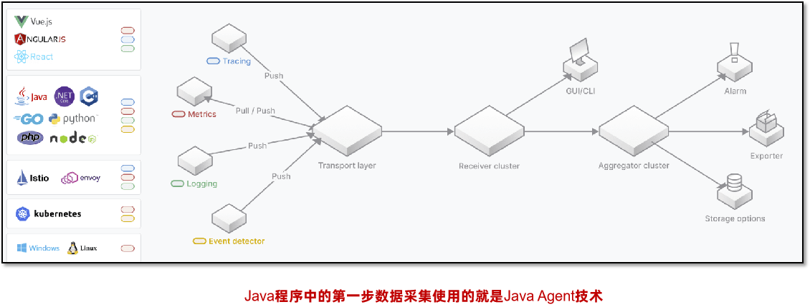

需求：

编写一个简化版的APM数据采集程序，具备以下几个功能：

1、无侵入性获取spring boot应用中，controller层方法的调用时间。

2、将所有调用时间写入文件中。

问题：

Java agent 采用静态加载模式 还是 动态加载模式？

一般程序启动之后就需要持续地进行信息的采集，所以采用静态加载模式。

### Java Agent参数的获取

在Java Agent中，可以通过如下的方式传递参数：

java -javaagent:./agent.jar=参数 -jar test.jar

接下来通过premain参数中的agentArgs字段获取：

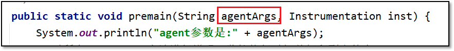

如果有多个参数，可以使用如下方式：

java -javaagent:./agent.jar=param1=value1,param2=value2 -jar test.jar

在Java代码中使用字符串解析出对应的key value。

在Java Agent中如果需要传递参数到Byte Buddy，可以采用如下的方式：

1、绑定Key Value，Key是一个自定义注解，Value是参数的值。

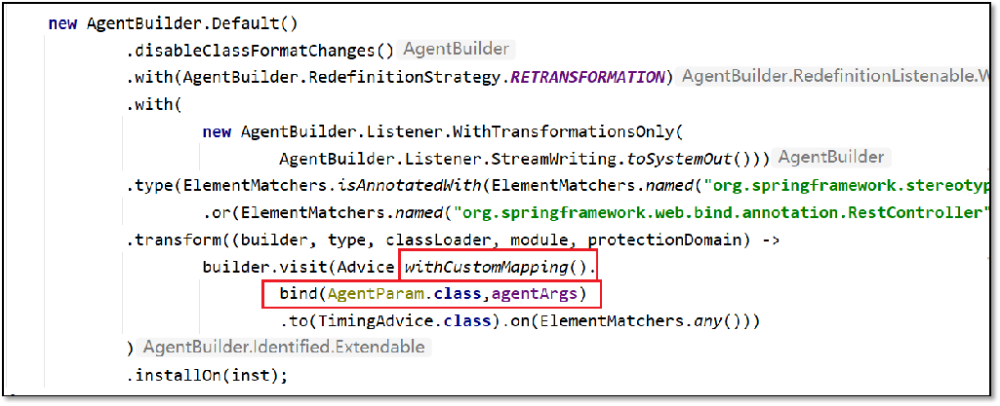

2、自定义注解

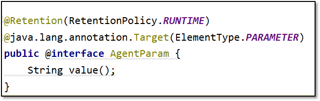

3、通过注解注入

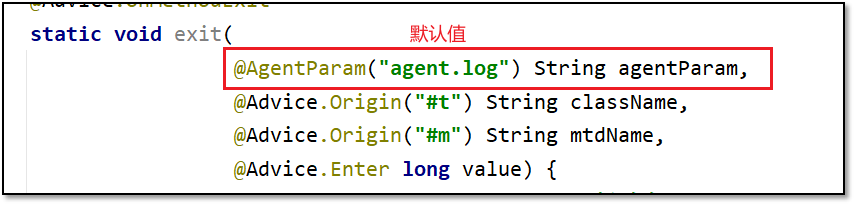

代码：

```Java
package com.itheima.javaagent;

import com.itheima.javaagent.command.ClassCommand;
import com.itheima.javaagent.command.MemoryCommand;
import com.itheima.javaagent.command.ThreadCommand;
import com.itheima.javaagent.enhancer.AgentParam;
import com.itheima.javaagent.enhancer.MyAdvice;
import com.itheima.javaagent.enhancer.TimingAdvice;
import net.bytebuddy.agent.builder.AgentBuilder;
import net.bytebuddy.asm.Advice;
import net.bytebuddy.matcher.ElementMatchers;

import java.lang.instrument.Instrumentation;
import java.util.Scanner;

public class AgentMain {
    //premain方法
    public static void premain(String agentArgs, Instrumentation inst){
        //使用bytebuddy增强类
        new AgentBuilder.Default()
                //禁止byte buddy处理时修改类名
                .disableClassFormatChanges()
                //处理时使用retransform增强
                .with(AgentBuilder.RedefinitionStrategy.RETRANSFORMATION)
                //打印出错误日志
                .with(new AgentBuilder.Listener.WithTransformationsOnly(AgentBuilder.Listener.StreamWriting
                        .toSystemOut()))
                //匹配哪些类
                .type(ElementMatchers.isAnnotatedWith(ElementMatchers.named("org.springframework.web.bind.annotation.RestController")
                        .or(ElementMatchers.named("org.springframework.web.bind.annotation.Controller")))
                )
                //增强，使用MyAdvice通知，对所有方法都进行增强
                .transform((builder, typeDescription, classLoader, module, protectionDomain) ->
                        builder.visit(Advice
                                        .withCustomMapping()
                                        .bind(AgentParam.class,agentArgs)
                                .to(TimingAdvice.class).on(ElementMatchers.any())))
                .installOn(inst);
    }

   

}
package com.itheima.javaagent.enhancer;

import net.bytebuddy.asm.Advice;
import org.apache.commons.io.FileUtils;

import java.io.File;
import java.io.IOException;
import java.nio.charset.StandardCharsets;

//统计耗时，打印方法名、类名
public class TimingAdvice {

    //方法进入时，返回开始时间
    @Advice.OnMethodEnter
    static long enter(){
        return System.nanoTime();
    }

    //方法退出时候，统计方法执行耗时
    @Advice.OnMethodExit
    static void exit(@Advice.Enter long value,
                     @Advice.Origin("#t") String className,
                     @Advice.Origin("#m") String methodName,
                     @AgentParam("agent.log") String fileName){
        String str = methodName + "@" + className + "耗时为: " + (System.nanoTime() - value) + "纳秒\n";
        try {
            FileUtils.writeStringToFile(new File(fileName),str, StandardCharsets.UTF_8,true);
        } catch (IOException e) {
            e.printStackTrace();
        }
    }
}
```

修改jar包名字，并重新打包：

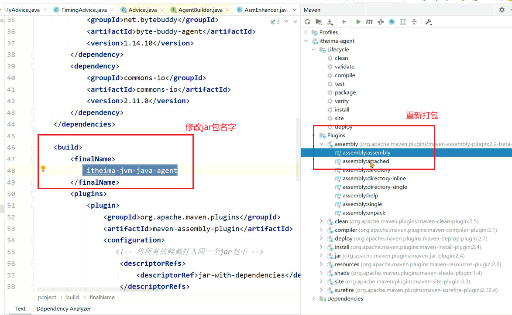

启动spring boot服务时，添加javaagent的路径,并添加文件名参数:

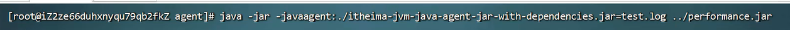

打印结果：

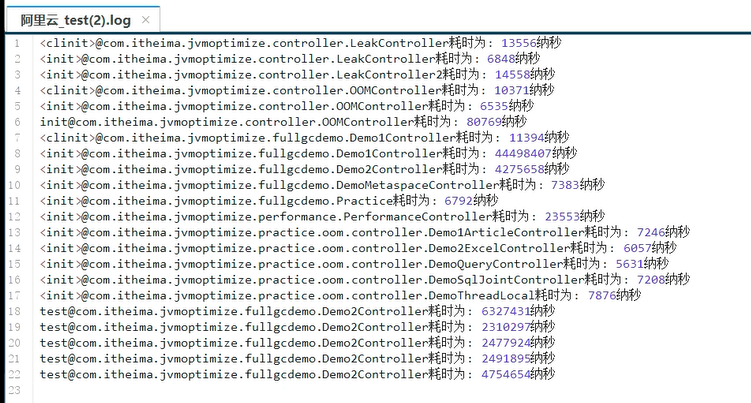

### 总结：

**Arthas这款工具用到了什么Java技术，有没有了解过？**

回答：

Arthas主要使用了Java Agent技术，这种技术可以让运行中的Java程序执行Agent中编写代码。

Arthas使用了Agent中的动态加载模式，可以选择让某个特定的Java进程加载Agent并执行其中的监控代码。监控方面主要使用的就是JMX提供的一些监控指标，同时使用字节码增强技术，对某些类和某些方法进行增强，从而监控方法的执行耗时、参数等内容。

**APM系统是如何获取到Java程序运行中的性能数据的？**

回答：

APM系统比如Skywalking主要使用了Java Agent技术，这种技术可以让运行中的Java程序执行Agent中编写代码。

Skywalking编写了Java Agent，使用了Agent中的静态加载模式，使用字节码增强技术，对某些类和某些方法进行增强，从而监控方法的执行耗时、参数等内容。比如对Controller层方法增强，获取接口调用的时长信息，对数据库连接增强，获取数据库查询的时长、SQL语句等信息。