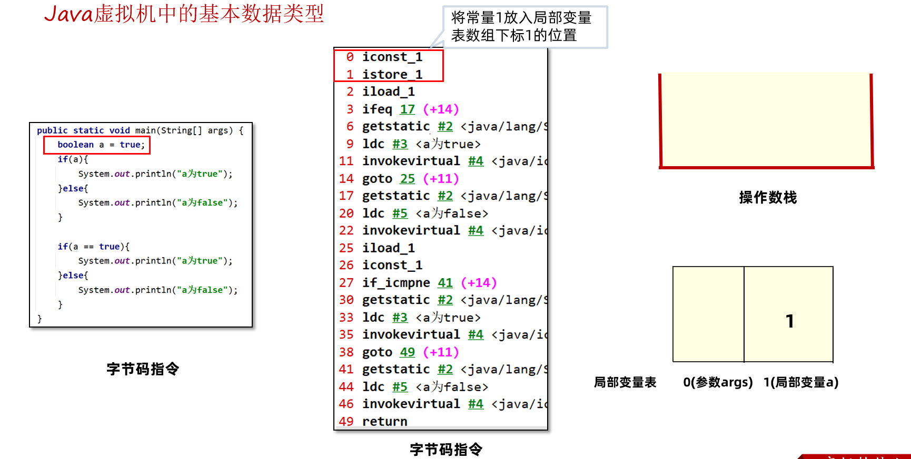
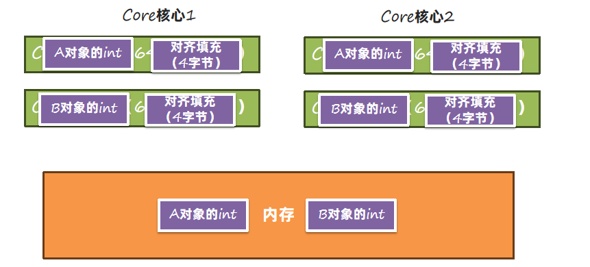
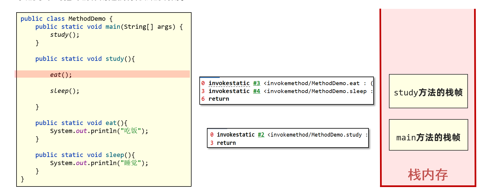
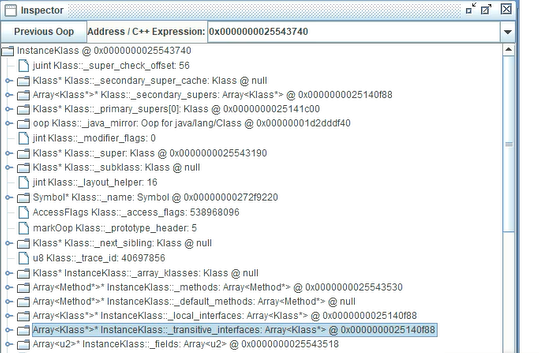
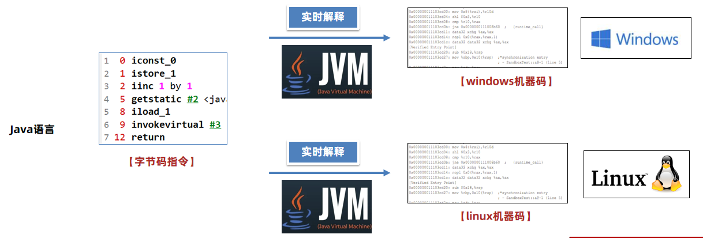

# 1、栈上的数据存储

在Java中有8大基本数据类型：


这里的内存占用，指的是堆上或者数组中内存分配的空间大小，栈上的实现更加复杂。

以基础篇的这段代码为例：


Java中的8大数据类型在虚拟机中的实现：


**boolean、byte、char、short在栈上是不是存在空间浪费？**

是的，Java虚拟机采用的是空间换时间方案，在栈上不存储具体的类型，只根据slot槽进行数据的处理，浪费了一些内存空间但是避免不同数据类型不同处理方式带来的时间开销。

同时，像long型在64位系统中占用2个slot，使用了16字节空间，但实际上在Hotspot虚拟机中，它的高8个字节没有使用，这样就满足了long型使用8个字节的需要。

## boolean数据类型保存方式

**需求：**

编写如下代码，并查看字节码文件中对boolean数据类型处理的指令。

```Java
package demo1;

public class Demo01 {
    public static void main(String[] args) {
        boolean a = false;
        if(a){
            System.out.println("a为true");
        }else{
            System.out.println("a为false");
        }

        if(a == true){
            System.out.println("a为true");
        }else{
            System.out.println("a为false");
        }
    }
}
```

1、常量1先放入局部变量表，相当于给a赋值为true。



2、将1与0比较（判断a是否为false），相当跳转到偏移量17的位置，不相等继续向下运行。这里显然是不相等的。


3、将局部变量表a的值取出来放到操作数栈中，再定义一个常量1，比对两个值是否相等。其实就是判断a == true，如果相等继续向下运行，不相等跳转到偏移量41也就是执行else部分代码。这里显然是相等的。


在Java虚拟机中栈上boolean类型保存方式与int类型相同，所以它的值如果是1代表true，如果是0代表false。但是我们可以通过修改字节码文件，让它的值超过1。

**需求2：**

使用ASM框架修改字节码指令，将iconst1指令修改为iconst2，并测试验证结果。

1、借助于ASM插件：


2、通过插件打开ASM界面：


将代码复制出来，修改一下导出Class文件：

```Java
package demo1;

import java.io.File;
import java.util.*;

import org.apache.commons.io.FileUtils;
import org.objectweb.asm.*;

public class Demo01Dump implements Opcodes {

    public static void main(String[] args) throws Exception {
        FileUtils.writeByteArrayToFile(new File("D:\\Demo01.class"),dump());
    }

    public static byte[] dump() throws Exception {

        ClassWriter cw = new ClassWriter(0);
        FieldVisitor fv;
        MethodVisitor mv;
        AnnotationVisitor av0;

        cw.visit(52, ACC_PUBLIC + ACC_SUPER, "demo1/Demo01", null, "java/lang/Object", null);

        cw.visitSource("Demo01.java", null);

        {
            mv = cw.visitMethod(ACC_PUBLIC, "<init>", "()V", null, null);
            mv.visitCode();
            Label l0 = new Label();
            mv.visitLabel(l0);
            mv.visitLineNumber(3, l0);
            mv.visitVarInsn(ALOAD, 0);
            mv.visitMethodInsn(INVOKESPECIAL, "java/lang/Object", "<init>", "()V", false);
            mv.visitInsn(RETURN);
            Label l1 = new Label();
            mv.visitLabel(l1);
            mv.visitLocalVariable("this", "Ldemo1/Demo01;", null, l0, l1, 0);
            mv.visitMaxs(1, 1);
            mv.visitEnd();
        }
        {
            mv = cw.visitMethod(ACC_PUBLIC + ACC_STATIC, "main", "([Ljava/lang/String;)V", null, null);
            mv.visitCode();
            Label l0 = new Label();
            mv.visitLabel(l0);
            mv.visitLineNumber(5, l0);
            mv.visitInsn(ICONST_2);
            mv.visitVarInsn(ISTORE, 1);
            Label l1 = new Label();
            mv.visitLabel(l1);
            mv.visitLineNumber(6, l1);
            mv.visitVarInsn(ILOAD, 1);
            Label l2 = new Label();
            mv.visitJumpInsn(IFEQ, l2);
            Label l3 = new Label();
            mv.visitLabel(l3);
            mv.visitLineNumber(7, l3);
            mv.visitFieldInsn(GETSTATIC, "java/lang/System", "out", "Ljava/io/PrintStream;");
            mv.visitLdcInsn("a\u4e3atrue");
            mv.visitMethodInsn(INVOKEVIRTUAL, "java/io/PrintStream", "println", "(Ljava/lang/String;)V", false);
            Label l4 = new Label();
            mv.visitJumpInsn(GOTO, l4);
            mv.visitLabel(l2);
            mv.visitLineNumber(9, l2);
            mv.visitFrame(Opcodes.F_APPEND, 1, new Object[]{Opcodes.INTEGER}, 0, null);
            mv.visitFieldInsn(GETSTATIC, "java/lang/System", "out", "Ljava/io/PrintStream;");
            mv.visitLdcInsn("a\u4e3afalse");
            mv.visitMethodInsn(INVOKEVIRTUAL, "java/io/PrintStream", "println", "(Ljava/lang/String;)V", false);
            mv.visitLabel(l4);
            mv.visitLineNumber(12, l4);
            mv.visitFrame(Opcodes.F_SAME, 0, null, 0, null);
            mv.visitVarInsn(ILOAD, 1);
            mv.visitInsn(ICONST_1);
            Label l5 = new Label();
            mv.visitJumpInsn(IF_ICMPNE, l5);
            Label l6 = new Label();
            mv.visitLabel(l6);
            mv.visitLineNumber(13, l6);
            mv.visitFieldInsn(GETSTATIC, "java/lang/System", "out", "Ljava/io/PrintStream;");
            mv.visitLdcInsn("a\u4e3atrue");
            mv.visitMethodInsn(INVOKEVIRTUAL, "java/io/PrintStream", "println", "(Ljava/lang/String;)V", false);
            Label l7 = new Label();
            mv.visitJumpInsn(GOTO, l7);
            mv.visitLabel(l5);
            mv.visitLineNumber(15, l5);
            mv.visitFrame(Opcodes.F_SAME, 0, null, 0, null);
            mv.visitFieldInsn(GETSTATIC, "java/lang/System", "out", "Ljava/io/PrintStream;");
            mv.visitLdcInsn("a\u4e3afalse");
            mv.visitMethodInsn(INVOKEVIRTUAL, "java/io/PrintStream", "println", "(Ljava/lang/String;)V", false);
            mv.visitLabel(l7);
            mv.visitLineNumber(17, l7);
            mv.visitFrame(Opcodes.F_SAME, 0, null, 0, null);
            mv.visitInsn(RETURN);
            Label l8 = new Label();
            mv.visitLabel(l8);
            mv.visitLocalVariable("args", "[Ljava/lang/String;", null, l0, l8, 0);
            mv.visitLocalVariable("a", "Z", null, l1, l8, 1);
            mv.visitMaxs(2, 2);
            mv.visitEnd();
        }
        cw.visitEnd();

        return cw.toByteArray();
    }
}
```

注意这句已经修改为iconst_2:


使用jclasslib查看字节码文件：


执行字节码文件：


这里就出现了两个判断语句结果不一致的情况：

第一个判断是将2和0比较，如果不相同就继续运行if下面的分支不会走else分支，显然会走if下面的分支。


第二个判断是将2和1比较，相等走if下面的分支，否则走else。这里由于2和1不相等就会走else分支。


**这个案例就可以证明在栈上boolean类型确实是使用了int类型来保存的。**

## 栈中的数据要保存到堆上或者从堆中加载到栈上时怎么处理？

1、堆中的数据加载到栈上，由于栈上的空间大于或者等于堆上的空间，所以直接处理但是需要注意下符号位。

boolean、char为无符号，低位复制，高位补0


byte、short为有符号，低位复制，高位非负则补0，负则补1


2、栈中的数据要保存到堆上，byte、char、short由于堆上存储空间较小，需要将高位去掉。boolean比较特殊，只取低位的最后一位保存。


### 案例：验证boolean从栈保存到堆上只取最后一位

将a保存在堆上（使用static），使用ASM框架修改字节码指令，将iconst1指令修改为iconst2和iconst3，并测试验证结果。

```Java
package demo1;

public class Demo02 {
    static boolean a;
    public static void main(String[] args) {
        a = true;
        if(a){
            System.out.println("a为true");
        }else{
            System.out.println("a为false");
        }

        if(a == true){
            System.out.println("a为true");
        }else{
            System.out.println("a为false");
        }
    }
}
```

完整生成class字节码文件的代码:

```Java
package demo1;

import java.io.File;
import java.util.*;

import org.apache.commons.io.FileUtils;
import org.objectweb.asm.*;

public class Demo02Dump implements Opcodes {

    public static void main(String[] args) throws Exception {
        FileUtils.writeByteArrayToFile(new File("D:\\demo1\\Demo02.class"),dump());
    }

    public static byte[] dump() throws Exception {

        ClassWriter cw = new ClassWriter(0);
        FieldVisitor fv;
        MethodVisitor mv;
        AnnotationVisitor av0;

        cw.visit(52, ACC_PUBLIC + ACC_SUPER, "demo1/Demo02", null, "java/lang/Object", null);

        cw.visitSource("Demo02.java", null);

        {
            fv = cw.visitField(ACC_STATIC, "a", "Z", null, null);
            fv.visitEnd();
        }
        {
            mv = cw.visitMethod(ACC_PUBLIC, "<init>", "()V", null, null);
            mv.visitCode();
            Label l0 = new Label();
            mv.visitLabel(l0);
            mv.visitLineNumber(3, l0);
            mv.visitVarInsn(ALOAD, 0);
            mv.visitMethodInsn(INVOKESPECIAL, "java/lang/Object", "<init>", "()V", false);
            mv.visitInsn(RETURN);
            Label l1 = new Label();
            mv.visitLabel(l1);
            mv.visitLocalVariable("this", "Ldemo1/Demo02;", null, l0, l1, 0);
            mv.visitMaxs(1, 1);
            mv.visitEnd();
        }
        {
            mv = cw.visitMethod(ACC_PUBLIC + ACC_STATIC, "main", "([Ljava/lang/String;)V", null, null);
            mv.visitCode();
            Label l0 = new Label();
            mv.visitLabel(l0);
            mv.visitLineNumber(6, l0);
            mv.visitInsn(ICONST_3);
            mv.visitFieldInsn(PUTSTATIC, "demo1/Demo02", "a", "Z");
            Label l1 = new Label();
            mv.visitLabel(l1);
            mv.visitLineNumber(7, l1);
            mv.visitFieldInsn(GETSTATIC, "demo1/Demo02", "a", "Z");
            Label l2 = new Label();
            mv.visitJumpInsn(IFEQ, l2);
            Label l3 = new Label();
            mv.visitLabel(l3);
            mv.visitLineNumber(8, l3);
            mv.visitFieldInsn(GETSTATIC, "java/lang/System", "out", "Ljava/io/PrintStream;");
            mv.visitLdcInsn("a\u4e3atrue");
            mv.visitMethodInsn(INVOKEVIRTUAL, "java/io/PrintStream", "println", "(Ljava/lang/String;)V", false);
            Label l4 = new Label();
            mv.visitJumpInsn(GOTO, l4);
            mv.visitLabel(l2);
            mv.visitLineNumber(10, l2);
            mv.visitFrame(Opcodes.F_SAME, 0, null, 0, null);
            mv.visitFieldInsn(GETSTATIC, "java/lang/System", "out", "Ljava/io/PrintStream;");
            mv.visitLdcInsn("a\u4e3afalse");
            mv.visitMethodInsn(INVOKEVIRTUAL, "java/io/PrintStream", "println", "(Ljava/lang/String;)V", false);
            mv.visitLabel(l4);
            mv.visitLineNumber(13, l4);
            mv.visitFrame(Opcodes.F_SAME, 0, null, 0, null);
            mv.visitFieldInsn(GETSTATIC, "demo1/Demo02", "a", "Z");
            mv.visitInsn(ICONST_1);
            Label l5 = new Label();
            mv.visitJumpInsn(IF_ICMPNE, l5);
            Label l6 = new Label();
            mv.visitLabel(l6);
            mv.visitLineNumber(14, l6);
            mv.visitFieldInsn(GETSTATIC, "java/lang/System", "out", "Ljava/io/PrintStream;");
            mv.visitLdcInsn("a\u4e3atrue");
            mv.visitMethodInsn(INVOKEVIRTUAL, "java/io/PrintStream", "println", "(Ljava/lang/String;)V", false);
            Label l7 = new Label();
            mv.visitJumpInsn(GOTO, l7);
            mv.visitLabel(l5);
            mv.visitLineNumber(16, l5);
            mv.visitFrame(Opcodes.F_SAME, 0, null, 0, null);
            mv.visitFieldInsn(GETSTATIC, "java/lang/System", "out", "Ljava/io/PrintStream;");
            mv.visitLdcInsn("a\u4e3afalse");
            mv.visitMethodInsn(INVOKEVIRTUAL, "java/io/PrintStream", "println", "(Ljava/lang/String;)V", false);
            mv.visitLabel(l7);
            mv.visitLineNumber(18, l7);
            mv.visitFrame(Opcodes.F_SAME, 0, null, 0, null);
            mv.visitInsn(RETURN);
            Label l8 = new Label();
            mv.visitLabel(l8);
            mv.visitLocalVariable("args", "[Ljava/lang/String;", null, l0, l8, 0);
            mv.visitMaxs(2, 1);
            mv.visitEnd();
        }
        cw.visitEnd();

        return cw.toByteArray();
    }
}
```

对于iconst2来说：


2的最后两位是10，所以只取最末尾0。


对于iconst3来说：


2的最后两位是11，所以只取最末尾1。


# 2、对象在堆上是如何存储的？

对象在堆中的内存布局，指的是对象在堆中存放时的各个组成部分，主要分为以下几个部分：


## 标记字段

标记字段相对比较复杂。在不同的对象状态（有无锁、是否处于垃圾回收的标记中）下存放的内容是不同的，同时在64位（又分为是否开启指针压缩）、32位虚拟机中的布局都不同。以64位开启指针压缩为例：


怎么确认标记字段的内容呢？我们可以使用JOL，JOL是用于分析 JVM 中对象布局的一款专业工具。工具中使用 Unsafe、JVMTI 和 Serviceability Agent (SA)等虚拟机技术来打印实际的对象内存布局。

使用方法：

1、添加依赖

```XML
<dependency>
    <groupId>org.openjdk.jol</groupId>
    <artifactId>jol-core</artifactId>
    <version>0.9</version>
</dependency>
```

2、使用如下代码打印对象内存布局：

 `System.out.println(ClassLayout.parseInstance(对象).toPrintable());`

代码：

```Java
package oop1;

import org.openjdk.jol.info.ClassLayout;

import java.io.IOException;
//-XX:-UseCompressedOops 关闭压缩指针
public class Student {
    private long id;
    private int age;
    private String name;

    public long getId() {
        return id;
    }

    public void setId(long id) {
        this.id = id;
    }

    public int getAge() {
        return age;
    }

    public void setAge(int age) {
        this.age = age;
    }

    public String getName() {
        return name;
    }

    public void setName(String name) {
        this.name = name;
    }

    public static void main(String[] args) throws IOException {
        Student student = new Student();
        System.out.println(Integer.toBinaryString(student.hashCode()));
        System.out.println(ClassLayout.parseInstance(student).toPrintable());
        System.in.read();
    }
}
//0010011 01011111 10111010 10100100
//  0x26163608
```

打印结果如下：


和hashcode值是一致的（注意小端存储，结果会倒着写）


## 元数据的指针

Klass pointer元数据的指针指向方法区中保存的InstanceKlass对象：


## 指针压缩

在64位的Java虚拟机中，Klass Pointer以及对象数据中的对象引用都需要占用8个字节，为了减少这部分的内存使用量，64 位 Java 虚拟机使用指针压缩技术，将堆中原本 8个字节的 指针压缩成 4个字节 ，此功能默认开启，可以使用-XX:-UseCompressedOops关闭。


指针压缩的思想是将寻址的单位放大，比如原来按1字节去寻址，现在可以按8字节寻址。如下图所示，原来按1去寻址，能拿到1字节开始的数据，现在按1去寻址，就可以拿到8个字节开始的数据。


这与停车场是类似的。以前需要记录我的车占用了那几米的空间，现在只需要记下停车场的编号：


这样将编号当成地址，就可以用更小的内存访问更多的数据。但是这样的做法有两个问题：

1、需要进行内存对齐，指的是将对象的内存占用填充至8字节的倍数。存在空间浪费（对于Hotspot来说不存在，即便不开启指针压缩，也需要进行内存对齐）


2、寻址大小仅仅能支持2的35 次方个字节（32GB，如果超过32GB指针压缩会自动关闭）。不用压缩指针，应该是2的64次方 = 16EB，用了压缩指针就变成了8（字节） = 2的3次方 * 2的32次方 = 2的35次方


### 案例：在hsdb工具中验证klass pointer正确性

操作步骤：

1、使用JOL打印对象的Klass Pointer。

2、使用Klass Pointer的地址，在hsdb工具中使用Inspector找到InstanceKlass对象。

注意：由于使用了小端存储，打印的地址要反着读。


这个0x254d3608就是klass对象的地址：


## 内存对齐

对象中还有一部分内容就是对齐。内存对齐指的是对象中会空出来几个字节，不做任何数据存储。内存对齐主要目的是为了解决并发情况下CPU缓存失效的问题：

在内存中缓存了A和B的数据


A的数据写入时，由于A和B在同一个缓存行中，所以A和B的缓存数据都会被清空:


这样就需要再从内存中读取一次：


我们只修改了A对象的数据，引起了B对象的缓存失效。

内存对齐解决了这个问题：内存对齐之后，同一个缓存行中不会出现不同对象的属性。在并发情况下，如果让A对象一个缓存行失效，是不会影响到B对象的缓存行的。



内存对齐要求每个对象字节数是8的倍数，除了添加字节填充之外，还有字段的要求。

在Hotspot中，要求每个属性的偏移量Offset（字段地址 –  起始地址）必须是字段长度的N倍。

比如下图中，Student类中的id属性类型为long，那么偏移量就必须是8的倍数。所以将id和age的字段顺序进行了调整，这种方式叫**字段重排列**。


这样可以更容易让一个字段在一整个缓存行中，提升缓存行读取的效率。

如果不满足要求，会尝试使用内存对齐，通过在属性之间插入一块对齐区域达到目的。

如下图中，name字段是引用占用8个字节（关闭了指针压缩），所以Offset必须是8的倍数，在age和name之间插入了4个字节的空白区域。


### 案例：子类和父类的偏移量

需求：

通过如下代码验证下：子类继承自父类的属性，属性的偏移量和父类是一致的。

```Java
package oop1;

class A {
    long l;
    int i;
    String name;
}

class B extends A {
    long l;
    int i;
}

class C{
    long l1;
    int i1;
    String name;
    long l2;
    int i2;
}
```

结果如下：


总结：


# 3、方法调用的原理

方法调用的本质是通过字节码指令的执行，能在栈上创建栈帧，并执行调用方法中的字节码执行。以invoke开头的字节码指令的作用是执行方法的调用。

1、调用study方法，会执行invokestatic指令，Java虚拟机找到#2对应的方法，也就是study方法，创建栈帧。


2、eat和sleep方法也是类似的处理方式。



3、方法栈帧创建之后，就可以执行方法里的字节码指令了。


在JVM中，一共有五个字节码指令可以执行方法调用：

1、invokestatic：调用静态方法


2、invokespecial: 调用对象的private方法、构造方法，以及使用 super 关键字调用父类实例的方法、构造方法，以及所实现接口的默认方法。


3、invokevirtual：调用对象的非private方法。


4、invokeinterface：调用接口对象的方法。


5、invokedynamic：用于调用动态方法，主要应用于lambda表达式中，机制极为复杂了解即可。

**Invoke方法的核心作用就是找到字节码指令并执行。**

Invoke指令执行时，需要找到方法区中instanceKlass中保存的方法相关的字节码信息。但是方法区中有很多类，每一个类又包含很多个方法，怎么精确地定位到方法的位置呢？


## 静态绑定

1、编译期间，invoke指令会携带一个参数符号引用，引用到常量池中的方法定义。方法定义中包含了类名 + 方法名 + 返回值 + 参数。


2、在方法第一次调用时，这些符号引用就会被替换成内存地址的直接引用，这种方式称之为静态绑定。


静态绑定适用于处理静态方法、私有方法、或者使用final修饰的方法，因为这些方法不能被继承之后重写。

invokestatic

invokespecial

final修饰的invokevirtual

## 动态绑定

对于非static、非private、非final的方法，有可能存在子类重写方法，那么就需要通过动态绑定来完成方法地址绑定的工作。比如在这段代码中，调用的其实是Cat类对象的eat方法，但是编译完之后虚拟机指令中调用的是Animal类的eat方法，这就需要在运行过程中通过动态绑定找到Cat类的eat方法，这样就实现了多态。


动态绑定是基于方法表来完成的，invokevirtual使用了虚方法表（vtable），invokeinterface使用了接口方法表(itable)，整体思路类似。所以接下来使用invokevirtual和虚方法表来解释整个过程。

每个类中都有一个虚方法表，本质上它是一个数组，记录了方法的地址。子类方法表中包含父类方法表中的所有方法；子类如果重写了父类方法，则使用自己类中方法的地址进行替换。


产生invokevirtual调用时，先根据对象头中的类型指针找到方法区中InstanceClass对象，获得虚方法表。再根据虚方法表找到对应的对方，获得方法的地址，最后调用方法。


代码：

```Java
package invokemethod;

import java.io.IOException;

//-XX:-UseCompressedOops
public abstract class Animal {

    public abstract void eat();

    @Override
    public String toString() {
        return "Animal";
    }

    public static void main(String[] args) throws IOException {
        Animal animal = new Cat();
        animal.eat();
        System.in.read();
    }
}

class Cat extends Animal {

    @Override
    public void eat() {
        System.out.println("吃鱼");
    }

    void jump() {
        System.out.println("猫跳了一下");
    }

}


class Dog extends Animal {

    @Override
    public void eat() {
        System.out.println("啃骨头");
    }
}
```

**演示动态绑定：**

1、在HSDB中，打开Query查询界面：


2、写上类似SQL的查询语句，查询Cat类：


3、查到了这个对象，但是看不到虚方法表里的内容，虚方法表数组长度为7。


4、打开控制台界面。查询2个字word长度的内容，一个字代表CPU字长，32位4个字节，64位8个字节。


5、获得第二个字的内容，第一个8字节是markword，第二个8字节就指向InstanceKlass对象。




但是很遗憾，还是看不到具体的内容，hsdb没有显示那么清楚。

6、直接根据固定的偏移量计算虚方法表的地址，初始地址+1B8:


7、通过控制台的mem命令查询，长度为7，就查7个字长。


8、右边显示的就是方法的地址。这些方法不是来自于父类，可就是来自于当前类。


产生invokevirtual调用时，先根据对象头中的类型指针找到方法区中InstanceClass对象，获得虚方法表。再根据虚方法表找到对应的对方，获得方法的地址，最后调用方法。


## 总结：

在JVM中，一共有五个字节码指令可以执行方法调用：

1、invokestatic：调用静态方法。静态绑定

2、invokespecial: 调用对象的private方法、构造方法，以及使用 super 关键字调用父类实例的方法、构造方法，以及所实现接口的默认方法。静态绑定

3、invokevirtual：调用对象的非private方法。非final方法使用动态绑定，使用虚方法表找到方法的地址，子类会复制父类的虚方法表，如果子类重写了方法，会替换成重写后方法的地址。

4、invokeinterface：调用接口对象的方法。动态绑定，使用接口表找到方法的地址，进行调用。

5、invokedynamic：用于调用动态方法，主要应用于lambda表达式中，机制极为复杂了解即可。

Invoke方法的核心作用就是找到字节码指令并执行。

# 4、异常捕获的原理

在Java中，程序遇到异常时会向外抛出，此时可以使用try-catch捕获异常的方式将异常捕获并继续让程序按程序员设计好的方式运行。比如如下代码：在try代码块中如果抛出了Exception对象或者子类对象，则会进入catch分支。

异常捕获机制的实现，需要借助于编译时生成的异常表。

异常表在编译期生成，存放的是代码中异常的处理信息，包含了异常捕获的生效范围以及异常发生后跳转到的字节码指令位置。

起始/结束PC：此条异常捕获生效的字节码起始/结束位置。

跳转PC：异常捕获之后，跳转到的字节码位置。


在位置2到4字节码指令执行范围内，如果出现了Exception对象的异常或者子类对象异常，直接跳转到位置7的指令。也就是i = 2代码位置。


程序运行中触发异常时，Java 虚拟机会从上至下遍历异常表中的所有条目。当触发异常的字节码的索引值在某个异常表条目的监控范围内，Java 虚拟机会判断所抛出的异常和该条目想要捕获的异常是否匹配。

1、如果匹配，跳转到“跳转PC”对应的字节码位置。

2、如果遍历完都不能匹配，说明异常无法在当前方法执行时被捕获，此方法栈帧直接弹出，在上一层的栈帧中进行异常捕获的查询。


多个catch分支情况下，异常表会从上往下遍历，先捕获RuntimeException，如果捕获不了，再捕获Exception。


finally的处理方式就相对比较复杂一点了，分为以下几个步骤：

1、finally中的字节码指令会插入到try 和 catch代码块中,保证在try和catch执行之后一定会执行finally中的代码。

如下，在`i=1`和`i=2`两段字节码指令之后，都加入了finally下的字节码指令。


2、如果抛出的异常范围超过了Exception，比如Error或者Throwable，此时也要执行finally，所以异常表中增加了两个条目。覆盖了try和catch两段字节码指令的范围，any代表可以捕获所有种类的异常。


# 5、JIT即时编译器

在Java中，JIT即时编译器是一项用来提升应用程序代码执行效率的技术。字节码指令被 Java 虚拟机解释执行，如果有一些指令执行频率高，称之为热点代码，这些字节码指令则被JIT即时编译器编译成机器码同时进行一些优化，最后保存在内存中，将来执行时直接读取就可以运行在计算机硬件上了。



在HotSpot中，有三款即时编译器，C1、C2和Graal，其中Graal在GraalVM章节中已经介绍过。

C1编译效率比C2快，但是优化效果不如C2。所以C1适合优化一些执行时间较短的代码，C2适合优化服务端程序中长期执行的代码。


JDK7之后，采用了分层编译的方式，在JVM中C1和C2会一同发挥作用，分层编译将整个优化级别分成了5个等级。

| 等级 | 使用的组件   | 描述                                 | 保存的内容                                             | 性能打分（1 - 5） |
| ---- | ------------ | ------------------------------------ | ------------------------------------------------------ | ----------------- |
| 0    | 解释器       | 解释执行记录方法调用次数及循环次数   | 无                                                     | 1                 |
| 1    | C1即时编译器 | C1完整优化                           | 优化后的机器码                                         | 4                 |
| 2    | C1即时编译器 | C1完整优化记录方法调用次数及循环次数 | 优化后的机器码部分额外信息：方法调用次数及循环次数     | 3                 |
| 3    | C1即时编译器 | C1完整优化记录所有额外信息           | 优化后的机器码所有额外信息：分支跳转次数、类型转换等等 | 2                 |
| 4    | C2即时编译器 | C2完整优化                           | 优化后的机器码                                         | 5                 |

C1即时编译器和C2即时编译器都有独立的线程去进行处理，内部会保存一个队列，队列中存放需要编译的任务。一般即时编译器是针对方法级别来进行优化的，当然也有对循环进行优化的设计。


详细来看看C1和C2是如何进行协作的：

1、先由C1执行过程中收集所有运行中的信息，方法执行次数、循环执行次数、分支执行次数等等，然后等待执行次数触发阈值（分层即时编译由JVM动态计算）之后，进入C2即时编译器进行深层次的优化。


2、方法字节码执行数目过少，先收集信息，JVM判断C1和C2优化性能差不多，那之后转为不收集信息，由C1直接进行优化。


3、C1线程都在忙碌的情况下，直接由C2进行优化。


4、C2线程忙碌时，先由2层C1编译收集一些基础信息，多运行一会儿，然后再交由3层C1处理，由于3层C1处理效率不高，所以尽量减少这一层停留时间（C2忙碌着，一直收集也没有意义），最后C2线程不忙碌了再交由C2进行处理。


## 案例：测试JIT即时编译器的优化效果

需求：

1、编写JMH案例，代码如下：

```Java
/*
 * Copyright (c) 2005, 2014, Oracle and/or its affiliates. All rights reserved.
 * DO NOT ALTER OR REMOVE COPYRIGHT NOTICES OR THIS FILE HEADER.
 *
 * This code is free software; you can redistribute it and/or modify it
 * under the terms of the GNU General Public License version 2 only, as
 * published by the Free Software Foundation.  Oracle designates this
 * particular file as subject to the "Classpath" exception as provided
 * by Oracle in the LICENSE file that accompanied this code.
 *
 * This code is distributed in the hope that it will be useful, but WITHOUT
 * ANY WARRANTY; without even the implied warranty of MERCHANTABILITY or
 * FITNESS FOR A PARTICULAR PURPOSE.  See the GNU General Public License
 * version 2 for more details (a copy is included in the LICENSE file that
 * accompanied this code).
 *
 * You should have received a copy of the GNU General Public License version
 * 2 along with this work; if not, write to the Free Software Foundation,
 * Inc., 51 Franklin St, Fifth Floor, Boston, MA 02110-1301 USA.
 *
 * Please contact Oracle, 500 Oracle Parkway, Redwood Shores, CA 94065 USA
 * or visit www.oracle.com if you need additional information or have any
 * questions.
 */

package org.sample;

import org.openjdk.jmh.annotations.*;
import org.openjdk.jmh.infra.Blackhole;
import org.openjdk.jmh.runner.Runner;
import org.openjdk.jmh.runner.RunnerException;
import org.openjdk.jmh.runner.options.Options;
import org.openjdk.jmh.runner.options.OptionsBuilder;

import java.util.concurrent.TimeUnit;
//执行5轮预热，每次持续1秒
@Warmup(iterations = 5, time = 1, timeUnit = TimeUnit.SECONDS)
//执行一次测试
@Fork(value = 1, jvmArgsAppend = {"-Xms1g", "-Xmx1g"})
//显示平均时间，单位纳秒
@BenchmarkMode(Mode.AverageTime)
@OutputTimeUnit(TimeUnit.NANOSECONDS)
@State(Scope.Benchmark)
public class MyJITBenchmark {

    public int add (int a,int b){
        return a + b;
    }

    public int jitTest(){
        int sum = 0;
        for (int i = 0; i < 10000000; i++) {
            sum = add(sum,100);
        }
        return sum;
    }


    //禁用JIT
    @Benchmark
    @Fork(value = 1,jvmArgsAppend = {"-Xint"})
    public void testNoJIT(Blackhole blackhole) {
        int i = jitTest();
        blackhole.consume(i);
    }

    //只使用C1 1层
    @Benchmark
    @Fork(value = 1,jvmArgsAppend = {"-XX:TieredStopAtLevel=1"})
    public void testC1(Blackhole blackhole) {
        int i = jitTest();
        blackhole.consume(i);
    }

    //分层编译
    @Benchmark
    public void testMethod(Blackhole blackhole) {
        int i = jitTest();
        blackhole.consume(i);
    }

    public static void main(String[] args) throws RunnerException {
        Options opt = new OptionsBuilder()
                .include(MyJITBenchmark.class.getSimpleName())
                .forks(1)
                .build();

        new Runner(opt).run();
    }
}
```

2、分别采用三种不同虚拟机参数测试JIT优化效果：不加参数（开启完全JIT即时编译），-Xint（关闭JIT只使用解释器）、-XX:TieredStopAtLevel=1（分层编译下只使用1层C1进行编译）

测试结果如下：


JIT编译器主要优化手段是方法内联和逃逸分析。

## 方法内联

方法内联（Method Inline）：方法体中的字节码指令直接复制到调用方的字节码指令中，节省了创建栈帧的开销。


需求： 1、安装JIT Watch工具，下载源码：https://github.com/AdoptOpenJDK/jitwatch/tree/1.4.2 2、使用资料中提供的脚本文件直接启动。


3、添加源代码目录，点击沙箱环境RUN：


4、通过JIT Watch观察到通过C1调用多次收集信息之后，进入C2优化。C2优化之后的机器码大小非常小。


5、方法调用进行了内联优化，汇编代码中直接使用乘法计算出值再进行累加，这样效率更高。


并不是所有的方法都可以内联，内联有一定的限制：

1、方法编译之后的字节码指令总大小 < 35字节，可以直接内联。（通过-XX:MaxInlineSize=值 控制）

2、方法编译之后的字节码指令总大小 < 325字节，并且是一个热方法。（通过-XX:FreqInlineSize=值 控制）

3、方法编译生成的机器码不能大于1000字节。（通过-XX:InlineSmallCode=值 控制）

4、一个接口的实现必须小于3个，如果大于三个就不会发生内联。

### 案例：String的toUpperCase方法性能优化

需求：

1、String的toUpperCase为了适配很多种不同的语言导致方法编译出来的字节码特别大，通过编写一个方法只处理a-z的大写转换提升性能。

2、通过JIT Watch观察方法内联的情况。

```Java
import java.util.Locale;

public class UpperCase
{
        public String upper;

        public UpperCase()
        {
                int iterations = 10_000_000;

                String source = "Lorem ipsum dolor sit amet, sensibus partiendo eam at.";

                long start = System.currentTimeMillis();
                convertString(source, iterations);
                System.out.println(upper);
                System.out.println(System.currentTimeMillis() - start);

                start = System.currentTimeMillis();
                convertCustom(source, iterations);
                System.out.println(upper);
                System.out.println(System.currentTimeMillis() - start);
        }

        private void convertString(String source, int iterations)
        {
                for (int i = 0; i < iterations; i++)
                {
                        upper = source.toUpperCase(Locale.getDefault());
                }
        }

        private void convertCustom(String source, int iterations)
        {
                for (int i = 0; i < iterations; i++)
                {
                        upper = doUpper(source);
                }
        }

        private String doUpper(String source)
        {
                StringBuilder builder = new StringBuilder();

                int len = source.length();

                for (int i = 0; i < len; i++)
                {
                        char c = source.charAt(i);

                        if (c >= 'a' && c <= 'z')
                        {
                                c -= 32;
                        }

                        builder.append(c);
                }

                return builder.toString();
        }

        public static void main(String[] args)
        {
                new UpperCase();
        }
}
```

3、通过JIT测试性能：

```Java
import java.util.Locale;

public class UpperCase
{
        public String upper;

        public UpperCase()
        {
                int iterations = 10_000_000;

                String source = "Lorem ipsum dolor sit amet, sensibus partiendo eam at.";

                long start = System.currentTimeMillis();
                convertString(source, iterations);
                System.out.println(upper);
                System.out.println(System.currentTimeMillis() - start);

                start = System.currentTimeMillis();
                convertCustom(source, iterations);
                System.out.println(upper);
                System.out.println(System.currentTimeMillis() - start);
        }

        private void convertString(String source, int iterations)
        {
                for (int i = 0; i < iterations; i++)
                {
                        upper = source.toUpperCase(Locale.getDefault());
                }
        }

        private void convertCustom(String source, int iterations)
        {
                for (int i = 0; i < iterations; i++)
                {
                        upper = doUpper(source);
                }
        }

        private String doUpper(String source)
        {
                StringBuilder builder = new StringBuilder();

                int len = source.length();

                for (int i = 0; i < len; i++)
                {
                        char c = source.charAt(i);

                        if (c >= 'a' && c <= 'z')
                        {
                                c -= 32;
                        }

                        builder.append(c);
                }

                return builder.toString();
        }

        public static void main(String[] args)
        {
                new UpperCase();
        }
}
```

最终结果:


自行实现的方法性能要比JDK默认提供的高很多，当然只支持对a-z做大写化。

## 逃逸分析

逃逸分析指的是如果JIT发现在方法内创建的对象不会被外部引用，那么就可以采用锁消除、标量替换等方式进行优化。

这段代码可以使用逃逸分析进行优化，因为test对象不会被外部引用，只会在方法中使用。


这段代码就会有一定的问题，如果在方法中对象被其他静态变量引用，那优化就无法进行。


#### **锁消除**

逃逸分析中的**锁消除**指的是如果对象被判断不会逃逸出去，那么在对象就不存在并发访问问题，对象上的锁处理都不会执行，从而提高性能。比如如下写法


锁消除优化在真正的工作代码中并不常见，一般加锁的对象都是支持多线程去访问的。

#### 标量替换

逃逸分析真正对性能优化比较大的方式是标量替换，在Java虚拟机中，对象中的基本数据类型称为标量，引用的其他对象称为聚合量。标量替换指的是如果方法中的对象不会逃逸，那么其中的标量就可以直接在栈上分配。

如下图中，point对象不存在逃逸，那么就可以将test方法中的字节码指令直接挪到循环中，减少方法调用的开销。


**性能测试**

**需求：**

1、编写JMH性能测试案例，测试方法内联和标量替换之后的性能变化。

2、分别使用三种不同虚拟机参数进行测试：

- 开启方法内联和标量替换
- 关闭标量替换
- 关闭所有优化

3、比对测试结果。

```Java
/*
 * Copyright (c) 2005, 2014, Oracle and/or its affiliates. All rights reserved.
 * DO NOT ALTER OR REMOVE COPYRIGHT NOTICES OR THIS FILE HEADER.
 *
 * This code is free software; you can redistribute it and/or modify it
 * under the terms of the GNU General Public License version 2 only, as
 * published by the Free Software Foundation.  Oracle designates this
 * particular file as subject to the "Classpath" exception as provided
 * by Oracle in the LICENSE file that accompanied this code.
 *
 * This code is distributed in the hope that it will be useful, but WITHOUT
 * ANY WARRANTY; without even the implied warranty of MERCHANTABILITY or
 * FITNESS FOR A PARTICULAR PURPOSE.  See the GNU General Public License
 * version 2 for more details (a copy is included in the LICENSE file that
 * accompanied this code).
 *
 * You should have received a copy of the GNU General Public License version
 * 2 along with this work; if not, write to the Free Software Foundation,
 * Inc., 51 Franklin St, Fifth Floor, Boston, MA 02110-1301 USA.
 *
 * Please contact Oracle, 500 Oracle Parkway, Redwood Shores, CA 94065 USA
 * or visit www.oracle.com if you need additional information or have any
 * questions.
 */

package org.sample;

import org.openjdk.jmh.annotations.*;
import org.openjdk.jmh.infra.Blackhole;
import org.openjdk.jmh.runner.Runner;
import org.openjdk.jmh.runner.RunnerException;
import org.openjdk.jmh.runner.options.Options;
import org.openjdk.jmh.runner.options.OptionsBuilder;

import java.util.Random;
import java.util.concurrent.TimeUnit;

//执行5轮预热，每次持续1秒
@Warmup(iterations = 5, time = 1, timeUnit = TimeUnit.SECONDS)
//执行一次测试
//显示平均时间，单位纳秒
@BenchmarkMode(Mode.AverageTime)
@OutputTimeUnit(TimeUnit.NANOSECONDS)
@Measurement(iterations = 3,time = 1,timeUnit = TimeUnit.SECONDS)
@State(Scope.Benchmark)
public class EscapeAnalysisBenchmark2 {

    public int test(){
        int count = 0;
        for (int i = 0; i < 10000000; i++) {
            Point point = new Point();
            point.test();
        }
        return count;
    }

    @Benchmark
    @Fork(value = 1,jvmArgsAppend = {"-Xmx10m"})
    public void testWithJIT(Blackhole blackhole) {
        int i = test();
        blackhole.consume(i);
    }

    @Benchmark
    @Fork(value = 1,jvmArgsAppend = {"-XX:-DoEscapeAnalysis","-Xmx10m"})
    public void testWithoutEA(Blackhole blackhole) {
        int i = test();
        blackhole.consume(i);
    }

    @Benchmark
    @Fork(value = 1,jvmArgsAppend = {"-Xint","-Xmx10m"})
    public void testWithoutJIT(Blackhole blackhole) {
        int i = test();
        blackhole.consume(i);
    }

        public static void main(String[] args) throws RunnerException {
        Options opt = new OptionsBuilder()
                .include(EscapeAnalysisBenchmark2.class.getSimpleName())
                .forks(1)
                .build();

        new Runner(opt).run();
    }

}


class Point{
    private int x;
    private int y;

    public void test(){
        x = 1;
        y = 2;
        int z = x++;
    }
}
```

测试结果：


性能最高的是JIT功能全开的情况下；不开启逃逸分析，虽然方法内联还生效，但是性能要差很多；完全不开性能就特别差了。

##### 案例：使用JIT Watch工具查看逃逸分析的优化结果需求：

1、在JIT Watch中创建新的文件，将之前准备好的代码复制进去。

2、观察创建对象这一行源代码的字节码信息。

3、对象没有逃离方法的作用域，可以标量替换等方式进行优化。


## 总结

根据JIT即时编器优化代码的特性，在编写代码时注意以下几个事项，可以让代码执行时拥有更好的性能：

1、尽量编写比较小的方法，让方法内联可以生效。

2、高频使用的代码，特别是第三方依赖库甚至是JDK中的，如果内容过度复杂是无法内联的，可以自行实现一个特定的优化版本。

3、注意下接口的实现数量，尽量不要超过2个，否则会影响内联的处理。

4、高频调用的方法中创建对象临时使用，尽量不要让对象逃逸。

# 6、垃圾回收器原理

## 6.1 G1垃圾回收器原理

G1垃圾回收有两种方式：

1、年轻代回收（Young GC）

2、混合回收（Mixed GC）

### 年轻代回收

年轻代回收只扫描年轻代对象（Eden + Survivor），所以从GC Root到年轻代的对象或者年轻代对象引用了其他年轻代的对象都很容易扫描出来。


这里就存在一个问题，年轻代回收只扫描年轻代对象（Eden + Survivor），如果有老年代中的对象引用了年轻代中的对象，我们又如何知道呢？


比如上图中，E对象被对象引用了，那么显然在垃圾回收时E对象是不应该被回收的。

**方案1：从GC Root开始，扫描所有对象，如果年轻代对象在引用链上，就标记为存活。**


重新扫描一遍GC Root关联的所有对象，包括老年代的。这个方案显然不可行，需要遍历引用链上所有对象，效率太低。

**方案2：维护一个详细的表，记录哪个对象被哪个老年代引用了。在年轻代中被引用的对象，不进行回收。**


如上图中，通过引用详情表记录F和E对象分别被A和B对象引用了。问题：如果对象太多这张表会占用很大的内存空间。存在错标的情况

方案2的第一次优化：只记录Region被哪些对象引用了。这种引用详情表称为记忆集 RememberedSet（简称RS或RSet）：是一种记录了从非收集区域对象引用收集区域对象的这些关系的数据结构。扫描时将记忆集中的对象也加入到GC Root中，就可以根据引用链判断哪些对象需要回收了。

问题：如果区域中引用对象很多，还是占用很多内存。


方案2的第二次优化：将所有区域中的内存按一定大小划分成很多个块，每个块进行编号。记忆集中只记录对块的引用关系。如果一个块中有多个对象，只需要引用一次，减少了内存开销。


每一个Region都拥有一个自己的卡表，如果产生了跨代引用（老年代引用年轻代），此时这个Region对应的卡表上就会将字节内容进行修改,JDK8源码中0代表被引用了称为脏卡。这样就可以标记出当前Region被老年代中的哪些部分引用了。那么要生成记忆集就比较简单了，只需要遍历整个卡表，找到所有脏卡。


那么怎么样去维护这个卡表呢？或者说怎么知道A对F引用了？

JVM使用写屏障（Write Barrier）技术，在执行引用关系建立的代码时，可以在代码前和代码后插入一段指令，从而维护卡表。

记忆集中不会记录新生代到新生代的引用，同一个Region中的引用也不会记录。


记忆集的生成流程分为以下几个步骤：

1、通过写屏障获得引用变更的信息。

2、将引用关系记录到卡表中，并记录到一个脏卡队列中。

3、JVM中会由Refinement 线程定期从脏卡队列中获取数据，生成记忆集。不直接写入记忆集的原因是避免过多线程并发访问记忆集。


#### 执行流程：

更详细的分析下年轻代回收的步骤，整个过程是STW的：

1、Root扫描，将所有的静态变量、局部变量扫描出来。

2、处理脏卡队列中的没有处理完的信息，更新记忆集的数据，此阶段完成后，记忆集中包含了所有老年代对当前Region的引用关系。


3、标记存活对象。记忆集中的对象会加入到GC Root对象集合中，在GC Root引用链上的对象也会被标记为存活对象。

4、根据设定的最大停顿时间，选择本次收集的区域，称之为回收集合Collection Set。


5、复制对象：将标记出来的对象复制到新的区中，将年龄加1，如果年龄到达15则晋升到老年代。老的区域内存直接清空。

6、处理软、弱、虚、终结器引用，以及JNI中的弱引用。


**G1年轻代回收核心技术**

**1、卡表 Card Table**

每一个Region都拥有一个自己的卡表，卡表是一个字节数组，如果产生了跨代引用（老年代引用年轻代），G1会将卡表上引用对象所在的位置字节内容进行修改为0, 称为脏卡。卡表的主要作用是生成记忆集。

卡表会占用一定的内存空间，堆大小是1G时，卡表大小为1G = 1024 MB / 512 = 2MB

**2、记忆集 RememberedSet（简称RS或RSet）**

每一个Region都拥有一个自己的记忆集，如果产生了跨代引用，记忆集中会记录引用对象所在的卡表位置。标记阶段将记忆集中的对象加入GC ROOT集合中一起扫描，就可以将被引用的对象标记为存活。

**3、写屏障 Write Barrier**

G1使用写屏障技术，在执行引用关系建立的代码执行后插入一段指令，完成卡表的维护工作。

会损失一部分的性能，大约在5%~10%之间。

### 混合回收

多次回收之后，会出现很多Old老年代区，此时总堆占有率达到阈值（默认45%）时会触发混合回收MixedGC。

混合回收会由年轻代回收之后或者大对象分配之后触发，混合回收会回收 整个年轻代 + 部分老年代。

老年代很多时候会有大量对象，要标记出所有存活对象耗时较长，所以整个标记过程要尽量能做到和用户线程并行执行。

**混合回收的步骤：**

1、初始标记，STW，采用三色标记法标记从GC Root可直达的对象。

2、并发标记，并发执行，对存活对象进行标记。

3、最终标记，STW，处理SATB相关的对象标记。

4、清理，STW，如果区域中没有任何存活对象就直接清理。

5、转移，将存活对象复制到别的区域。

#### 初始标记

初始标记会暂停所有用户线程，只标记从GC Root可直达的对象，所以停顿时间不会太长。采用三色标记法进行标记，三色标记法在原有双色标记（黑也就是1代表存活，白0代表可回收）增加了一种灰色，采用队列的方式保存标记为灰色的对象。

黑色：存活，当前对象在GC Root引用链上，同时他引用的其他对象也都已经标记完成。

灰色：待处理，当前对象在GC Root引用链上，他引用的其他对象还未标记完成。

白色：可回收，不在GC Root引用链上。

初始所有对象都是默认为白色，初始值为0：


三色标记中的黑色和白色是使用位图(bitmap)来实现的,比如8个字节使用1个bit来标识标记的内容，黑色为1，白色为0，灰色不会体现在位图中，会单独放入一个队列中。如果对象超过8个字节，仅仅使用第一个bit位处理。


将GC Root可以直到的对象D标记，D没有其他引用对象，所以直接标记为为黑色：


接下来将B对象标记，由于B关联了A和C，而A和C没有标记完成，所以B是待处理状态，将B送入灰色队列。


#### 并发标记

接下来进入并发标记阶段，继续进行未完成的标记任务。此阶段和用户线程并发执行。

从灰色队列中获取尚未完成标记的对象B。标记B关联的A和C对象，由于A和C对象并未引用其他对象，可以直接标记成黑色，而B也完成了所有引用对象的标记，也标记为黑色。

最后从队列获取C对象，标记为黑色，E也标记为黑色。所以剩余对象F就是白色，可回收。


最后从队列获取C对象，标记为黑色，E也标记为黑色。所以剩余对象F就是白色，可回收。


三色标记存在一个比较严重的问题，由于用户线程可能同时在修改对象的引用关系，就会出现错标的情况，比如：

这个案例中正常情况下，B和C都会被标记成黑色。但是在BC标记前，用户线程执行了 B.c = null；将B到C的引用去除了。


同时执行了A.c = c; 添加了A到C的引用。此时会出现严重问题，C是白色可回收一旦回收代码中再去使用对象会造成重大问题。


如果接着处理B：


B在GC引用链上，没有引用任何对象，所以B标记为黑色：


这样C虽然在引用链上，但是被回收了。

G1为了解决这个问题，使用了**SATB技术（Snapshot At The Beginning， 初始快照）**。SATB技术是这样处理的：


1、标记开始时创建一个快照，记录当前所有对象，标记过程中新生成的对象直接标记为黑色。


2、采用前置写屏障技术，在引用赋值前比如B.c = null之前，将之前引用的对象c放入SATB待处理队列中。SATB队列每个线程都有一个，最终会汇总到一个大的SATB队列中。


最终队列处理完之后，C和F就可以完成标记了。


SATB的缺点是在本轮清理时可能会将不存活的对象标记成存活对象，产生了一些所谓的浮动垃圾，等到下一轮清理时才能回收。比如图中的E对象。

**SATB练习题**


C和E对象会被加入SATB队列中，最终被标记为存活。


转移的步骤如下:

1、根据最终标记的结果，可以计算出每一个区域的垃圾对象占用内存大小，根据停顿时间，选择转移效率最高（垃圾对象最多）的几个区域。

2、转移时先转移GC Root直接引用的对象，然后再转移其他对象。


先转移A对象：


接下来转移B对象：


3、回收老的区域，如果外部有其他区域对象引用了转移对象，也需要重新设置引用关系。


多次回收之后，会出现很多Old老年代区，此时总堆占有率达到阈值（默认45%）时会触发混合回收MixedGC。

混合回收会由年轻代回收之后或者大对象分配之后触发，混合回收会回收 整个年轻代 + 部分老年代。

老年代很多时候会有大量对象，要标记出所有存活对象耗时较长，所以整个标记过程要尽量能做到和用户线程并行执行。

混合回收的步骤：

1、初始标记，STW，采用三色标记法标记从GC Root可直达的对象。

2、并发标记，并发执行，对存活对象进行标记。

3、最终标记，STW，处理SATB相关的对象标记。

4、清理，STW，如果区域中没有任何存活对象就直接清理。

5、转移，将存活对象复制到别的区域。

## 6.2 ZGC原理

ZGC 是一种可扩展的低延迟垃圾回收器。ZGC 在垃圾回收过程中，STW的时间不会超过一毫秒，适合需要低延迟的应用。支持几百兆到16TB 的堆大小，堆大小对STW的时间基本没有影响。 

在G1垃圾回收器中，STW时间的主要来源是在转移阶段：

1、初始标记，STW，采用三色标记法标记从GC Root可直达的对象。 STW时间极短

2、并发标记，并发执行，对存活对象进行标记。

3、最终标记，STW，处理SATB相关的对象标记。  STW时间极短

4、清理，STW，如果区域中没有任何存活对象就直接清理。 STW时间极短5、转移，将存活对象复制到别的区域。  STW时间较长


### G1转移时需要停顿的主要原因

在转移时，能不能让用户线程和GC线程同时工作呢？考虑下面的问题：

转移完之后，需要将A对对象的引用更改为新对象的引用。但是在更改前，执行A.c.count = 2，此时更改的是转移前对象中的属性


更改引用之后, A引用了转移之后的对象，此时获取A.c.count发现属性值依然是1。这样就产生了问题，所以G1为了解决问题，在转移过程中需要进行用户线程的停止。ZGC和Shenandoah解决了这个问题，让转移过程也能够并发执行。


在ZGC中，使用了读屏障Load Barrier技术，来实现转移后对象的获取。当获取一个对象引用时，会触发读后的屏障指令，如果对象指向的不是转移后的对象，用户线程会将引用指向转移后的对象。

f变量一开始指向转移前的对象：


通过读后屏障指令，判断如果是转移前的对象，就改写指针内容，指向转移后的对象。


这样对f.count进行赋值操作，操作的就是转移后的对象了：


那么ZGC是如何判断对象是转移前还是转移后的呢？它主要使用了着色指针（Colored Pointers）。

### 着色指针（Colored Pointers）

着色指针将原来的8字节保存地址的指针拆分成了三部分：

1、最低的44位，用于表示对象的地址，所以最多能表示16TB的内存空间。

2、中间4位是颜色位，每一位只能存放0或者1，并且同一时间只有其中一位是1。

终结位：只能通过终结器访问

重映射位(Remap)：转移完之后，对象的引用关系已经完成变更。

Marked0和Marked1：标记可达对象

3、16位未使用


访问对象引用时，使用的是对象的地址。在64位虚拟机中，是8个字节可以表示接近无限的内存空间。所以一般内存中对象，高几位都是0没有使用。着色指针就是利用了这多余的几位，存储了状态信息。


正常应用程序使用8个字节去进行对象的访问，现在只使用了44位，不会产生问题吗？

应用程序使用的对象地址，只是虚拟内存，操作系统会将虚拟内存转换成物理内存。而ZGC通过操作系统更改了这层逻辑。所以不管颜色位变成多少，指针指向的都是同一个对象。


在ZGC中，与G1垃圾回收器一样将堆内存划分成很多个区域，这些内存区域被称之为Zpage。

Zpage分成三类大中小，管控粒度比G1更细，这样更容易去控制停顿时间。

小区域：2M，只能保存256KB内的对象。

中区域：32M，保存256KB – 4M的对象。

大区域：只保存一个大于4M的对象。

### 初始标记阶段

标记Gc Roots引用的对象为存活对象数量不多，所以停顿时间非常短。

初始阶段会标记GC Roots直接关联的对象，对引用这些对象的指针上的marked0位标记为1：


### 并发标记阶段

遍历所有对象，标记可以到达的每一个对象是否存活，用户线程使用读屏障，如果发现对象没有完成标记也会帮忙进行标记。


### 并发处理阶段

选择需要转移的Zpage，并创建转移表，用于记录转移前对象和转移后对象地址。


### 转移开始阶段

转移GC Root直接关联的对象，不转移的对象remapped值设置成1，避免重复进行判断。

如下1和2不转移，将remapped置为1：


接下来开始转移：


### 并发转移阶段

将剩余对象转移到新的ZPage中，转移之后将两个对象的地址记入转移映射表。


转移完之后，转移前的Zpage就可以清空了，转移表需要保留下来。


此时，如果用户线程访问4对象引用的5对象，会通过读屏障，将4对5的引用进行重置，修改为对5的引用，同时将remap标记为1代表已经重新映射完成。


并发转移阶段结束之后，这一轮的垃圾回收就结束了，但其实并没有完成所有指针的重映射工作，这个工作会放到下一阶段，与下一阶段的标记阶段一起完成（因为都需要遍历整个对象图）。


### 第二次垃圾回收的初始标记阶段

第二次垃圾回收的初始标记阶段，沿着GC Root标记对象。这一次会使用marked1，因为marked0是上一次垃圾回收了。这样可以很容易区分出是这一次垃圾回收的标记阶段还是上一次垃圾回收的。


如果Marked0为1代表上一轮的重映射还没有完成，先完成重映射从转移表中找到老对象转移后的新对象，再进行标记。如果Remap为1，只需要进行标记。


将转移映射表删除，释放内存空间。


### 并发问题

如果用户线程在帮忙转移时，GC线程也发现这个对象需要复制，那么就会去尝试写入转移映射表，如果发现映射表中已经有相同的老对象，直接放弃。


### 分代ZGC的设计

在JDK21之后，ZGC设计了年轻代和老年代，这样可以让大部分对象在年轻代回收，减少老年代的扫描次数，同样可以提升一定的性能。同时，年轻代和老年代的垃圾回收可以并行执行。


分代之后的着色指针将原来的8字节保存地址的指针拆分成了三部分：

1、46位用来表示对象地址，最多可以表示64TB的地址空间。

2、中间的12位为颜色位。

3、最低4位和最高2位未使用

整个分代之后的读写屏障、着色指针的移位使用都变的异常复杂，仅作了解即可。


### 总结 - ZGC核心技术：

1、着色指针(Colored Pointers）

着色指针将原来的8字节保存地址的指针拆分成了三部分，不仅能保存对象的地址，还可以保存当前对象所属的状态。

不支持32位系统、不支持指针压缩

2、读屏障（Load Barrier）

在获取对象引用判断对象所属状态，如果所属状态和当前GC阶段的颜色状态不一致，由用户线程完成本阶段的工作。

会损失一部分的性能，大约在5%~10%之间。

## 6.3 ShenandoahGC原理

ShenandoahGC和ZGC不同， ShenandoahGC很多是使用了G1源代码改造而成，所以在很多算法、数据结构的定义上，与G1十分相像，而ZGC是完全重新开发的一套内容。

1、ShenandoahGC的区域定义与G1是一样的。

2、没有着色指针，通过修改对象头的设计来完成并发转移过程的实现。

3、ShenandoahGC有两个版本，1.0版本存在于JDK8和JDK11中，后续的JDK版本中均使用2.0版本。

### 1.0版本


如果转移阶段未完成，此时转移前的对象和转移后的对象都会存活。如果用户去访问数据，需要使用转移后的数据。 ShenandoahGC使用了读前屏障，根据对象的前向指针来获取到转移后的对象并读取。


写入数据时会使用写前屏障，判断Mark Word中的GC状态，如果GC状态为0证明没有处于GC过程中，直接写入，如果不为0则根据GC状态值确认当前处于垃圾回收的哪个阶段，让用户线程执行垃圾回收相关的任务。


1.0版本的缺点：

1、对象内存大大增加，每个对象都需要增加8个字节的前向指针，基本上会占用5% - 10%的空间。

2、读屏障中加入了复杂的指令，影响使用效率。

### 2.0版本

2.0版本优化了前向指针的位置，仅转移阶段将其放入了Mark Word中。


### ShenandoahGC的执行流程


### 并发转移阶段 – 并发问题

如果用户线程在帮忙转移时，ShenandoahGC线程也发现这个对象需要复制，那么就会去尝试写入前向指针，使用了类似CAS的方式来实现，只有一个线程能成功修改，其他线程会放弃转移的操作。

