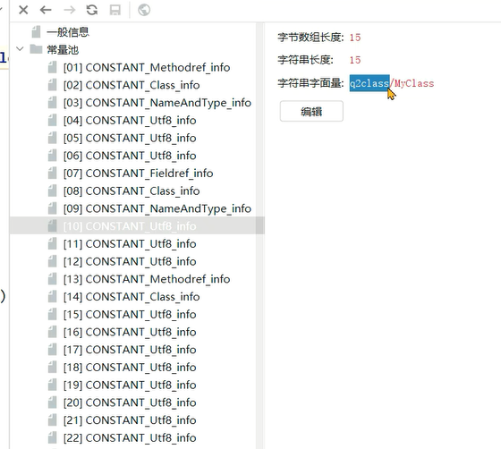
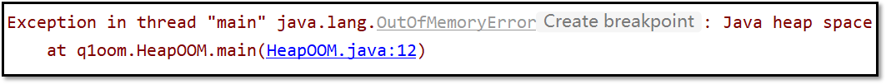
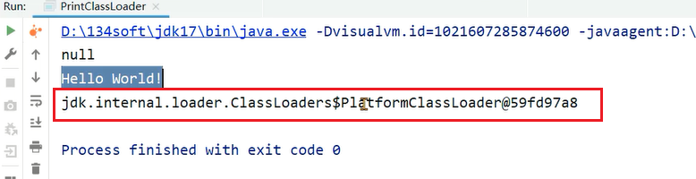
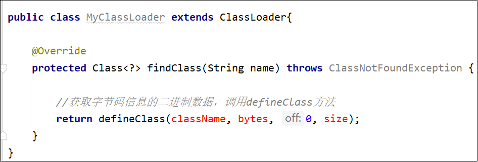
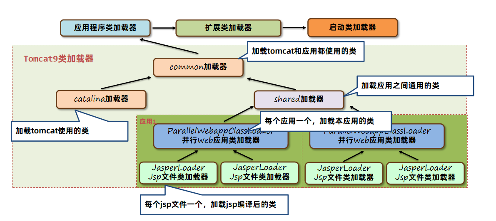
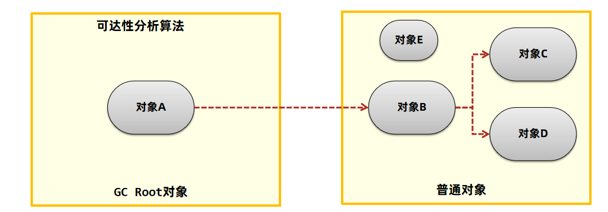
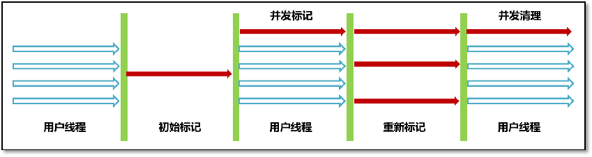

## 什么是JVM？

- 关联课程内容
  - 基础篇-初识JVM
  - 基础篇-Java虚拟机的组成

- 回答路径
  - JVM的定义
  - 作用
  - 功能
  - 组成

### 1、定义：

JVM 指的是Java虚拟机（ Java Virtual Machine ）。JVM 本质上是一个运行在计算机上的程序，他的职责是运行Java字节码文件，Java虚拟机上可以运行Java、Kotlin、Scala、Groovy等语言。

启动这个程序：

```Java
package q1jvm;

import java.io.IOException;

//用java命令启动一个jvm进程，执行程序
public class C01JVM {
    public static void main(String[] args) throws IOException {
        System.in.read();
    }
}
```


任务管理器中启动的Java进程，其实是一个虚拟机进程，它会执行我们编写好的代码。

通过`jps`命令也可以看到java进程，`jps`是JDK自带的一共显示Java进程的小工具：


只要能编译成Java字节码文件的语言，Java虚拟机都可以运行。下图是Groovy语言在Java虚拟机上成功运行的结果：


### 2、作用：

为了支持Java中Write Once，Run Anywhere；编写一次，到处运行的跨平台特性。


对于C/C++这类语言来说，需要将源代码编译成对应平台（不同的操作系统+CPU架构)的机器码，才能让计算机运行。不满足一次编译，到处运行的跨平台特性。


但是Java语言不同，Java语言将源代码编译成字节码文件之后，就可以交由不同平台下已经安装好的Java虚拟机。Java虚拟机会将字节码指令实时解释成机器码。这样就满足了一次编译（编译成字节码），到处运行的跨平台特性。


### 3、功能

- 解释和运行，对字节码文件中的指令，实时的解释成机器码，让计算机执行。
- 内存管理，自动为对象、方法等分配内存，自动的垃圾回收机制，回收不再使用的对象。
- 即时编译，对热点代码进行优化，提升执行效率。

执行以下代码：

```Java
package q1jvm;

//-Xint 禁止JIT即时编译器优化
public class C03Usage {
    public static void main(String[] args) {
        long start = System.currentTimeMillis();

        C03Usage test = new C03Usage();
        test.jitTest();

        long end = System.currentTimeMillis();
        System.out.println("执行耗时:" + (end - start) + "ms");
    }

    public int add (int a,int b){
        return a + b;
    }

    public int jitTest(){
        int sum = 0;
        for (int i = 0; i < 10000000; i++) {
            sum = add(sum,100);
        }
        return sum;
    }
}
```

加上JIT即时编译优化之后，代码执行只需要3ms。但是如果加上`-Xint`参数关闭即时编译器优化，执行时间需要233ms。

### 4、组成


- 编译器：不属于Java虚拟机的一部分，负责将源代码文件编译成字节码文件。
- 类加载子系统，负责将字节码文件读取、解析并保存到内存中。其核心就是类加载器。
- 运行时数据区，管理JVM使用到的内存。
- 执行引用，分为解释器 解释执行字节码指令；即时编译器 优化代码执行性能； 垃圾回收器 将不再使用的对象进行回收。
- 本地接口，保存了本地已经编译好的方法，使用C/C++语言实现。

### 5、常见的JVM


### 总结

1、JVM 指的是Java虚拟机，本质上是一个运行在计算机上的程序，他的职责是运行Java字节码文件，作用是为了支持跨平台特性。

2、JVM的功能有三项：第一是解释执行字节码指令；第二是管理内存中对象的分配，完成自动的垃圾回收；第三是优化热点代码提升执行效率。

3、JVM组成分为类加载子系统、运行时数据区、执行引擎、本地接口这四部分。

4、常用的JVM是Oracle提供的Hotspot虚拟机，也可以选择GraalVM、龙井、OpenJ9等虚拟机。

## 了解过字节码文件的组成吗？

- 关联课程内容
  - 基础篇-字节码文件的组成
  - 基础篇-字节码文件的工具

- 回答路径
  - 查看字节码文件常用工具
  - 字节码文件的组成
  - 应用场景：工作中一般不直接查看字节码文件，深入学习JVM的基础

字节码文件本质上是一个二进制的文件，无法直接用记事本等工具打开阅读其内容。需要通过专业的工具打开。

- 开发环境使用jclasslib插件
- 服务器环境使用javap –v命令

### 1、基本信息

魔数、字节码文件对应的Java版本号、访问标识(public final等等)、父类和接口。

类代码:

```Java
package q2class;

public class MyClass extends MyParent implements MyInterface{

    private int i = 0;

    @Override
    public void test() {
        int j = 0;
        j++;
    }

    public static void main(String[] args) {
        new MyClass();
    }
}
```

父类代码:

```Java
package q2class;

public class MyParent {
}
```

接口代码:

```Java
package q2class;

public interface MyInterface {
    void test();
}
```

编译之后用notepad++打开：


魔数前四个字节是固定的内容0xcafebabe，只有前四个字节满足这个内容才是字节码文件。

使用jclasslib查看到基本信息：


如果在服务器上，可以通过`javap -v`命令打开字节码文件查看内容：


结果：


### 2、常量池

保存了字符串常量、类或接口名、字段名，主要在字节码指令中使用。

常量池是一个数组，比如这个序号为10的常量就是一个UTF8的字符串。保存了MyClass的全限定名。



### 3、字段

当前类或接口声明的字段信息

字段里保存的是名字、描述符（字段类型）、访问标识。其中名字和描述符都指向常量池中的内容。


### 4、方法

当前类或接口声明的方法信息、字节码指令。

方法中保存了方法名、描述符（参数和返回值）、访问标识。


还有字节码指令，代码编译后就变成了字节码指令：


### 5、属性

类的属性，比如源码的文件名、内部类的列表等。


## 说一下运行时数据区

- 关联课程内容
  - 基础篇-程序计数器
  - 基础篇-栈
  - 基础篇-堆
  - 基础篇-方法区
  - 基础篇-直接内存

- 回答路径
  - 程序计数器
  - 栈
  - 堆
  - 方法区
  -  直接内存（可选）
  - 
  -  运行时数据区指的是JVM所管理的内存区域，其中分成两大类：
  -  线程共享 – 方法区、堆     线程不共享 – 本地方法栈、虚拟机栈、程序计数器
  -  直接内存主要是NIO使用，由操作系统直接管理，不属于JVM内存。
  - 

### 程序计数器

程序计数器（Program Counter Register）也叫PC寄存器，每个线程会通过程序计数器记录当前要执行的的字节码指令的地址。主要有两个作用：

1、程序计数器可以控制程序指令的进行，实现分支、跳转、异常等逻辑。


2、在多线程执行情况下，Java虚拟机需要通过程序计数器记录CPU切换前解释执行到那一句指令并继续解释运行。


### 栈 - Java虚拟机栈

Java虚拟机栈采用栈的数据结构来管理方法调用中的基本数据，先进后出 ,每一个方法的调用使用一个栈帧来保存。每个线程都会包含一个自己的虚拟机栈，它的生命周期和线程相同。


栈帧主要包含三部分内容：

1、局部变量表，在方法执行过程中存放所有的局部变量。


2、操作数栈，虚拟机在执行指令过程中用来存放临时数据的一块区域。

如下图中，iadd指令会将操作数栈上的两个数相加，为了实现`i+1`。最终结果也会放到操作数上。


3、帧数据，主要包含动态链接、方法出口、异常表等内容。

动态链接：方法中要用到其他类的属性和方法，这些内容在字节码文件中是以编号保存的，运行过程中需要替换成内存中的地址，这个编号到内存地址的映射关系就保存在动态链接中。

方法出口：方法调用完需要弹出栈帧，回到上一个方法，程序计数器要切换到上一个方法的地址继续执行，方法出口保存的就是这个地址。

异常表：存放的是代码中异常的处理信息，包含了异常捕获的生效范围以及异常发生后跳转到的字节码指令位置。

### 本地方法栈

Java虚拟机栈存储了Java方法调用时的栈帧，而本地方法栈存储的是native本地方法的栈帧。

在Hotspot虚拟机中，Java虚拟机栈和本地方法栈实现上使用了同一个栈空间。本地方法栈会在栈内存上生成一个栈帧，临时保存方法的参数同时方便出现异常时也把本地方法的栈信息打印出来。


### 堆

- 一般Java程序中堆内存是空间最大的一块内存区域。创建出来的对象都存在于堆上。
- 栈上的局部变量表中，可以存放堆上对象的引用。静态变量也可以存放堆对象的引用，通过静态变量就可以实现对象在线程之间共享。
- 堆是垃圾回收最主要的部分，堆结构更详细的划分与垃圾回收器有关。


### 方法区

方法区是Java虚拟机规范中提出来的一个虚拟机概念，在HotSpot不同版本中会用永久代或者元空间来实现。方法区主要存放的是基础信息，包含：

1、每一个加载的类的元信息（基础信息）。


2、运行时常量池，保存了字节码文件中的常量池内容，避免常量内容重复创建减少内存开销。

3、字符串常量池，存储字符串的常量。

### 直接内存

直接内存并不在《Java虚拟机规范》中存在，所以并不属于Java运行时的内存区域。在 JDK 1.4 中引入了 NIO 机制，由操作系统直接管理这部分内容，主要为了提升读写数据的性能。在网络编程框架如Netty中被大量使用。

要创建直接内存上的数据，可以使用ByteBuffer。

语法： ByteBuffer directBuffer = ByteBuffer.allocateDirect(size);

### 总结

运行时数据区指的是JVM所管理的内存区域，其中分成两大类：

- 线程共享 方法区、堆 

方法区：存放每一个加载的类的元信息、运行时常量池、字符串常量池。

堆：存放创建出来的对象。

- 线程不共享 – 本地方法栈、虚拟机栈、程序计数器

本地方法栈和虚拟机栈都存放了线程中执行方法时需要使用的基础数据。

程序计数器存放了当前线程执行的字节码指令在内存中的地址。

直接内存主要是NIO使用，由操作系统直接管理，不属于JVM内存。

## 哪些区域会出现内存溢出，会有什么现象？

内存溢出指的是内存中某一块区域的使用量超过了允许使用的最大值，从而使用内存时因空间不足而失败，虚拟机一般会抛出指定的错误。

在Java虚拟机中，只有程序计数器不会出现内存溢出的情况，因为每个线程的程序计数器只保存一个固定长度的地址。


### 堆内存溢出：

堆内存溢出指的是在堆上分配的对象空间超过了堆的最大大小，从而导致的内存溢出。堆的最大大小使用-Xmx参数进行设置，如-Xmx10m代表最大堆内存大小为10m。

```Java
package q1oom;

import java.io.IOException;
import java.util.ArrayList;

//-Xmx10m
public class HeapOOM {
    public static void main(String[] args) throws InterruptedException, IOException {

        ArrayList<Object> objects = new ArrayList<Object>();
        while (true){
            objects.add(new byte[1024 * 1024 * 1]);
        }


    }
}
```

溢出之后会抛出OutOfMemoryError，并提示是Java heap Space导致的：



### 栈内存溢出：

栈内存溢出指的是所有栈帧空间的占用内存超过了最大值，最大值使用-Xss进行设置，比如-Xss256k代表所有栈帧占用内存大小加起来不能超过256k。

```Java
package q1oom;


/**
 * -Xss180k 每个线程栈内存最大180k
 */
public class StackOOM {
    public static void main(String[] args) {
        recursion();
    }

    public static int count = 0;

    //递归方法调用自己
    public static void recursion() {
        long a,b,c,d,f,g,h,i,j,k;
        System.out.println(++count);
        recursion();
    }
}
```

溢出之后会抛出StackOverflowError：


### 方法区内存溢出：

方法区内存溢出指的是方法区中存放的内容比如类的元信息超过了方法区内存的最大值，JDK7及之前版本方法区使用永久代（-XX:MaxPermSize=值）来实现，JDK8及之后使用元空间（-XX:MaxMetaspaceSize=值）来实现。

```Java
package q1oom;

import net.bytebuddy.jar.asm.ClassWriter;
import net.bytebuddy.jar.asm.Opcodes;

import java.io.IOException;

/**
 * JDK8 -XX:MaxMetaspaceSize=20m JDK7 -XX:MaxPermSize=20m
 */
public class MethodAreaOOM extends ClassLoader {
    public static void main(String[] args) throws IOException {
        MethodAreaOOM demo1 = new MethodAreaOOM();
        int count = 0;
        while (true) {
            String name = "Class" + count;
            ClassWriter classWriter = new ClassWriter(0);
            classWriter.visit(Opcodes.V1_7, Opcodes.ACC_PUBLIC, name, null
                    , "java/lang/Object", null);
            byte[] bytes = classWriter.toByteArray();
            demo1.defineClass(name, bytes, 0, bytes.length);
            System.out.println(++count);
        }
    }
}
```

元空间溢出：


永久代溢出：


### 直接内存溢出：

直接内存溢出指的是申请的直接内存空间大小超过了最大值，使用 -XX:MaxDirectMemorySize=值 设置最大值。

溢出之后会抛出OutOfMemoryError：

```Java
package q1oom;

import java.io.IOException;
import java.nio.ByteBuffer;
import java.util.ArrayList;
import java.util.List;

/**
 * -XX:MaxDirectMemorySize=50m
 */
public class DirectOOM {
    public static int size = 1024 * 1024 * 100; //100mb
    public static List<ByteBuffer> list = new ArrayList<ByteBuffer>();
    public static int count = 0;

    public static void main(String[] args) throws IOException, InterruptedException {
        while (true) {
            ByteBuffer directBuffer = ByteBuffer.allocateDirect(size);
            list.add(directBuffer);
        }

    }
}
```

溢出之后出现：


### 总结：

内存溢出指的是内存中某一块区域的使用量超过了允许使用的最大值，从而使用内存时因空间不足而失败，虚拟机一般会抛出指定的错误。

堆：溢出之后会抛出OutOfMemoryError，并提示是Java heap Space导致的。

栈：溢出之后会抛出StackOverflowError。

方法区：溢出之后会抛出OutOfMemoryError，JDK7及之前提示永久代，JDK8及之后提示元空间。

直接内存：溢出之后会抛出OutOfMemoryError。

## JVM在JDK6-8之间在内存区域上有什么不同 

### 方法区的实现

方法区是《Java虚拟机规范》中设计的虚拟概念，每款Java虚拟机在实现上都各不相同。Hotspot设计如下：

- JDK7及之前的版本将方法区存放在堆区域中的永久代空间，堆的大小由虚拟机参数来控制。
- JDK8及之后的版本将方法区存放在元空间中，元空间位于操作系统维护的直接内存中，默认情况下只要不超过操作系统承受的上限，可以一直分配。也可以手动设置最大大小。


使用元空间替换永久代的原因：

1、提高内存上限：元空间使用的是操作系统内存，而不是JVM内存。如果不设置上限，只要不超过操作系统内存上限，就可以持续分配。而永久代在堆中，可使用的内存上限是有限的。所以使用元空间可以有效减少OOM情况的出现。

2、优化垃圾回收的策略：永久代在堆上，垃圾回收机制一般使用老年代的垃圾回收方式，不够灵活。使用元空间之后单独设计了一套适合方法区的垃圾回收机制。

### 字符串常量池的位置


字符串常量池从方法区移动到堆的原因：

1、垃圾回收优化：字符串常量池的回收逻辑和对象的回收逻辑类似，内存不足的情况下，如果字符串常量池中的常量不被使用就可以被回收；方法区中的类的元信息回收逻辑更复杂一些。移动到堆之后，就可以利用对象的垃圾回收器，对字符串常量池进行回收。

2、让方法区大小更可控：一般在项目中，类的元信息不会占用特别大的空间，所以会给方法区设置一个比较小的上限。如果字符串常量池在方法区中，会让方法区的空间大小变得不可控。

3、intern方法的优化：JDK6版本中intern () 方法会把第一次遇到的字符串实例复制到永久代的字符串常量池中。JDK7及之后版本中由于字符串常量池在堆上，就可以进行优化：字符串保存在堆上，把字符串的引用放入字符串常量池，减少了复制的操作。

### 总结


## 类的生命周期

- 关联课程内容
  - 基础篇-类的生命周期-加载阶段
  - 基础篇-类的生命周期-连接阶段
  - 基础篇-类的生命周期-初始化阶段
  - 基础篇-方法区的回收

- 回答路径
  - 加载
  - 连接（验证、准备、解析）
  - 初始化
  - 卸载

类的生命周期分为以下几个阶段：


### 加载阶段

1、加载(Loading)阶段第一步是类加载器根据类的全限定名通过不同的渠道以二进制流的方式获取字节码信息。

​    程序员可以使用Java代码拓展的不同的渠道。


2、类加载器在加载完类之后，Java虚拟机会将字节码中的信息保存到内存的方法区中。在方法区生成一个InstanceKlass对象，保存类的所有信息。


3、在堆中生成一份与方法区中数据类似的java.lang.Class对象， 作用是在Java代码中去获取类的信息。


比如这段代码中，就会访问堆中的Class对象：


### 连接阶段

连接阶段分为三个小阶段：


连接（Linking）阶段的第一个环节是**验证**，验证的主要目的是检测Java字节码文件是否遵守了《Java虚拟机规范》中的约束。这个阶段一般不需要程序员参与。

主要包含如下四部分，具体详见《Java虚拟机规范》：

1.文件格式验证，比如文件是否以0xCAFEBABE开头，主次版本号是否满足当前Java虚拟机版本要求。

2.元信息验证，例如类必须有父类（super不能为空）。

3.验证程序执行指令的语义，比如方法内的指令执行到一半强行跳转到其他方法中去。

4.符号引用验证，例如是否访问了其他类中private的方法等。

**准备阶段**为静态变量（static）分配内存并设置初值。final修饰的基本数据类型的静态变量，准备阶段直接会将代码中的值进行赋值。


**解析阶段**主要是将常量池中的符号引用替换为直接引用。符号引用就是在字节码文件中使用编号来访问常量池中的内容。直接引用不在使用编号，而是使用内存中地址进行访问具体的数据。


### 初始化阶段

初始化阶段会执行静态代码块中的代码，并为静态变量赋值。

初始化阶段会执行字节码文件中clinit部分的字节码指令。


以如下代码为例：

```Java
package q3loadclass;

public class Demo1 {
    public static int value = 1;
    static {
        value = 2;
    }
    {
        value = 3;
    }
    public static void main(String[] args) {
        new Demo1();
        System.out.println(value);
    }
}
```

1.连接的准备阶段value赋初值为0 2.初始化阶段执行clinit方法中的指令,value赋值为2 3.如果创建对象，会执行对象的init方法，value赋值为3 （类中代码块中的内容被放到了构造方法中）

### 卸载阶段

判定一个类可以被卸载。需要同时满足下面三个条件：

1、此类所有实例对象都已经被回收，在堆中不存在任何该类的实例对象以及子类对象。


2、加载该类的类加载器已经被回收。


3、该类对应的 java.lang.Class 对象没有在任何地方被引用。


### 总结


## 什么是类加载器？

- 关联课程内容
  - 基础篇-类加载器的分类
  - 基础篇-启动类加载器
  - 基础篇-扩展和引用程序类加载器
  - 基础篇-JDK9之后的类加载器
  - 
- 回答路径
  - 类加载器的作用
  - 启动类加载器
  - 扩展/平台类加载器
  - 应用程序类加载器
  - 自定义类加载器（加分项）

类加载器负载在类的加载过程中将字节码信息以流的方式获取并加载到内存中。JDK8及之前如下：


JDK9之后均由Java实现：


### 启动类加载器

启动类加载器（Bootstrap ClassLoader）是由Hotspot虚拟机提供的类加载器，JDK9之前使用C++编写的、JDK9之后使用Java编写。

默认加载Java安装目录/jre/lib下的类文件，比如rt.jar，tools.jar，resources.jar等。


```Java
//String类 核心类 由启动类加载器加载，在Java中无法获得启动类加载器
System.out.println(java.lang.String.class.getClassLoader());
```

打印结果为:


在Java代码中无法获得启动类加载器。

### 扩展类加载器

扩展类加载器（Extension Class Loader）是JDK中提供的、使用Java编写的类加载器。JDK9之后由于采用了模块化，改名为Platform平台类加载器。

默认加载Java安装目录/jre/lib/ext下的类文件。


```Java
//nashorn包中的类，使用java script引擎打印Hello World 由扩展类加载器加载
ScriptEngine engine = new ScriptEngineManager().getEngineByName("nashorn");
engine.eval("print('Hello World!');");
System.out.println(ScriptEngineManager.class.getClassLoader());
```

打印结果（JDK17平台类加载器)：



### 应用程序类加载器

应用程序类加载器（Application Class Loader）是JDK中提供的、使用Java编写的类加载器。默认加载为应用程序classpath下的类。

### 自定义类加载器

自定义类加载器允许用户自行实现类加载的逻辑，可以从网络、数据库等来源加载类信息。自定义类加载器需要继承自ClassLoader抽象类，重写findClass方法。



```Java
package q4classloader;

import org.apache.commons.io.FileUtils;

import java.io.ByteArrayOutputStream;
import java.io.File;
import java.io.FileInputStream;
import java.io.IOException;
import java.lang.reflect.Field;

//自定义类加载器
public class MyClassLoader extends ClassLoader{

    @Override
    protected Class<?> findClass(String name) throws ClassNotFoundException {

        String filename = name.substring(name.lastIndexOf(".") + 1);

        byte[] bytes = new byte[0];
        try {
            bytes = FileUtils.readFileToByteArray(new File("D:\\jvm\\data\\" + filename + ".class"));
        } catch (IOException e) {
            e.printStackTrace();
        }
        //获取字节码信息的二进制数据，调用defineClass方法
        return defineClass(name, bytes, 0, bytes.length);
    }

    public static void main(String[] args) throws ClassNotFoundException, InstantiationException, IllegalAccessException {

        MyClassLoader myClassLoader = new MyClassLoader();

        Class<?> clazz = myClassLoader.loadClass("com.itheima.springbootclassfile.pojo.vo.UserVO");

        //打印字段
        Field[] fields = clazz.getDeclaredFields();
        for (Field field : fields) {
            System.out.println(field.getName());
        }

    }
}
```

### 总结：

1.启动类加载器（Bootstrap ClassLoader）加载核心类

2.扩展类加载器（Extension ClassLoader）加载扩展类

3.应用程序类加载器（Application ClassLoader）加载应用classpath中的类

4.自定义类加载器，重写findClass方法。

JDK9及之后扩展类加载器（Extension ClassLoader）变成了平台类加载器（Platform ClassLoader）

## 什么是双亲委派机制

- 关联课程内容
  - 基础篇-双亲委派机制
  - 基础篇-打破双亲委派机制
  - 
- 回答路径
  - 类加载器和父类加载器
  - 什么是双亲委派机制
  - 双亲委派机制的作用
  - 

类加载有层级关系，上一级称之为下一级的父类加载器。


测试代码:

```Java
package q4classloader;


import javax.script.ScriptEngineManager;
import javax.script.ScriptException;

public class PrintParentClassLoader {
    public static void main(String[] args) throws ScriptException {
        new ScriptEngineManager();
        //扩展类加载器的父类加载器
        System.out.println(ScriptEngineManager.class.getClassLoader().getParent());
        //应用程序类加载器的父类加载器
        System.out.println(PrintParentClassLoader.class.getClassLoader().getParent());
        //自定义类加载器的父类加载器
        System.out.println(new MyClassLoader().getParent());
    }
}
```

打印结果:


- 扩展类加载器的父类加载器但是在java中无法获得，所以打印null
- 应用程序类加载器的父类加载器是扩展类加载器（平台类加载器）
- 自定义类加载器的父类加载器是应用程序类加载器

**双亲委派机制指的是：当一个类加载器接收到加载类的任务时，会向上查找是否加载过，再由顶向下进行加载。**


每个类加载器都有一个父类加载器，在类加载的过程中，每个类加载器都会先检查是否已经加载了该类，如果已经加载则直接返回，否则会将加载请求委派给父类加载器。

应用程序类加载器接收到加载类的任务，首先先检查自己有没有加载过：


没有加载过就一层一层向上传递，都检查下自己有没有加载过这个类：


到了启动类加载器发现已经加载过，就返回。

另一个案例：com.itheima.my.C 这个类在当前程序的classpath中，看看是如何加载的。

先由应用程序类加载器检查，发现没有加载过，向上传递检查发现都没有加载过。此时启动类加载器会优先加载：


接下来向下传递加载：


最后由应用程序类加载器加载成功：


### 双亲委派机制有什么用？

1.保证类加载的安全性，通过双亲委派机制避免恶意代码替换JDK中的核心类库，比如java.lang.String，确保核心类库的完整性和安全性。

2.避免重复加载，双亲委派机制可以避免同一个类被多次加载。

### 总结

双亲委派机制指的是：当一个类加载器接收到加载类的任务时，会向上交给父类加载器查找是否加载过，再由顶向下进行加载。

双亲委派机制的作用：保证类加载的安全性，避免重复加载。


## 如何打破双亲委派机制

先了解下双亲委派机制的原理：


调用关系如下：


ClassLoader中包含了4个核心方法，对Java程序员来说，打破双亲委派机制的唯一方法就是实现自定义类加载器重写loadClass方法，将其中的双亲委派机制代码去掉。


打破双亲委派机制的源码：

```Java
package q4classloader;

import org.apache.commons.io.FileUtils;

import java.io.File;
import java.io.IOException;
import java.lang.reflect.Field;

public class ItheimaClassLoader extends ClassLoader{

    @Override
    public Class<?> loadClass(String name) throws ClassNotFoundException {
        if(name.startsWith("java.")){
            return super.loadClass(name);
        }
        //com.itheima.springbootclassfile.pojo.vo.UserVO .class
        String filename = name.substring(name.lastIndexOf(".") + 1) + ".class";
        //加载 D:/jvm/data
        byte[] bytes = new byte[0];
        try {
            bytes = FileUtils.readFileToByteArray(new File("D:\\教学\\同步课程资料\\BaiduSyncdisk\\实战Java虚拟机\\实战Java虚拟机\\代码\\day12\\jvm-interview\\target\\classes\\q4classloader\\" + filename));
        } catch (IOException e) {
            e.printStackTrace();
        }

        return defineClass(name,bytes,0,bytes.length);
    }

    public static void main(String[] args) throws ClassNotFoundException {
        ItheimaClassLoader itheimaClassLoader = new ItheimaClassLoader();

        Class<?> clazz = itheimaClassLoader.loadClass("q4classloader.PrintParentClassLoader");

        //打印类字段
//        Field[] declaredFields = clazz.getDeclaredFields();
//        for (Field declaredField : declaredFields) {
//            System.out.println(declaredField.getName());
//        }

        //打印类加载器名字
        System.out.println(clazz.getClassLoader());

    }
}
```

### 总结

双亲委派机制指的是：当一个类加载器接收到加载类的任务时，会自底向上交给父类加载器查找是否加载过，再由顶向下进行加载。

双亲委派机制的作用：保证类加载的安全性，避免重复加载。

打破双亲委派机制的方法：实现自定义类加载器，重写defineClass方法，将双亲委派机制的代码去除。

## Tomcat的自定义类加载器

Tomcat中，实现了一套自定义的类加载器。这一小节使用目前应用比较广泛的Tomcat9（9.0.84）源码进行分析。

### 环境搭建：

可以直接运行代码文件夹下的tomcat源码，这个项目已经修改过源码了，但是为了保证将来版本更新后同学们还能搭建最新代码版本的环境，将搭建过程在这里记录一下。

1、打开tomcat找到9.0版本的源代码，下载：


2、使用Idea打开，整个项目没有使用Maven，为了方便进行项目管理。在项目中创建pom文件，内容如下:

```XML
<?xml version="1.0" encoding="UTF-8"?>
<project xmlns="http://maven.apache.org/POM/4.0.0"
         xmlns:xsi="http://www.w3.org/2001/XMLSchema-instance"
         xsi:schemaLocation="http://maven.apache.org/POM/4.0.0 http://maven.apache.org/xsd/maven-4.0.0.xsd">

  <modelVersion>4.0.0</modelVersion>
  <groupId>org.apache.tomcat</groupId>
  <artifactId>tomcat</artifactId>
  <name>tomcat</name>
  <version>c</version>

  <build>
    <finalName>tomcat</finalName>
    <sourceDirectory>java</sourceDirectory>
    <!--<testSourceDirectory>test</testSourceDirectory>-->
    <resources>
      <resource>
        <directory>java</directory>
      </resource>
    </resources>
    <testResources>
      <testResource>
        <directory>test</directory>
      </testResource>
    </testResources>
    <plugins>
      <plugin>
        <groupId>org.apache.maven.plugins</groupId>
        <artifactId>maven-compiler-plugin</artifactId>
        <version>3.6.1</version>
        <configuration>
          <encoding>UTF-8</encoding>
          <source>1.8</source>
          <target>1.8</target>
        </configuration>
      </plugin>
    </plugins>
  </build>

  <dependencies>
    <dependency>
      <groupId>junit</groupId>
      <artifactId>junit</artifactId>
      <version>4.12</version>
      <scope>test</scope>
    </dependency>
    <dependency>
      <groupId>org.easymock</groupId>
      <artifactId>easymock</artifactId>
      <version>4.0.2</version>
      <scope>test</scope>
    </dependency>
    <dependency>
      <groupId>org.apache.ant</groupId>
      <artifactId>ant</artifactId>
      <version>1.10.8</version>
    </dependency>
    <dependency>
      <groupId>wsdl4j</groupId>
      <artifactId>wsdl4j</artifactId>
      <version>1.6.2</version>
    </dependency>
    <dependency>
      <groupId>javax.xml</groupId>
      <artifactId>jaxrpc</artifactId>
      <version>1.1</version>
    </dependency>

    <dependency>
      <groupId>org.eclipse.jdt.core.compiler</groupId>
      <artifactId>ecj</artifactId>
      <version>4.6.1</version>
    </dependency>
    <dependency>
      <groupId>biz.aQute.bnd</groupId>
      <artifactId>biz.aQute.bndlib</artifactId>
      <version>5.1.1</version>
    </dependency>

    <dependency>
      <groupId>com.unboundid</groupId>
      <artifactId>unboundid-ldapsdk</artifactId>
      <version>4.0.13</version>
      <scope>test</scope>
    </dependency>

  </dependencies>
</project>
```

3、选择Application,添加应用。JDK选择JDK8：


4、添加JVM参数：

```XML
 -Duser.language=en   -Duser.region=US
```

5、将JDTCompiler.java中这一段内容报错删除，这里我已经删除了：


6、在StringManager.java中添加这段代码，强制用iso8859-1编码获取字符串。


```Java
try {
    value = new String(value.getBytes("iso8859-1"),"utf-8");
} catch (UnsupportedEncodingException e) {
    e.printStackTrace();
}
```

7、在ContextConfig.java文件中添加JSP初始化器：


```Java
context.addServletContainerInitializer(new JasperInitializer(),null);
```

8、将web项目放入webapps目录下，运行项目：


Tomcat类加载器整体结构图如下：


### common类加载器

common类加载器主要加载tomcat自身使用以及应用使用的jar包，默认配置在catalina.properties文件中。

common.loader="${catalina.base}/lib","${catalina.base}/lib/*.jar"


debug调试common累类加载器初始化代码:


它是URLClassLoader类的子类对象，根据URL获取jar包中的class字节码文件。

### catalina类加载器

catalina类加载器主要加载tomcat自身使用的jar包，不让应用使用，默认配置在catalina.properties文件中。

server.loader=     默认配置为空，为空时catalina加载器和common加载器是同一个。

配置参数之前，catalina加载器其实就是common加载器：


配置catalina加载的路径：


这次就创建了一个新的Catalina类加载器，专门加载配置目录下的类：


### shared类加载器

shared类加载器主要加载应用使用的jar包，不让tomcat使用，默认配置在catalina.properties文件中。

shared.loader=     默认配置为空，为空时shared加载器和common加载器是同一个。


### ParallelWebappClassLoader类加载器

ParallelWebappClassLoader类加载器可以多线程并行加载应用中使用到的类，每个应用都拥有一个自己的该类加载器。

demo1项目的类加载器：


demo2的类加载器：


**为什么每个应用会拥有一个独立的ParallelWebappClassLoader类加载器呢？**

同一个类加载器，只能加载一个同名的类。两个应用中相同名称的类都必须要加载。


所以tomcat的做法是为每个应用创建一个web应用类加载器：


**ParallelWebappClassLoader的执行流程：**


默认这里打破了双亲委派机制，应用中的类如果没有加载过。会先从当前类加载器加载，然后再交给父类加载器通过双亲委派机制加载。


### JasperLoader类加载器

JasperLoader类加载器负责加载JSP文件编译出来的class字节码文件，为了实现热部署（不重启让修改的jsp生效），每一个jsp文件都由一个独立的JasperLoader负责加载。

访问一个JSP文件，会触发JasperLoader类加载器的创建：


修改JSP文件：


用Arthas看类加载器情况：


类加载器数量变多了。

### 总结：



## 如何判断堆上的对象没有被引用？？

- 关联课程内容
  - 基础篇-引用计数法
  - 基础篇-可达性分析法

- 回答路径
  - 引用计数法
  - 可达性分析法
  - 使用可达性分析法原因

### 引用计数法

引用计数法会为每个对象维护一个引用计数器，当对象被引用时加1，取消引用时减1。

当局部变量对A对象产生引用之后，A的计数器就会加1：


同样，当A对象对B对象产生引用之后，B的计数器会加1：


引用计数法的优点是实现简单，缺点有两点：

1.每次引用和取消引用都需要维护计数器，对系统性能会有一定的影响

2.存在循环引用问题，所谓循环引用就是当A引用B，B同时引用A时会出现对象无法回收的问题。

如下图：


A对象和B对象在局部变量中已经无法访问了，但是由于他们互相引用对方，导致对象不能被回收。

### 可达性分析法

Java使用的是可达性分析算法来判断对象是否可以被回收。可达性分析将对象分为两类：垃圾回收的根对象（GC Root）和普通对象，对象与对象之间存在引用关系。

下图中A到B再到C和D，形成了一个引用链，可达性分析算法指的是如果从某个到GC Root对象是可达的，对象就不可被回收。



哪些对象被称之为GC Root对象呢？

- 线程Thread对象，引用线程栈帧中的方法参数、局部变量等。
- 系统类加载器加载的java.lang.Class对象，引用类中的静态变量。
- 监视器对象，用来保存同步锁synchronized关键字持有的对象。
- 本地方法调用时使用的全局对象。

### 总结：

引用计数法会为每个对象维护一个引用计数器，当对象被引用时加1，取消引用时减1，存在循环引用问题所以Java没有使用这种方法。

Java使用的是可达性分析算法来判断对象是否可以被回收。可达性分析将对象分为两类：垃圾回收的根对象（GC Root）和普通对象。

可达性分析算法指的是如果从某个到GC Root对象是可达的，对象就不可被回收。最常见的是GC Root对象会引用栈上的局部变量和静态变量导致对象不可回收。

##  JVM 中都有哪些引用类型？

- 关联课程内容
  - 基础篇-软引用
  - 基础篇-弱虚终结器引用

- 回答路径

  - 强引用

  - 软引用

  - 弱引用

  - 虚引用

  - 终结器引用

  - 

  -  强引用，JVM中默认引用关系就是强引用，即是对象被局部变量、静态变量等GC Root关联的对象引用，只要这层关系存在，普通对象就不会被回收。

  - ```Java
    package q5reference;
    
    import java.util.ArrayList;
    import java.util.List;
    
    //-Xmx10m -verbose:gc
    public class StrongReferenceDemo {
        private static int _1MB = 1024 * 1024 * 1;
        public static void main(String[] args) {
            List<Object> objects = new ArrayList<>();
    
            while (true){
                byte[] bytes = new byte[_1MB];
                //强引用
                objects.add(bytes);
            }
    
        }
    }
    ```

  -  强引用的对象不会被回收掉，所以会出现内存溢出：

  - 

  - 

  -  软引用，软引用相对于强引用是一种比较弱的引用关系，如果一个对象只有软引用关联到它，当程序内存不足时，就会将软引用中的数据进行回收。软引用主要在缓存框架中使用。

  - ```Java
    package q5reference;
    
    import java.lang.ref.SoftReference;
    import java.util.ArrayList;
    import java.util.List;
    
    //-Xmx10m -verbose:gc
    public class SoftReferenceDemo {
        private static int _1MB = 1024 * 1024 * 1;
        public static void main(String[] args) {
            List<SoftReference> objects = new ArrayList<>();
    
            for (int i = 0; i < 10; i++) {
                byte[] bytes = new byte[_1MB];
                //软引用
                SoftReference<byte[]> softReferences = new SoftReference<byte[]>(bytes);
                //软引用对象放入集合中
                objects.add(softReferences);
    
                System.out.println(i);
            }
    
            //有一部分对象因为内存不足，已经被回收了
            for (SoftReference softReference : objects) {
                System.out.println(softReference.get());
            }
    
        }
    }
    ```

  -  内存不足时，触发了垃圾回收。

  - 

  -  所以前几个对象已经被回收了，但是后边几个会保留下来：

  - 

  - 

  -  弱引用，弱引用的整体机制和软引用基本一致，区别在于弱引用包含的对象在垃圾回收时，不管内存够不够都会直接被回收，弱引用主要在ThreadLocal中使用。

  - ```Java
    package q5reference;
    
    import java.lang.ref.SoftReference;
    import java.lang.ref.WeakReference;
    import java.util.ArrayList;
    import java.util.List;
    
    //-Xmx100m -verbose:gc
    public class WeakReferenceDemo {
        private static int _1MB = 1024 * 1024 * 1;
        public static void main(String[] args) {
            List<WeakReference<byte[]>> objects = new ArrayList<>();
            System.out.println("-------------------");
            for (int i = 0; i < 10; i++) {
                byte[] bytes = new byte[_1MB];
                //弱引用
                WeakReference<byte[]> weakReference = new WeakReference<byte[]>(bytes);
                //弱引用对象放入集合中
                objects.add(weakReference);
            }
    
            //设置一个强引用
            byte[] last = objects.get(9).get();
    
            //手动执行一次垃圾回收，弱引用对象只要没有强引用，就会被直接回收
            System.gc();
            System.out.println("-------------------");
            for (WeakReference softReference : objects) {
                System.out.println(softReference.get());
            }
        }
    }
    ```

  -  手动触发垃圾回收之后，前9个都被回收了，最后一个由于存在强引用会保留下来：

  - 

  - 

  -  虚引用（幽灵引用/幻影引用），不能通过虚引用对象获取到包含的对象。虚引用唯一的用途是当对象被垃圾回收器回收时可以接收到对应的通知。直接内存中为了及时知道直接内存对象不再使用，从而回收内存，使用了虚引用来实现。

  - ```Java
    package q5reference;
    
    import java.lang.ref.PhantomReference;
    import java.lang.ref.Reference;
    import java.lang.ref.ReferenceQueue;
    import java.lang.ref.WeakReference;
    import java.util.ArrayList;
    import java.util.List;
    
    //-Xmx10m -verbose:gc
    public class PhantomReferenceDemo {
        private static int _1MB = 1024 * 1024 * 1;
        public static void main(String[] args) {
            ReferenceQueue<byte[]> queue = new ReferenceQueue();
            byte[] bytes = new byte[_1MB];
            MyPhantomReference phantomReference = new MyPhantomReference(bytes, queue);
    
            //去除强引用
            bytes = null;
            //执行垃圾回收
            System.gc();
    
            //查看队列
            MyPhantomReference ref = (MyPhantomReference) queue.poll();
            //清理
            ref.clean();
    
        }
    }
    
    class MyPhantomReference extends PhantomReference<byte[]>{
        public void clean(){
            System.out.println("清理...");
        }
    
        public MyPhantomReference(byte[] referent, ReferenceQueue<byte[]> q) {
            super(referent, q);
        }
    }
    ```

  -  对象回收之后虚引用对象会进入队列，这样就可以获取对象执行指定的方法了。

  - 

  - 

  -  终结器引用，终结器引用指的是在对象需要被回收时，终结器引用会关联对象并放置在Finalizer类中的引用队列中，在稍后由一条由FinalizerThread线程从队列中获取对象，然后执行对象的finalize方法，在对象第二次被回收时，该对象才真正的被回收。

  - ```Java
    package q5reference;
    
    import java.io.IOException;
    
    //-verbose:gc
    public class FinalizeReferenceDemo {
        public static void main(String[] args) throws IOException {
            Demo demo = new Demo();
            demo = null;
    
            System.gc();
    
            System.in.read();
        }
    }
    
    
    class Demo{
        @Override
        protected void finalize() throws Throwable {
            System.out.println("触发finalize");
            super.finalize();
        }
    }
    ```

 对象回收时，触发了finalize方法：


## ThreadLocal中为什么要使用弱引用？

ThreadLocal可以在线程中存放线程的本地变量，保证数据的线程安全。


ThreadLocal中是这样去保存对象的：

1、在每个线程中，存放了一个ThreadLocalMap对象，本质上就是一个数组实现的哈希表，里边存放多个Entry对象。

2、每个Entry对象继承自弱引用，内部存放ThreadLocal对象。同时用强引用，引用保存的ThreadLocal对应的value值。


以代码为例：

```Java
 threadLocal.set(new User(1,"main线程对象"));
```


获取数据时：

```Java
         User user = threadLocal.get();
```


不再使用Threadlocal对象时， threadlocal = null；由于是弱引用，那么在垃圾回收之后，ThreadLocal对象就可以被回收。


此时还有Entry对象和value对象没有能被回收，所以在ThreadLocal类的set、get、remove方法中，在某些特定条件满足的情况下，会主动删除这两个对象。

如果一直不调用set、get、remove方法或者调用了没有满足条件，这部分对象就会出现内存泄漏。强烈建议在ThreadLocal不再使用时，调用remove方法回收将Entry对象的引用关系去掉，这样就可以回收这两个对象了。

### 总结：

当threadlocal对象不再使用时，使用弱引用可以让对象被回收；因为仅有弱引用没有强引用的情况下，对象是可以被回收的。

弱引用并没有完全解决掉对象回收的问题，Entry对象和value值无法被回收，所以合理的做法是手动调用remove方法进行回收，然后再将threadlocal对象的强引用解除。

## 有哪些常见的垃圾回收算法？

- 关联课程内容
  - 基础篇-垃圾回收算法的评价标准
  - 基础篇-垃圾回收算法
  - 基础篇-分代垃圾回收
  - 

- 回答路径
  - 垃圾回收算法的机制、优缺点
  - 标记清除
  - 标记整理
  - 复制
  - 分代GC

1960年John McCarthy发布了第一个GC算法：标记-清除算法。

1963年Marvin L. Minsky 发布了复制算法。

本质上后续所有的垃圾回收算法，都是在上述两种算法的基础上优化而来。


### 标记清除算法

标记清除算法的核心思想分为两个阶段：

1.标记阶段，将所有存活的对象进行标记。Java中使用可达性分析算法，从GC Root开始通过引用链遍历出所有存活对象。

2.清除阶段，从内存中删除没有被标记也就是非存活对象。


优点：实现简单，只需要在第一阶段给每个对象维护标志位，第二阶段删除对象即可。

缺点：1.碎片化问题

由于内存是连续的，所以在对象被删除之后，内存中会出现很多细小的可用内存单元。如果我们需要的是一个比较大的空间，很有可能这些内存单元的大小过小无法进行分配。


2.分配速度慢。由于内存碎片的存在，需要维护一个空闲链表，极有可能发生每次需要遍历到链表的最后才能获得合适的内存空间。


### 复制算法

复制算法的核心思想是：

1.准备两块空间From空间和To空间，每次在对象分配阶段，只能使用其中一块空间（From空间）。


2.在垃圾回收GC阶段，将From中存活对象复制到To空间。


3.将两块空间的From和To名字互换。


优点：

- 吞吐量高，复制算法只需要遍历一次存活对象复制到To空间即可，比标记-整理算法少了一次遍历的过程，因而性能较好，但是不如标记-清除算法，因为标记清除算法不需要进行对象的移动
- 不会发生碎片化，复制算法在复制之后就会将对象按顺序放入To空间中，所以对象以外的区域都是可用空间，不存在碎片化内存空间。

缺点：

- 内存使用效率低，每次只能让一半的内存空间来为创建对象使用

### 标记整理算法

标记整理算法也叫标记压缩算法，是对标记清理算法中容易产生内存碎片问题的一种解决方案。

核心思想分为两个阶段：

1.标记阶段，将所有存活的对象进行标记。Java中使用可达性分析算法，从GC Root开始通过引用链遍历出所有存活对象。

2.整理阶段，将存活对象移动到堆的一端。清理掉存活对象的内存空间。


优点：

- 内存使用效率高，整个堆内存都可以使用，不会像复制算法只能使用半个堆内存
- 不会发生碎片化，在整理阶段可以将对象往内存的一侧进行移动，剩下的空间都是可以分配对象的有效空间

缺点：

- 整理阶段的效率不高，整理算法有很多种，比如Lisp2整理算法需要对整个堆中的对象搜索3次，整体性能不佳。可以通过Two-Finger、表格算法、ImmixGC等高效的整理算法优化此阶段的性能

### 分代垃圾回收算法

现代优秀的垃圾回收算法，会将上述描述的垃圾回收算法组合进行使用，其中应用最广的就是分代垃圾回收算法(Generational GC)。

分代垃圾回收将整个内存区域划分为年轻代和老年代：


分代回收时，创建出来的对象，首先会被放入Eden伊甸园区。

随着对象在Eden区越来越多，如果Eden区满，新创建的对象已经无法放入，就会触发年轻代的GC，称为Minor GC或者Young GC。


Minor GC会把需要eden中和From需要回收的对象回收，把没有回收的对象放入To区。


接下来，S0会变成To区，S1变成From区。当eden区满时再往里放入对象，依然会发生Minor GC。


此时会回收eden区和S1(from)中的对象，并把eden和from区中剩余的对象放入S0。

注意：每次Minor GC中都会为对象记录他的年龄，初始值为0，每次GC完加1。


如果Minor GC后对象的年龄达到阈值（最大15，默认值和垃圾回收器有关），对象就会被晋升至老年代。


当老年代中空间不足，无法放入新的对象时，先尝试minor gc如果还是不足，就会触发Full GC，Full GC会对整个堆进行垃圾回收。

如果Full GC依然无法回收掉老年代的对象，那么当对象继续放入老年代时，就会抛出Out Of Memory异常。

程序中大部分对象都是朝生夕死，在年轻代创建并且回收，只有少量对象会长期存活进入老年代。分代垃圾回收的优点有：

1、可以通过调整年轻代和老年代的比例来适应不同类型的应用程序，提高内存的利用率和性能。

2、新生代和老年代使用不同的垃圾回收算法，新生代一般选择复制算法效率高、不会产生内存碎片，老年代可以选择标记-清除和标记-整理算法，由程序员来选择灵活度较高。

3、分代的设计中允许只回收新生代（minor gc），如果能满足对象分配的要求就不需要对整个堆进行回收(full gc),STW（Stop The World）由垃圾回收引起的停顿时间就会减少。

### 总结：


## 有哪些常用的垃圾回收器？

- 关联课程内容
  - 基础篇-垃圾回收器1
  - 基础篇-垃圾回收器2
  - 基础篇-垃圾回收器3
  - 基础篇-g1垃圾回收器
  - 实战篇-垃圾回收器的选择
  - 高级篇-ShenandoahGC
  - 高级篇-ZG

- 回答路径
  - Serial垃圾回收器 + SerialOld垃圾回收器
  - ParNew + CMS
  - PS + PO
  - G1
  - Shenandoah 和 ZGC
  - 

垃圾回收器是垃圾回收算法的具体实现。

由于垃圾回收器分为年轻代和老年代，除了G1之外其他垃圾回收器必须成对组合进行使用。

具体的关系图如下：


### Serial垃圾回收器 + SerialOld垃圾回收器

Serial是是一种单线程串行回收年轻代的垃圾回收器。

-XX:+UseSerialGC 新生代、老年代都使用串行回收器。


**回收年代和算法**

- 年轻代复制算法
- 老年代标记-整理算法

**优点**

单CPU处理器下吞吐量非常出色

**缺点**

多CPU下吞吐量不如其他垃圾回收器，堆如果偏大会让用户线程处于长时间的等待

**适用场景**

Java编写的客户端程序或者硬件配置有限的场景

### Parallel Scavenge垃圾回收器 + Parallel Old垃圾回收器

PS+PO是JDK8默认的垃圾回收器，多线程并行回收，关注的是系统的吞吐量。具备自动调整堆内存大小的特点。


**回收年代和算法**

- 年轻代复制算法
- 老年代标记-整理算法

**优点**

吞吐量高，而且手动可控。为了提高吞吐量，虚拟机会动态调整堆的参数

**缺点**

不能保证单次的停顿时间

**适用场景**

后台任务，不需要与用户交互，并且容易产生大量的对象

比如：大数据的处理，大文件导出

### 年轻代-ParNew垃圾回收器

ParNew垃圾回收器本质上是对Serial在多CPU下的优化，使用多线程进行垃圾回收

-XX:+UseParNewGC 新生代使用ParNew回收器，老年代使用串行回收器


**回收年代和算法**

- 年轻代
- 复制算法

**优点**

多CPU处理器下停顿时间较短

**缺点**

吞吐量和停顿时间不如G1，所以在JDK9之后不建议使用

**适用场景**

 JDK8及之前的版本中，与CMS老年代垃圾回收器搭配使用

### 老年代- CMS(Concurrent Mark Sweep)垃圾回收器

CMS垃圾回收器关注的是系统的暂停时间，允许用户线程和垃圾回收线程在某些步骤中同时执行，减少了用户线程的等待时间。

参数：-XX:+UseConcMarkSweepGC



**回收年代和算法**

- 老年代
- 标记清除算法

**优点**

系统由于垃圾回收出现的停顿时间较短，用户体验好

**缺点**

1、内存碎片问题

2、退化问题

3、浮动垃圾问题

**适用场景**

大型的互联网系统中用户请求数据量大、频率高的场景

比如订单接口、商品接口等

**CMS垃圾回收器存在的问题**

1、CMS使用了标记-清除算法，在垃圾收集结束之后会出现大量的内存碎片，CMS会在Full GC时进行碎片的整理。这样会导致用户线程暂停，可以使用-XX:CMSFullGCsBeforeCompaction=N 参数（默认0）调整N次Full GC之后再整理。

2.、无法处理在并发清理过程中产生的“浮动垃圾”，不能做到完全的垃圾回收。

3、如果老年代内存不足无法分配对象，CMS就会退化成Serial Old单线程回收老年代。

4、并发阶段会影响用户线程执行的性能

### G1 – Garbage First 垃圾回收器

参数1： -XX:+UseG1GC  打开G1的开关，JDK9之后默认不需要打开

参数2：-XX:MaxGCPauseMillis=毫秒值

最大暂停的时间


**回收年代和算法**

- 年轻代+老年代
- 复制算法

**优点**

对比较大的堆如超过6G的堆回收时，延迟可控

不会产生内存碎片

并发标记的SATB算法效率高

**缺点**

JDK8之前还不够成熟

**适用场景**

JDK8最新版本、JDK9之后建议默认使用

### 什么是Shenandoah？

Shenandoah 是由Red Hat开发的一款低延迟的垃圾收集器，Shenandoah 并发执行大部分 GC 工作，包括并发的整理，堆大小对STW的时间基本没有影响。


### 什么是ZGC？

ZGC 是一种可扩展的低延迟垃圾回收器。ZGC 在垃圾回收过程中，STW的时间不会超过一毫秒，适合需要低延迟的应用。支持几百兆到16TB 的堆大小，堆大小对STW的时间基本没有影响。 


### 垃圾回收器的技术演进


### 总结：

垃圾回收器的组合关系虽然很多，但是针对几个特定的版本，比较好的组合选择如下：

JDK8及之前：

ParNew + CMS（关注暂停时间）、Parallel Scavenge + Parallel Old (关注吞吐量)、 G1（JDK8之前不建议，较大堆并且关注暂停时间）

JDK9之后:

G1（默认）

从JDK9之后，由于G1日趋成熟，JDK默认的垃圾回收器已经修改为G1，所以强烈建议在生产环境上使用G1。

如果对低延迟有较高的要求，可以使用Shenandoah或者ZGC。

## 如何解决内存泄漏问题？

- 关联课程内容
  - 实战篇-内存泄漏和内存溢出
  - …
  - 实战篇-btrace和arthas在线定位问题

- 回答路径
  - 内存泄漏和内存溢出
  - 解决内存泄漏问题的思路
  - 常用的工具
  - 
  -  内存泄漏（memory leak）：在Java中如果不再使用一个对象，但是该对象依然在GC ROOT的引用链上，这个对象就不会被垃圾回收器回收，这种情况就称之为内存泄漏。
  -  少量的内存泄漏可以容忍，但是如果发生持续的内存泄漏，就像滚雪球雪球越滚越大，不管有多大的内存迟早会被消耗完，最终导致的结果就是内存溢出。                


解决内存泄漏问题总共分为四个步骤，其中前两个步骤是最核心的：


### 发现问题 – 堆内存状况的对比

**正常情况**


- 处理业务时会出现上下起伏，业务对象频繁创建内存会升高，触发MinorGC之后内存会降下来。
- 手动执行FULL GC之后，内存大小会骤降，而且每次降完之后的大小是接近的。
- 长时间观察内存曲线应该是在一个范围内。

**出现内存泄漏**


- 处于持续增长的情况，即使Minor GC也不能把大部分对象回收
- 手动FULL GC之后的内存量每一次都在增长
- 长时间观察内存曲线持续增长

生产环境通过运维提供的Prometheus + Grafana等监控平台查看

开发、测试环境通过visualvm查看

```Java
package q7oom;

import java.util.ArrayList;
import java.util.List;

//-Xmx10m -verbose:gc
public class OOMDemo {
    private static int _1MB = 1024 * 1024 * 1;
    public static void main(String[] args) throws InterruptedException {
        List<Object> objects = new ArrayList<>();

        while (true){
            byte[] bytes = new byte[_1MB];
            //强引用
            objects.add(bytes);
            Thread.sleep(50);
        }

    }
}
```

这段代码执行之后，使用visualvm查看结果：


处于持续增长的情况，手动FULL GC之后的内存量每一次都在增长，长时间观察内存曲线持续增长。属于内存泄漏的情况。

### 诊断 – 生成内存快照

当堆内存溢出时，需要在堆内存溢出时将整个堆内存保存下来，生成内存快照(Heap Profile )文件。

生成方式有两种

1、内存溢出时自动生成，添加生成内存快照的Java虚拟机参数：

​    -XX:+HeapDumpOnOutOfMemoryError：发生OutOfMemoryError错误时，自动生成hprof内存快照文件。

​    -XX:HeapDumpPath=<path>：指定hprof文件的输出路径。


发生oom之后，就会生成内存快照文件：


2、导出运行中系统的内存快照，比较简单的方式有两种，注意只需要导出标记为存活的对象：

通过JDK自带的jmap命令导出，格式为：

​      jmap -dump:live,format=b,file=文件路径和文件名 进程ID

通过arthas的heapdump命令导出，格式为：

​      heapdump --live  文件路径和文件名 


### 诊断 – MAT定位问题

使用MAT打开hprof文件，并选择内存泄漏检测功能，MAT会自行根据内存快照中保存的数据分析内存泄漏的根源。


### 修复问题

修复内存溢出问题的要具体问题具体分析，问题总共可以分成三类：

- 代码中的内存泄漏，由于代码的不合理写法存在隐患，导致内存泄漏
- 并发引起内存溢出 - 参数不当,由于参数设置不当，比如堆内存设置过小，导致并发量增加之后超过堆内存的上限。解决方案：设置合理参数
- 并发引起内存溢出 – 设计不当，系统的方案设计不当，比如：
  - 从数据库获取超大数据量的数据
  - 线程池设计不当
  - 生产者-消费者模型，消费者消费性能问题

​      解决方案：优化设计方案

### 常用的JVM工具

JDK自带的命令行工具：

jps   查看java进程，打印main方法所在类名和进程id

jmap  1、生成堆内存快照

​         2、打印类的直方图 

第三方工具：

VisualVM 监控

Arthas  综合性工具

MAT        堆内存分析工具

监控工具：

Prometheus + grafana 

## 常见的JVM参数？

- 关联课程内容
  - 实战篇-基础JVM参数的设置
  - 实战篇-垃圾回收器的选择
  - 实战篇-垃圾回收参数调优

- 回答路径
  - 最大堆内存参数
  - 最大栈内存参数
  - 最大元空间内存参数
  - 日志参数
  - 堆内存快照参数
  - 垃圾回收器参数
  - 垃圾回收器调优参数
  - 
  -  参数1 ： -Xmx 和 –Xms
  - 
  -  -Xmx参数设置的是最大堆内存，但是由于程序是运行在服务器或者容器上，计算可用内存时，要将元空间、操作系统、其它软件占用的内存排除掉。
  -  案例： 服务器内存4G，操作系统+元空间最大值+其它软件占用1.5G，-Xmx可以设置为2g。
  - 
  -  最合理的设置方式应该是根据最大并发量估算服务器的配置，然后再根据服务器配置计算最大堆内存的值。
  -  建议将-Xms设置的和-Xmx一样大,运行过程中不再产生扩容的开销。

### 参数2 ： -XX:MaxMetaspaceSize 和 -Xss

-XX:MaxMetaspaceSize=值  参数指的是最大元空间大小，默认值比较大，如果出现元空间内存泄漏会让操作系统可用内存不可控，建议根据测试情况设置最大值，一般设置为256m。

-Xss256k 栈内存大小，如果我们不指定栈的大小，JVM 将创建一个具有默认大小的栈。大小取决于操作系统和计算机的体系结构。比如Linux x86 64位 ： 1MB，如果不需要用到这么大的栈内存，完全可以将此值调小节省内存空间，合理值为256k – 1m之间。

### 参数3：-Xmn 年轻代的大小

默认值为整个堆的1/3，可以根据峰值流量计算最大的年轻代大小，尽量让对象只存放在年轻代，不进入老年代。但是实际的场景中，接口的响应时间、创建对象的大小、程序内部还会有一些定时任务等不确定因素都会导致这个值的大小并不能仅凭计算得出，如果设置该值要进行大量的测试。G1垃圾回收器尽量不要设置该值，G1会动态调整年轻代的大小。


### 打印GC日志

JDK8及之前 ： -XX:+PrintGCDetails -XX:+PrintGCDateStamps -Xloggc:文件路径

JDK9及之后 ： -Xlog:gc*:file=文件路径

 -XX:+DisableExplicitGC

禁止在代码中使用System.gc()， System.gc()可能会引起FULLGC，在代码中尽量不要使用。使用DisableExplicitGC参数可以禁止使用System.gc()方法调用。

-XX:+HeapDumpOnOutOfMemoryError：发生OutOfMemoryError错误时，自动生成hprof内存快照文件。

  -XX:HeapDumpPath=<path>：指定hprof文件的输出路径。

### JVM参数模板：

```Java
-Xms1g-Xmx1g-Xss256k
-XX:MaxMetaspaceSize=512m 
-XX:+DisableExplicitGC
-XX:+HeapDumpOnOutOfMemoryError
-XX:HeapDumpPath=/opt/dumps/my-service.hprof
-XX:+PrintGCDetails 
-XX:+PrintGCDateStamps 
-Xloggc:文件路径
```

注意：

JDK9及之后gc日志输出修改为 -Xlog:gc*:file=文件名

堆内存大小和栈内存大小根据实际情况灵活调整。